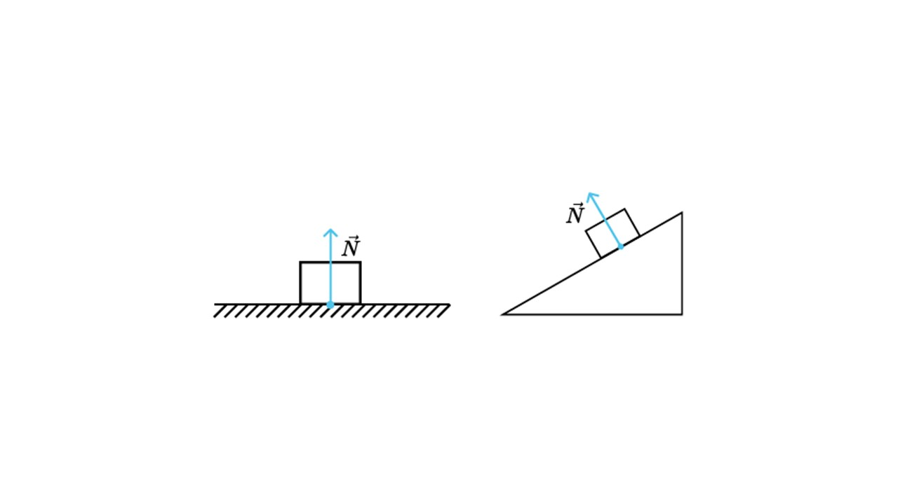
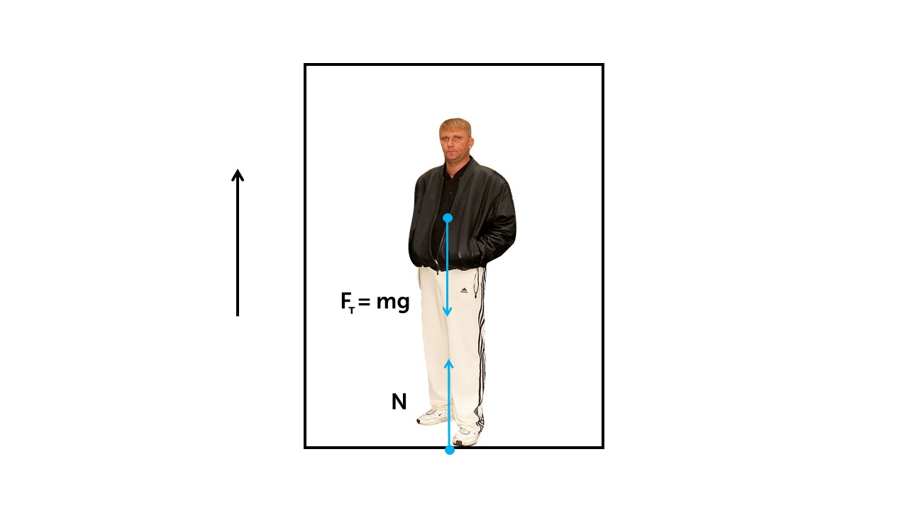
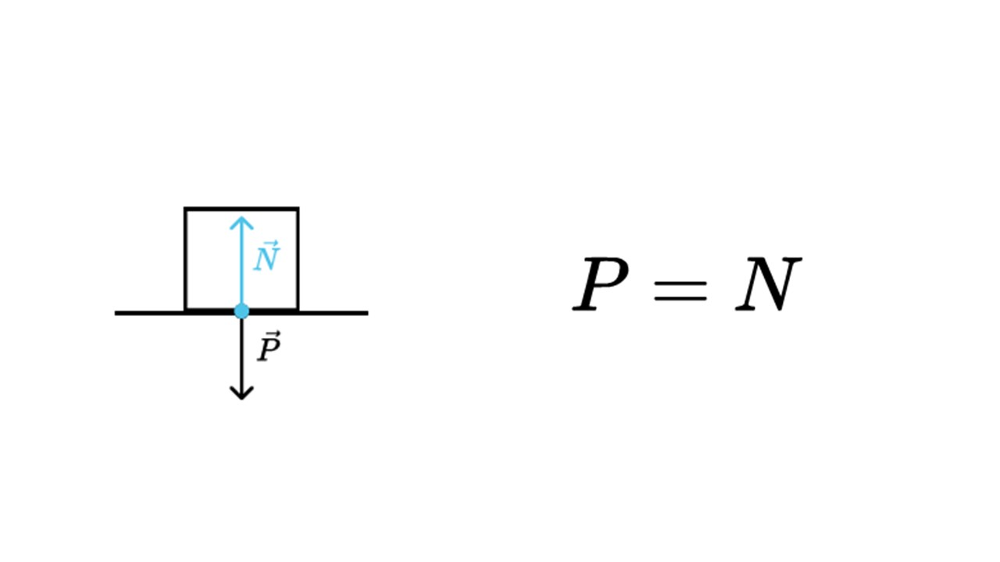

На любое тело находящееся на поверхности кроме силы тяжести действует сила реакции опоры

> [!info] Определение
> 
> **Сила реакции опоры  — сила, действующая на тело со стороны опоры и возникающая в точке контакта тела с поверхностью**

Эта сила возникает из-за третьего закона Ньютона. На тело действует сила тяжести и опора отвечает на нее силой реакции опоры (сила действия равна силе противодействия)

На графиках сила реакции опоры показывается вот так

Давай рассмотрим как действует сила реакции опоры на примере лифта

Лифт с человеком стоит: **N = mg** 

Лифт с человеком едет вверх. Разберем какие силы действуют на человека

Лифт двигается вверх, на человека действует сила тяжести и сила реакция опоры. Распишем их по второму закона Ньютона

**N - mg = ma** (так как сила тяжести направлена против движения перед ней ставим знак минус)

Теперь выразим силу реакции опоры

**N = mg + ma = m (g + a)**

Именно поэтому когда лифт начинает движение вверх мы чувствуем что становимся тяжелее, потому что сила реакции опора увеличивается и соответственно увеличивается вес человека

> [!info] Определение
> 
> **Вес тела — это сила, которая действует на опору или подвес (измеряется в Ньютонах)**

По третьему закону Ньютона вес численно равен силе реакции опоры

Главное не путать массу тела с его весом. Масса - это мера количества вещества, скалярная величина не имеющая направления, а вес - это сила с которой тело давит на опору и вес векторная величина. 

Когда мы ходим в магазин и покупаем что-то на развес, нам говорят вес 1 кг, а это со стороны физики не правильно, правильно будет масса 1 кг, а вес 10 Н.

Теперь давай узнаем почему мы можем кататься на коньках по льду, а по асфальту не можем: [[16. Сила трения скольжения. Сила трения покоя|Узнать]]

