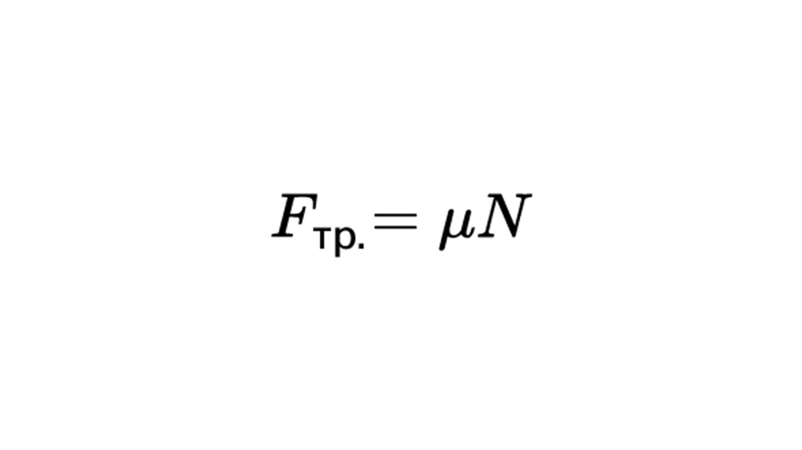
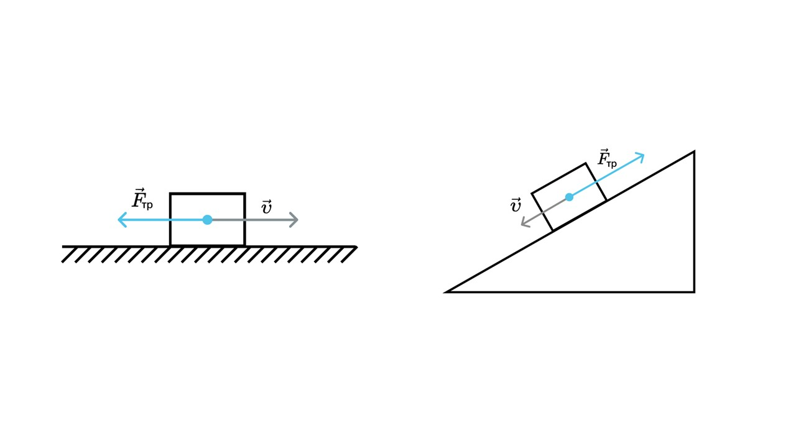
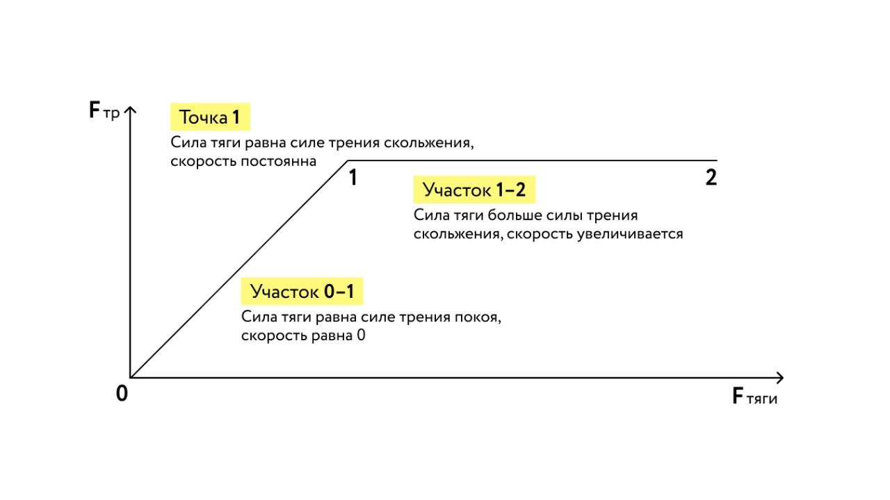

Когда мы гладим кота, катаемся на коньках или чешем пятку, то мы сталкиваемся с силой трения

> [!info] Определение
> 
> **Сила трения - это сила, возникающая между соприкасающимися поверхностями и препятствующая их относительному движению.** 

Вычисляется сила трения вот так

> [!example] Формула

**Fтр** - сила трения (Н)

**μ** - коэффициент трения (произносится как "Мю")

**N** - сила реакции опоры (Н)

Сила трения возникает из-за шероховатостей, неровностей и всех несовершенств поверхности. Эти дефекты задевают друг друга при соприкосновении и создается сила, тормозящая движение. 

Сила трения всегда направлена в противоположную сторону скорости тела. На графиках сила трения показывается следующим образом

Если ты решишь сдвинуть грузовик стоящий на ручнике с места у тебя не получится. Не то, чтобы я в тебя не верю — просто это невозможно сделать из-за того, что масса человека во много раз меньше массы грузовика, да еще и сила трения мешает это сделать. Мир жесток, что тут поделать.

В случае, когда сила трения есть, но тело не двигается с места, мы имеем дело с силой трения покоя. 

> [!info] Определение
> 
> **Сила трения покоя — это сила препятствующая началу движения.**

Давай посмотрим как работает сила трения покоя и сила трения (сила трения скольжения)

Представим что мы тянем тяжелый ящик. Сначала мы начнем его тянуть, то он не сдвинется с места, потому что сила трения покоя равна силе тяги (Участок 0-1)

**Fтр.покоя = Fтяги**

Потом мы поднатужимся и увеличим силу тяги и когда она станет равна силе трения скольжения, то ящик сдвинется с места (Точка 1)

**Fтяги = Fтр.скольжения

А когда сила тяги станет больше силы трения, то ящик будет двигаться быстрее (Участок 1-2)

**Fтяги > Fтр.скольжения

Если бы не существовало силы трения покоя, мы бы не смогли сидеть, ходить и вообще что-либо делать. Мы бы просто катались по Земле как масло на сковородке.

Теперь давай узнаем что такое сила упругости: [[17. Сила упругости. Закон Гука|Летс гоу]]

