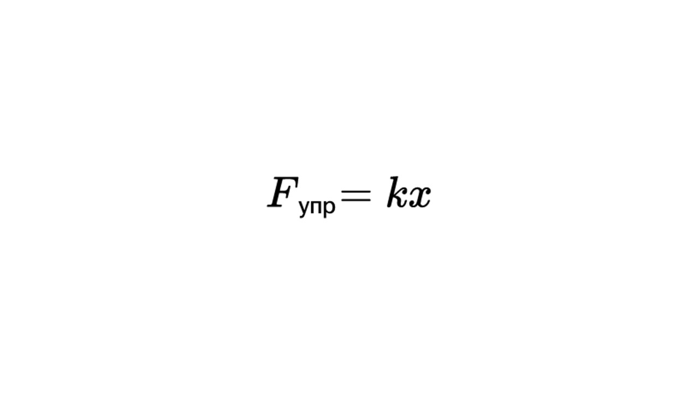
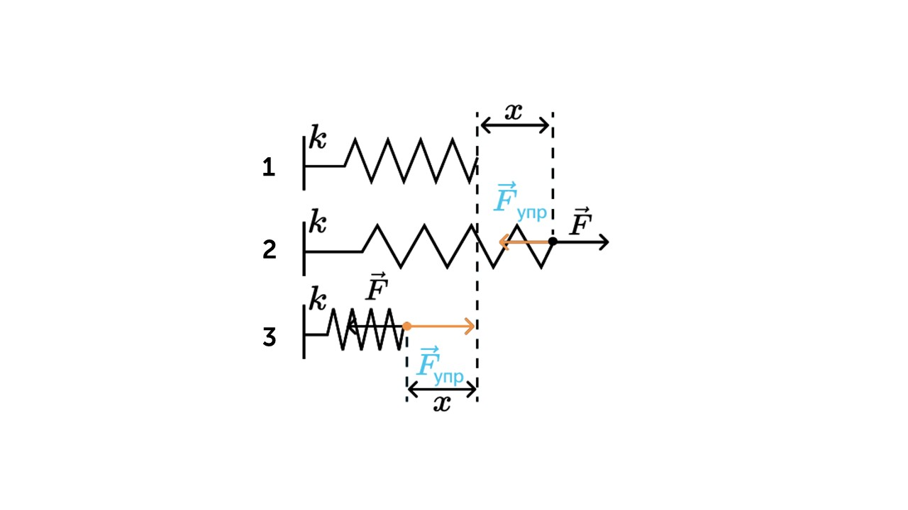

> [!info] Определение
> 
> **Сила упругости – это сила, которая возникает при деформации или сжатии упругого материала и направлена в сторону возвращения материала к его исходной форме или состоянию.**

Почему пружина расправляется после сжатия или сжимается после растягивания, а все из-за силы упругости, которая действует в противоположную сторону сжатия/растяжения тела

> [!example] Формула - Закон Гука

**Fупр** - сила упругости (Н)

**k** - коэффициент жесткости пружины (Н/м) 

**x** - растяжение пружины

Давай посмотрим на рисунке как действует сила упругости

На рисунке 1 показана пружина в неподвижном состоянии

На рисунке 2 пружину растягивают и **Fупр** действует в противоположном направлении растяжению

На рисунке 3 пружину сжимают  **Fупр** действует в противоположном направлении сжиманию

Давай решим задачку

> [!question] Задача 1
> 
> **Один конец проволоки жёстко закреплен. С какой силой нужно тянуть за второй конец, чтобы растянуть проволоку жёсткостью 2⋅10$^3$ Н/м на 5 мм?**

**k** =  2⋅10$^3$ Н/м

**x** = 5 мм = 0,005 м

Просто найдем **Fупр** 

 **Fупр = k * x = 2⋅10$^3$ * 0,005 = 10 Н**

Перейдем к силе натяжения: [[18. Сила натяжения нити. Связанные тела|Вперед]]
