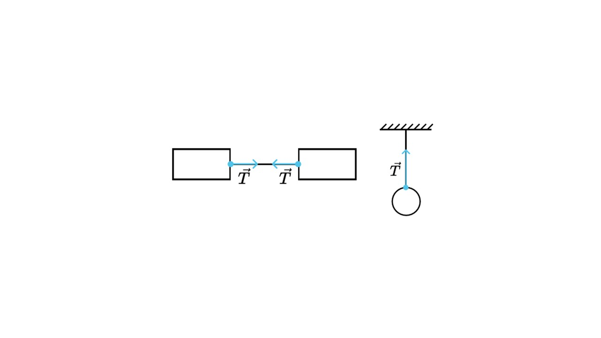
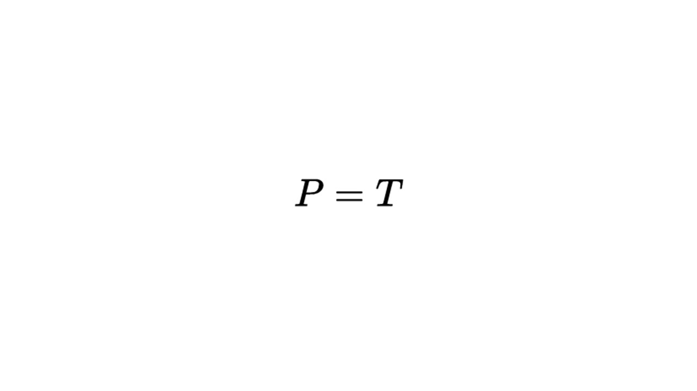
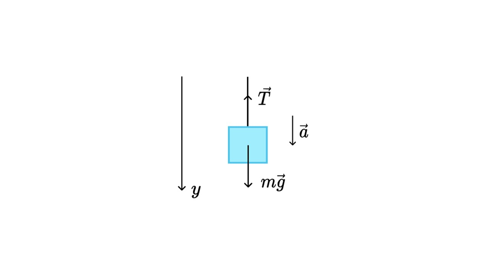
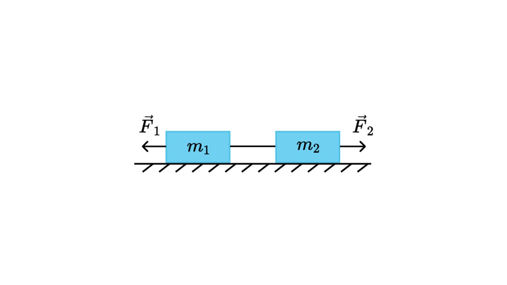

> [!info] Определение
> 
> **Сила натяжения нити (Т) – это сила, с которой нить или тонкая проволока натягивается вдоль своей оси.**

Сила натяжения показывается на рисунках вот так

Сила натяжения численно равна весу тела, который действует на опору или подвес

> [!example] Формула

Решим пару задачек

> [!question] Задача 1
> 
> **Груз массой 2 т спускают на лебедке вниз. Каково ускорение груза, если сила натяжения троса равна 10 кН?**

Запишем, что нам известно

**m = 2 т = 2000 кг** - масса груза

**Т = 10 кН = 10000 Н** - сила натяжения троса

**a = ?** - ускорение

Распишем действие сил по второму закону Ньютона

**T + mg = ma**

Спроецируем силы на ось Y. Сила тяжести и ускорение соноправлены с осью Y (ставим знак +), а сила натяжения разнонаправлена с осью Y (ставим знак -)

**-T + mg = ma**

Выразим ускорение, разделив все на m

**-$\frac{T}{m}$ + g = a**

Подставим значение и получим ответ

**a = 10 -$\frac{10000}{2000}$ = 10 - 5 = 5 м/с²** 

> [!question] Задача 2
> 
> **На гладкой поверхности расположены два связанных легкой и нерастяжимой нитью ящика массами 
 m1 = 2 кг и m2 = 1 кг. К ним начинают прикладывать силы F1 = 30 Н и F2 = 54 Н, как указано на рисунке. Определите модуль ускорения системы тел**

Так как нить нерастяжима, систему можно рассматривать как единое целое. Запишем 2-й закон Ньютона для неё:

**F1 + F2 = (m1 + m2) * a**

Распишем проекции сил

**F1 - F2 = (m1 + m2) * a

Выразим **а** и найдем ответ

**a = (F1 - F2) / (m1 + m2) = (30 - 54) / (1 + 2) = -24 / 3 = - 8 м/с²**

Так как ответ нужно записать по модулю, опускаем знак минуса и в ответ запишем **8 м/с²**

Сейчас давай перейдем к силе всемирного тяготения: [[19. Закон всемирного тяготения. Ускорение свободного падения|⏩вперед]]
