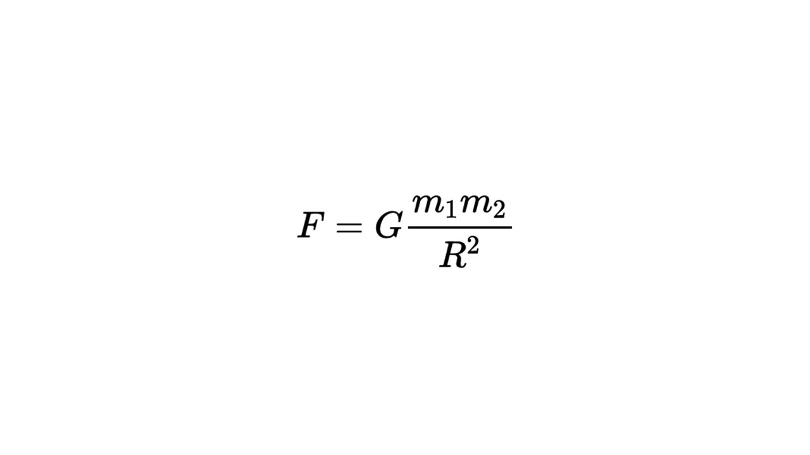
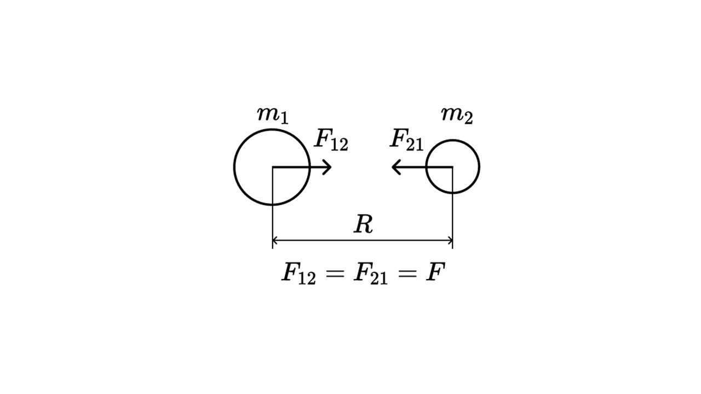

> [!info] Определение
> 
> **Закон всемирного тяготения утверждает, что любые два тела во Вселенной притягиваются друг к другу с силой, которая зависит от их масс и расстояния между ними.**

> [!example] Формула

**F** - это сила всемирного тяготения (Н)

**G** - гравитационная постоянная, равная 6,7 · 10$^2$ (Н * м$^2$ / кг $^2$)

**m1 , m2** - это масса тел, которые притягиваются

**R** - это радиус между центрами тел

На рисунке закон всемирного тяготения выглядит так

Благодаря силе всемирного тяготения все Земля и другие планеты движутся вокруг Солнца, потому что диаметр Солнца 1 392 000 км (в 109 раз больше Земли). Но так как Земля крутится вокруг своей оси она не падает на Солнце. 

А если бы мы на секунду отключили гравитацию на Земле и остановили ее, то Все взлетит вверх, так как больше ничего не удерживается гравитацией. 

Теперь давай узнаем что такое импульс [[20. Импульс тела и системы тел|Летс гоу]]

