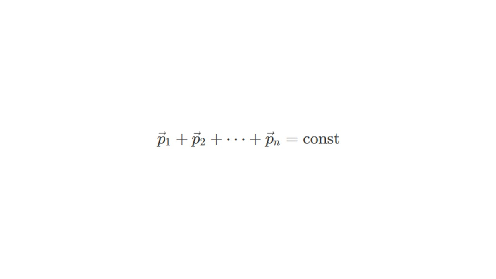
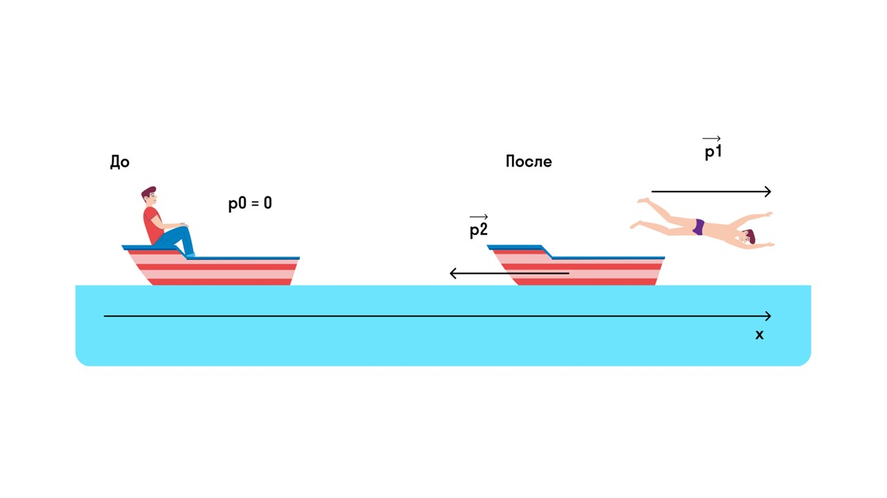

В физике и правда ничего не исчезает и не появляется из ниоткуда. Импульс — не исключение. В замкнутой изолированной системе (это та, в которой тела взаимодействуют только друг с другом) закон сохранения импульса звучит так: 

> [!info] Закон сохранения импульса 
> 
> **Векторная сумма импульсов тел в замкнутой системе постоянна** 

Вот так выглядит формула

Говоря этот закон проще, импульс до взаимодействия тел в системе, равен импульсу после взаимодействия тел. Давай решим задачку

> [!question] Задача 1
> 
> **Мальчик массой m = 45 кг плыл на лодке массой M = 270 кг в озере и решил искупаться. Остановил лодку (совсем остановил, чтобы она не двигалась) и спрыгнул с нее с горизонтально направленной скоростью 3 м/с. С какой скоростью станет двигаться лодка?** 

Запишем закон сохранения импульса для данного процесса 

**p0 = p1 + p2**

**p0** -  это импульс системы мальчик + лодка до того, как мальчик спрыгнул

**p1** - это импульс мальчика после прыжка

**p2** - это импульс лодки после прыжка

Изобразим на рисунке, что происходило до и после прыжка. 

До взаимодействия лодка и мальчик стояли на месте (скорость = 0) и поэтому импульс равен 0. А когда мальчик прыгнул вперед, он обрел свой импульс (p1) и передал импульс лодке, толкнув ее назад (p2). Если мы спроецируем импульсы на ось х, то закон сохранения импульса примет вид 

**0 = p1 - p2**

**p1 = p2**

Подставим формулы импульса

**mv1 = Мv2** 

**m** - это масса мальчика (кг)

**v1** - это скорость мальчика с которой он прыгнул с лодки (м/с)

**M** - это масса лодки (кг)

**v2** - это скорость лодки после прыжка (м/с)

Выразим скорость лодки и найдем ответ 

**v2 = mv1 / M = 45 * 3 / 270 = 0,5 м/с**

Давай разберем какие виды движение и ударов используются в задачах про импульсы: [[22. Абсолютно упругий и неупругий удары. Реактивное движение|Go]]
