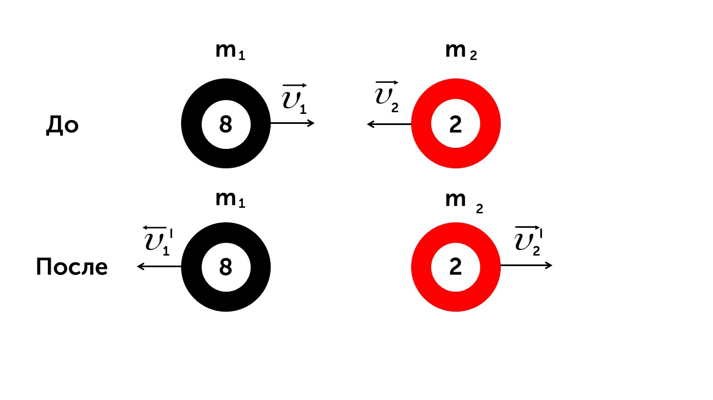
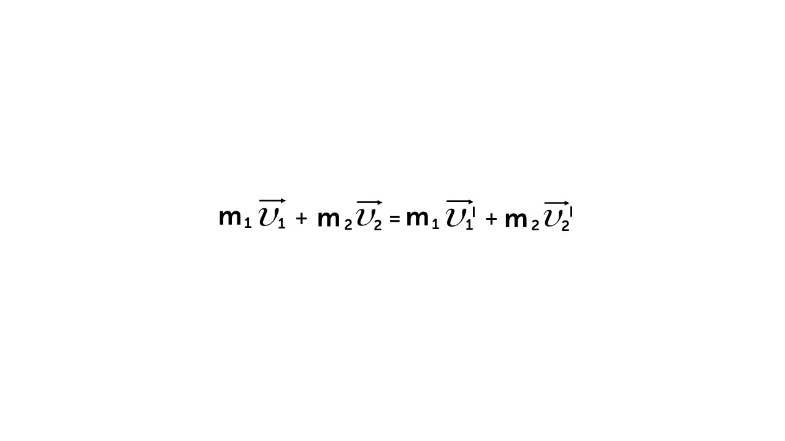
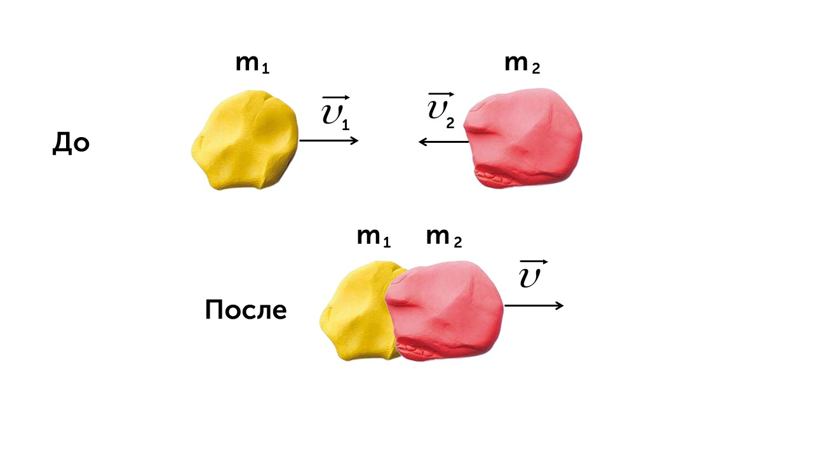
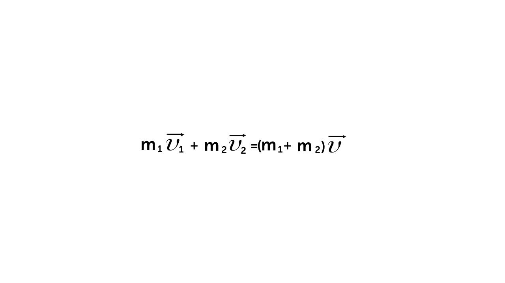
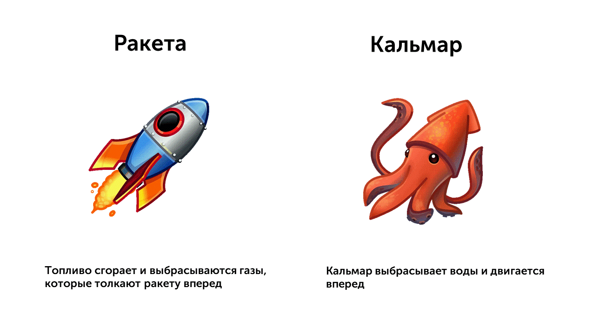

В задачах по физике используются два типа ударов

> [!info] Определение
> 
> **Абсолютно упругий удар - это столкновение, при котором сохраняется общая механическая энергия и деформация тел полностью исчезает после прекращения взаимодействия.**

Про энергию мы поговорим позже, пока рассмотрим удар только со стороны импульса. При абсолютно упругом ударе тела разлетаются после столкновения. Яркий пример это бильярдные шарики. Два шарика катятся друг на друга и после удара разлетаются в разные стороны с разными скоростями 

А вот выглядит запись закона сохранения импульса при абсолютно упругом ударе

Теперь поговорим про второй тип удара

> [!info] Определение
> 
> **Абсолютно неупругий удар - это удар, при котором кинетическая энергия сталкивающихся тел не сохраняется. Часть энергии преобразуется в другие формы, такие как тепло, звук или деформация объектов.** 

Говоря проще, абсолютно неупругий удар - это удар в ходе которого тела слипаются. Если ты кинешь друг в друга пластилиновые шарики, то они слипнутся и полетят в одну сторону с одной общей скоростью, а их масса сложится. Вот как это выглядит на рисунке 

Закон сохранения импульса будет выглядеть так 

И теперь давай разберем 

> [!info] Определение
> 
> **Реактивное движение — это движение тела, возникающее при отделении от него некоторой части массы с определённой скоростью. При этом тело получает импульс в одну сторону, а отброшенный фрагмент движется в противоположном направлении.**

Представь, что ты надул воздушный шарик и, не завязывая его, отпустил. Что произойдет?

Шарик начнёт летать по комнате! Почему?

Потому что воздух вырывается из него назад, а сам шарик толкается вперёд. Это и есть реактивное движение! Оно связано с законом сохранения импульса. Воздух вылетает назад - шарик летит вперед (импульс воздуха = импульс шарика). Еще примеры реактивного движения - это движение ракеты и движение кальмара в воде

