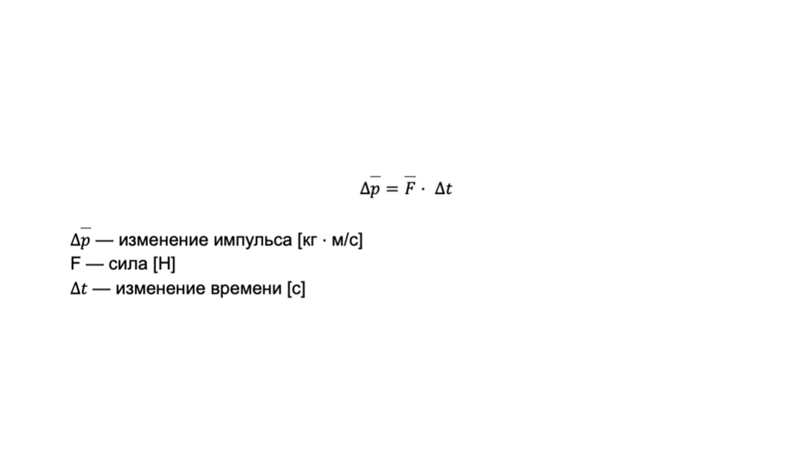

> [!info] Определение
> 
> **Импульс силы — это определённое воздействие, оказываемое на тело, благодаря чему оно получает возможность двигаться в заданном направлении.**

Второй закон Ньютона в импульсной форме описывает **изменение импульса** тела под действием силы за некоторый промежуток времени

Изменение импульса тела (материальной точки) равно импульсу действующей на это тело силы. Представь что ты толкаешь тележку в супермаркете и чем дольше и сильнее ее будешь толкать, тем сильнее она покатиться когда ты ее толкнешь

Сейчас мы перейдем к интересной теме - энергия: [[24. Энергия. Потенциальная и кинетическая энергии|погнали🔋]]

