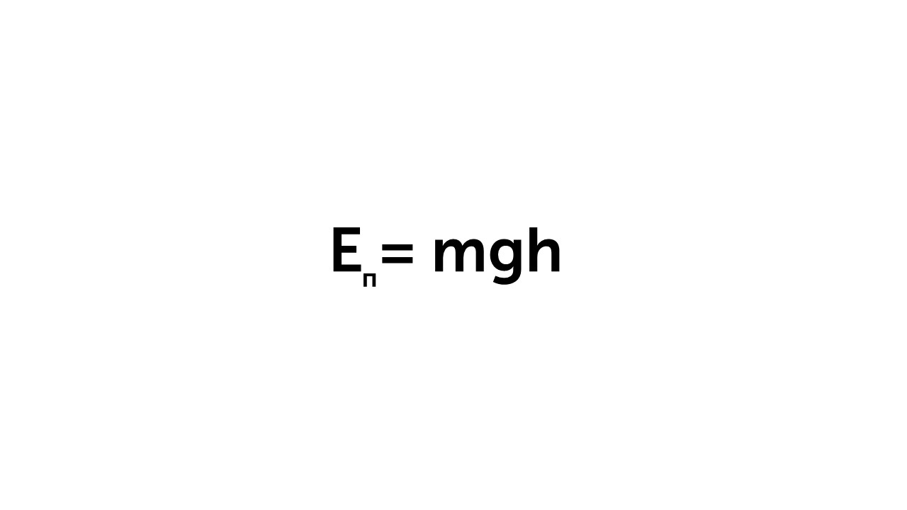
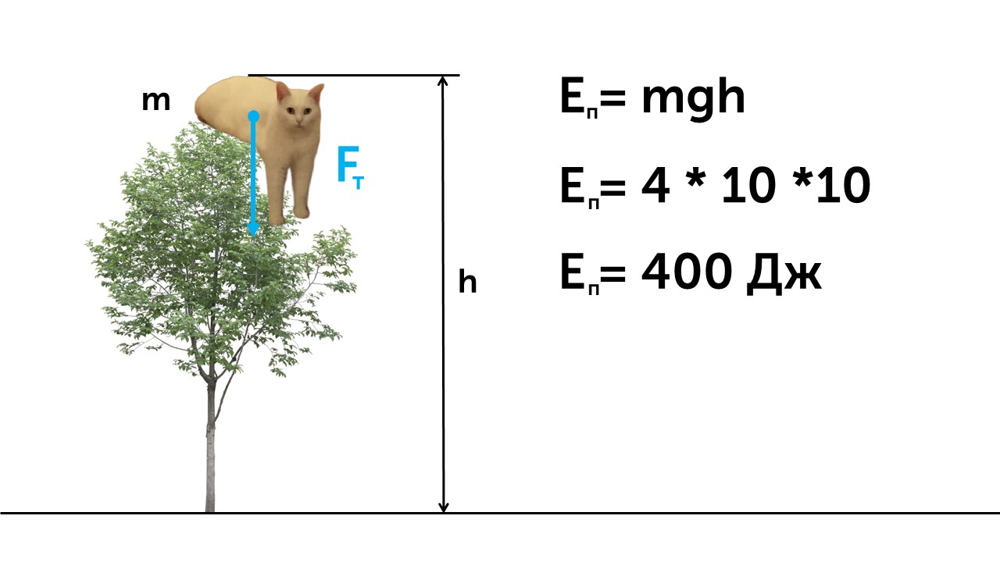
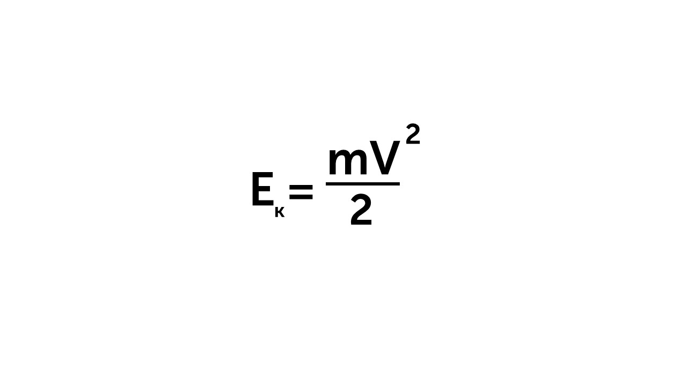
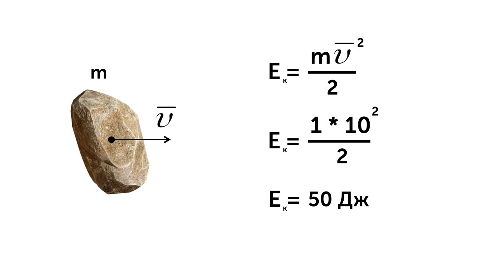

Наша новая тема посвящена энергии. Итак, что это такое?

> [!info] Определение
> 
> **Энергия – это универсальная количественная мера, характеризующая движение и взаимодействие тел. Энергия в механике может быть двух видов – потенциальная и кинетическая.**

Энергия есть у всего на свете. Ты бежишь - у тебя есть энергия, мячик летит - у него есть энергия. Давай разберем что такое потенциальная энергия

> [!info] Определение
> 
> **Потенциальная энергия – это энергия взаимодействия. Потенциальная энергия тела, поднятого над землей, определяется массой тела, ускорением свободного падения и расположением тела относительно земли**

Потенциальную энергию можно назвать спящей энергией, она находится в предметах пока они не двигаются. 

🍏**Яблоко на дереве:** Чем выше висит, тем больше у него энергии (упадет — будет громче «бух!»).

**⛓️‍💥Растянутая резинка:** Пока держишь — энергия «спит», отпустишь — резинка щёлкнет!

**🏋️‍♀️Гантели на полке:** Если они упадут, будет «бом» — значит, энергия была!

Величина потенциальной энергии зависит от массы тела, высота на котором оно расположено и от ускорения свободного падения

**Eп** - потенциальная энергия, измеряется в Джоулях (Дж)

**m** - масса тела (кг)

**g** - ускорение свободного падения

**h** - высота тела над выбранной системой отсчета

Если котик массой 4 кг будет сидеть на дереве высотой 10 метров, то его потенциальная энергия будет вычисляться вот так

Есть и второй тип энергии

> [!info] Определение
> 
> **Кинетическая энергия – энергия движения тела. Она определяет запас энергии тела, которое обладает скоростью.**

Представь что ты стоишь на воротах на футболе и в тебя пинают мячик. Чем быстрее будет лететь и чем он тяжелее тем больнее будет его отбивать, потому что он несет в себе больше кинетической энергии. Формула кинетической энергии выглядит так

**Eк** - это кинетическая энергия (Дж)

**m** - это масса тела (кг)

**υ** - скорость тела (м/с)

Еще разок: кинетическая энергия — это энергия действия. Величина, которая очевиднее всего характеризует действие — это скорость.  Чем быстрее движется тело, тем больше его кинетическая энергия. И наоборот — чем медленнее, тем меньше кинетическая энергия. 

Давай рассчитаем кинетическую энергию летящего камня массой 1 кг, со скоростью 10 м/с

Теперь давай узнаем, что такое полная механическая энергия: [[25. Полная механическая энергия|🛞Газ]]
