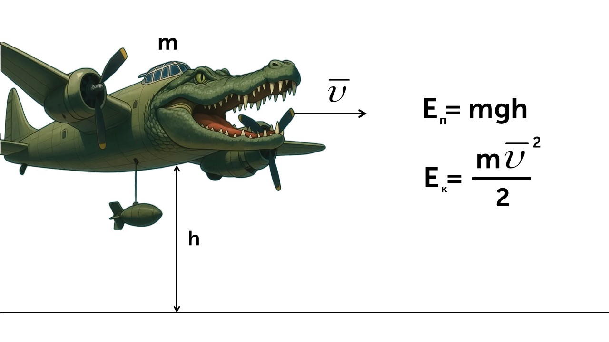
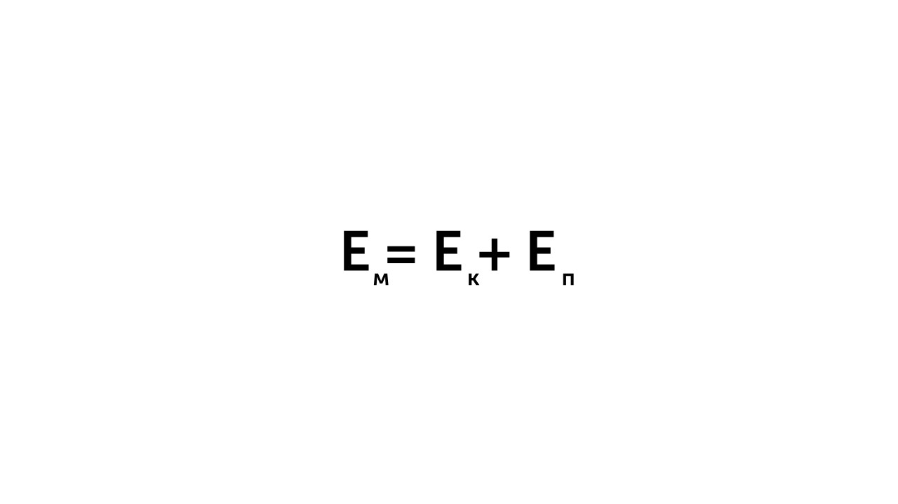

Когда мы говорим об энергии, нужно помнить, что тело обладает несколькими видами энергий одновременно. Например, если мы рассмотрим летящий на большой высоте самолет, то можно говорить, что самолет обладает и потенциальной энергией, поскольку находится на некоторой высоте относительно Земли, и кинетической, когда он обладает еще и скоростью.

Сумма кинетической и потенциальной энергии называется полной механической энергией. Вычисляется она по такой формуле

> [!example] Формула

С полной механической энергией разобрались, теперь давай изучим закон сохранения энергии: [[26. Закон сохранения и изменения энергии|⏩вперед]]
