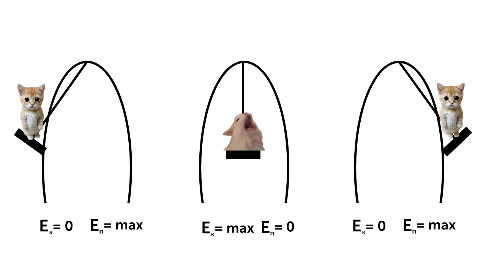

> [!info] Определение
> 
> **Закон сохранения энергии — один из фундаментальных законов природы, согласно которому энергия не может быть создана или уничтожена, а только преобразована из одной формы в другую.**

Этот закон говорит нам, что энергия не берется из ниоткуда, она всегда из одной формы переходит в другую. Человек может двигаться только из-за того, что его организм вырабатывает энергию и он может преобразовывать эту энергию на тренировки, ходьбу и другие действия. А как энергия переходит из одной в другую?

Давай представим как ты качаешься на качели. Когда ты находишься в крайних точках раскачивания ты замираешь на качели, а потом летишь со скоростью вниз. Это яркий пример перехода одной энергии в другую.

**Ты в самой высокой точке (остановка)**

Высота максимальная

Скорость = 0 (ты замираешь на мгновение)

Энергия: **Еполн = Еп = mgh**

**Ты летишь вниз**

Высота уменьшается → скорость растёт

Потенциальная энергия (Eп) превращается в кинетическую (Eк​).

Энергия в самой низкой точке полета: **Еполн = Ек = (mυ$^2$)/2**

**Ты поднимаешься вверх**

Скорость уменьшается → высота растёт

Кинетическая энергия снова превращается в потенциальную.

Вот так это выглядит на рисунке

Энергию мы прошли, давай изучим работу и мощность: [[27. Механическая работа и мощность|Работаем⛏️]]
