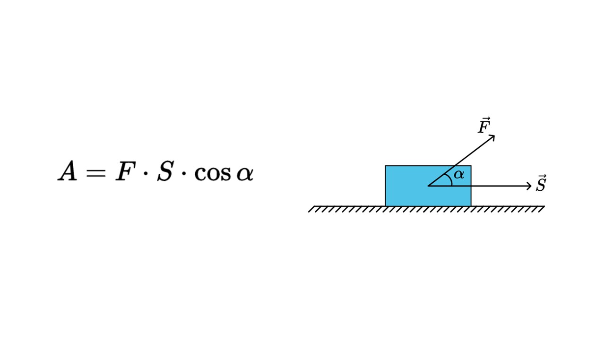
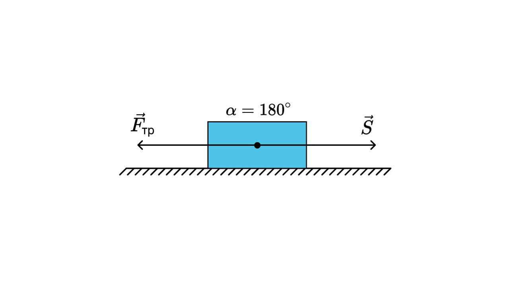
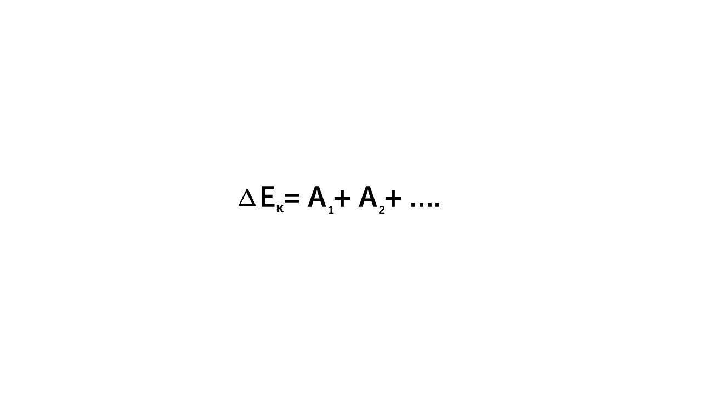
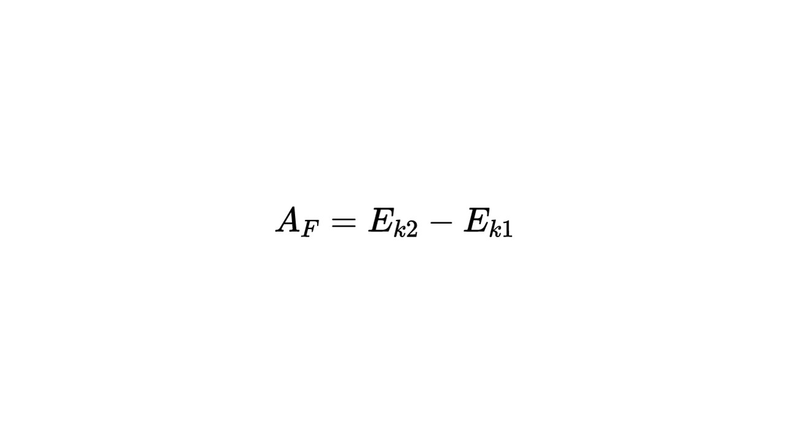
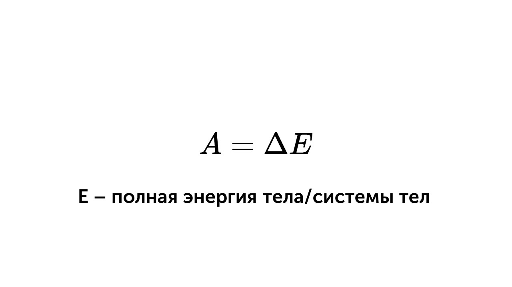
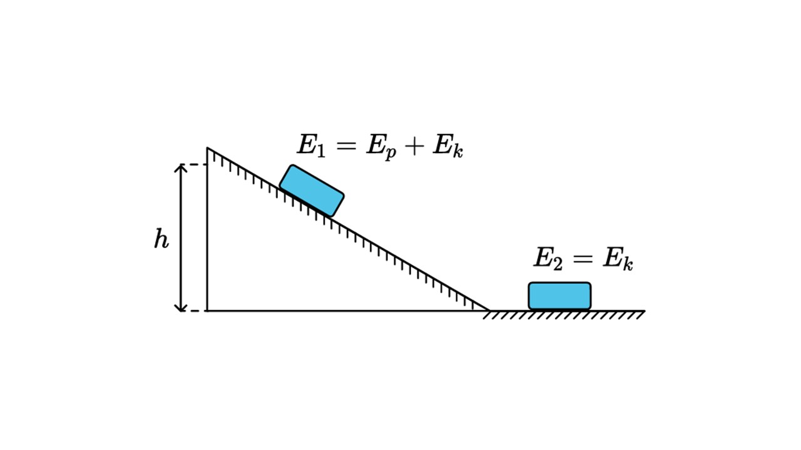
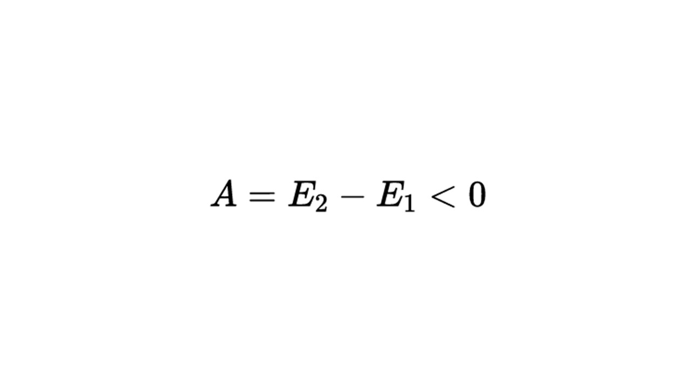
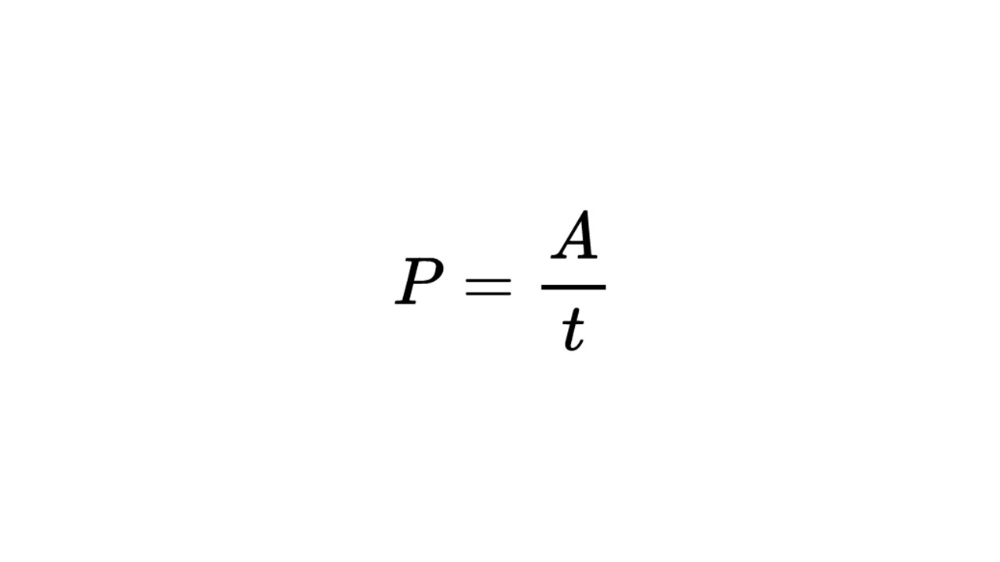
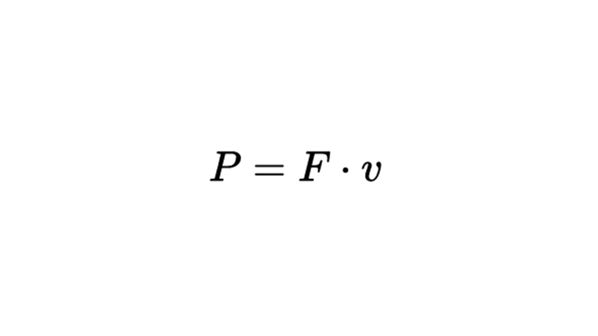

> [!info] Определение
> 
> **Работа — это процесс изменения энергии тела под действием силы.**

Для выполнения работы человеку необходимо обладать энергией, которую можно накопить, например, через прием пищи. Если мы толкаем тележку в магазине или тянем за веревку груз, то мы выполняем работу. Работа считается по следующей формуле

**А** - механическая работа (Дж)

**F** - сила, совершающая работу (Н)

**S** - перемещение (м)

**cos α** - угол между перемещением и силой (°)

Существует и отрицательная работа. 

> [!info] Определение
> 
>**Работа действующей силы отрицательна, если сила действует против вектора перемещения (тело движется вправо, а сила действует влево), в этом случае cos < 0.**

Например, сила трения: она всегда направлена против движения тела, поэтому ее работа всегда будет отрицательной

Как ты помнишь, работа - это изменение энергии. Существует теорема о кинетической энергии. Закон изменения кинетической энергии системы материальных точек в ИСО

Работа равнодействующей сил (сумма всех сил действующих на тело), приложенных к телу, будет равна изменению кинетической энергии, то есть разности конечной и начальной энергий

Таким образом, работа внешних сил действующих на тело изменяет энергию 

Например, представим с тобой наклонная плоскость по которой спускают брусок 

Работа равна разнице конечной и начальной энергий. В начальном положении на брусок действует потенциальная энергия, так как брусок находится на высоте и кинетическая энергия так как брусок движется. В нижней точке на брусок действует только кинетическая энергия, потому что брусок продолжает двигаться. Во время спуска бруска на него действовала сила трения, которая замедляла движение бруска. Чтобы посчитать работу нужно вычесть из начальной энергии конечную

Работа будет отрицательной, так как она действовала против направления движения

Есть еще очень важная величина

> [!info] Определение
> 
> **Мощность - это величина, которая характеризует скорость совершения работы**

> [!example] Формула

**P** - мощность, измеряется в Ваттах (Вт)

**А** - работа (Дж)

**t** - время (с)

Все мы видели лампочки💡 и слышали фразу "мощность лампочки". Она обозначает, какое количество электрической энергии, она превращает в свет и тепло за 1 секунду. Чем **больше мощность** лампочки, тем:

🔆 **Ярче свет** (но не всегда, если сравнивать лампы разных типов).

⚡ **Больше энергии** она потребляет из розетки.

 💸 **Выше счёт** за электричество.

При равномерном движении мощность измеряется по такой формуле

Работу и мощность мы изучили, давай перейдем к коэффициенту полезного действия: [[28. Коэффициент полезного действия (КПД)|⏩вперед]]

