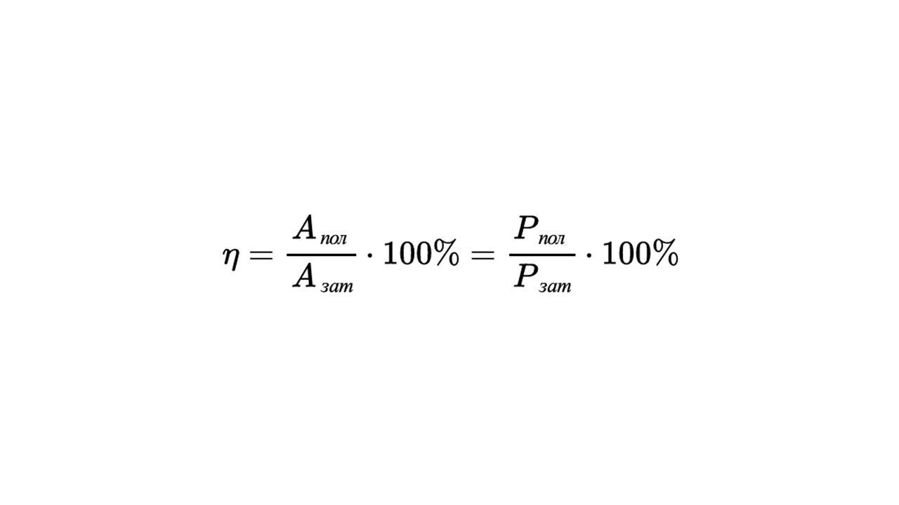

Любой механизм в мире нужно оценивать с точки зрения его пользы. Важно же понять, хорошо он выполняет свою функцию или нет. Как хорошо светит лампочка, как быстро едет машина и другие примеры. Для этого нужно такое понятие, как КПД. 

> [!info] Определение
> 
> **Коэффициент полезного действия (КПД) – это величина, характеризующая энергоэффективность данного устройства, определяется как отношение полезной работы (или мощности) к затрачиваемой. Данная величина всегда меньше единицы.**

Давай разберем что такое полезная и затрачиваемая работа/мощность. Представь что по дороге едет автомобиль. Его двигатель определенной мощности и ее часть тратится на преодоление силы трения дороги, сопротивление воздуха, а остальная часть отвечает за перемещение автомобиля. КПД считается по следующей формуле

> [!example] Формула
> 

> [!question] Алгоритм решения задач на КПД
> 
> **1) Определить полезную работу (то, что стремились получить в задаче)**
> 
> **2) Определить затраченную работу (то, какие силы и энергию на это потратили)**
>    
> **3) Написать и подставить все в формулу КПД**
> 
> **4) Вычислить неизвестное**

С КПД все понятно, теперь давай изучим что такое момент силы и плечо: [[29. Момент и плечо силы. Рычаг. Условие равновесия.|⏩вперед]]
