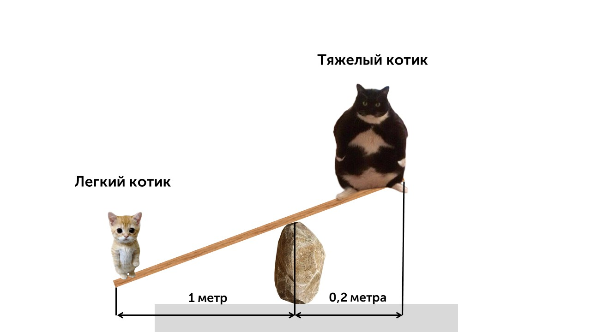
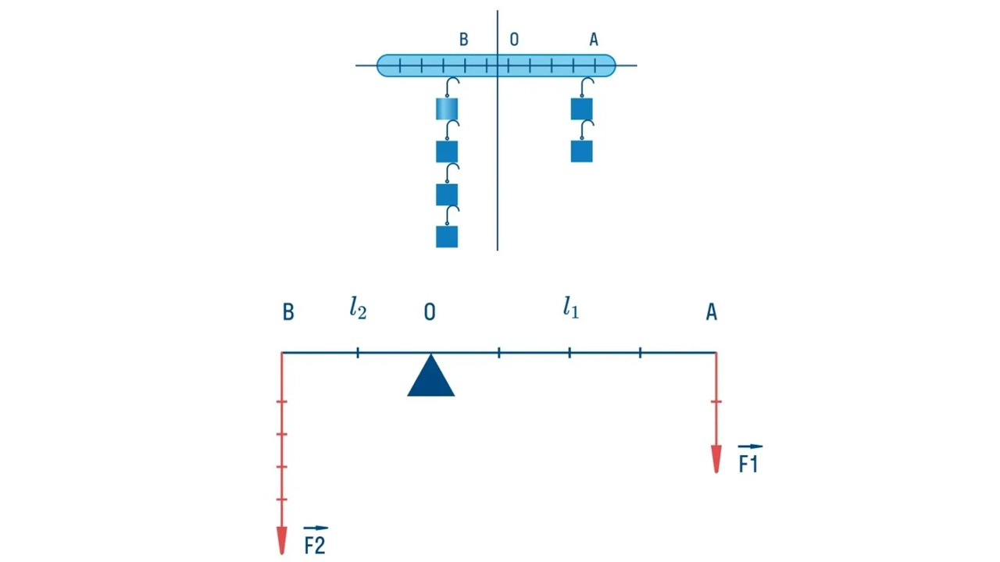
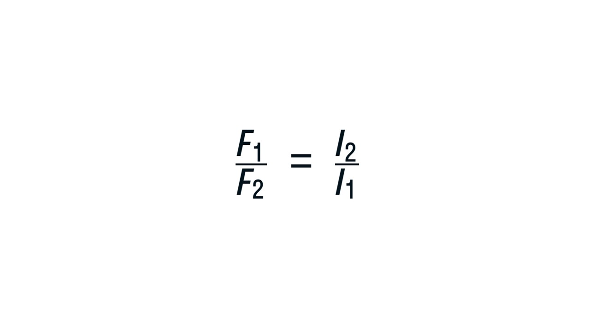
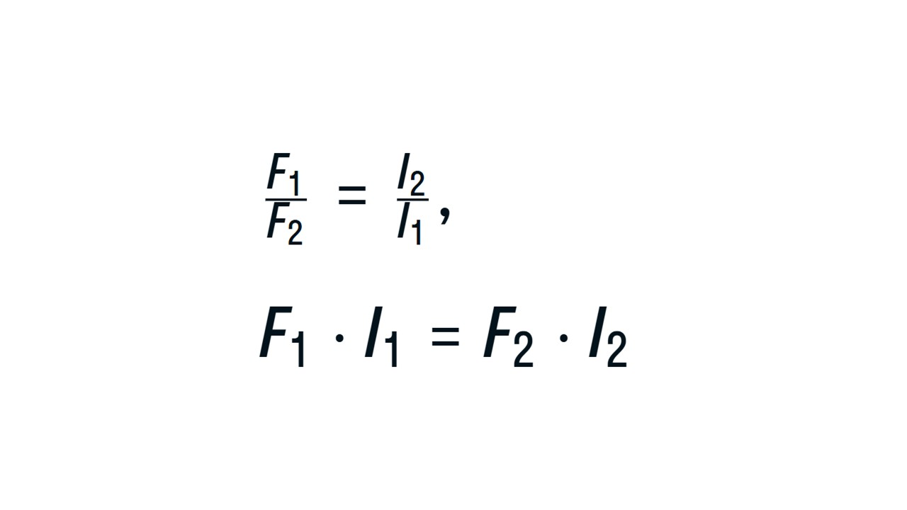

Строительство домов, памятников, дворцов и фонтанов — дело не из простых, поэтому еще в древние времена люди изобрели механизмы, которые позволяли упростить процесс.

> [!info] Определение
> 
> **Простые механизмы — это устройства, которые позволяют изменить величину или направление приложенных к ним сил.**

В общем случае простой механизм позволяет затратить меньше усилий для выполнения работы, приложить меньшую силу, получив при этом значительный результат. 

К простым механизмам относятся рычаги (на основе которых были созданы блоки и ворота)

> [!info] Определение
> 
> **Рычаг — это твердое тело, которое может вращаться вокруг неподвижной опоры.** 

Все вы видели пример рычага на игровой площадке в детстве. 

С помощью такой конструкции даже очень легкий котик может поднять тяжелого котика, весь секрет только в расположении опоры (оси вращения) и правильном распределении усилия. 

На рисунке представлен демонстрационный рычаг. O  — точка опоры, слева и справа от которой подвешены грузы. Заметим, что количество грузов неравное, но рычаг остается в положении равновесия. 

На рисунке у нас есть две силы F1 и F2 - это силы, которые приложены к рычагу. Еще на рисунке есть отрезки ВО (*l*2) и ОА (*l*1) - это плечо силы рычага 

> [!info] Определение
> 
> **Плечо силы рычага — это кратчайшее расстояние от точки опоры до точки приложения силы.** 

В каком случае рычаг находится в равновесии? Как необходимо расположить точки приложения сил, чтобы достигнуть этого состояния? Это условие было сформулировано еще много столетий назад. 

> [!info] Условие равновесия рычага
> 
> **Рычаг будет находится в равновесии, если силы, действующие на него, обратно пропорциональны плечам этих сил** 
> 
> 

> [!example] Формула

**F1 и F2** - это силы, которые приложены к рычагу

***l*1 и *l*2** - плечи сил F1 и F2

Правило равновесия рычагов можно переписать, используя понятие «момент силы». Но что это такое? 

> [!info] Определение
> 
> **Момент силы — физическая величина, характеризующая действие силы на объект, которое вызывает его вращательное движение.** 

Простыми словами, момент силы - это произведение величины силы на ее плечо. 

В физике момент силы обозначается **М**, а измеряется в Ньютонах на метр (**Н * м**). Формула момента силы:

**М = F*l***

Преобразуем условие равновесия рычагов, умножив накрест по основному свойству пропорции: 

а так как **М = F*l***, то

**М1 = М2

А значит, сформулировать условие равновесия рычага можно так: **рычаг будет находиться в равновесии, когда моменты сил, приложенных к его разным концам, равны.** 

Момент и плечо силы мы изучили, теперь давай познакомимся с "Золотым правилом механики": [[30. Блоки, неподвижный и подвижный. «Золотое правило» механики|Делаем🥇]]
