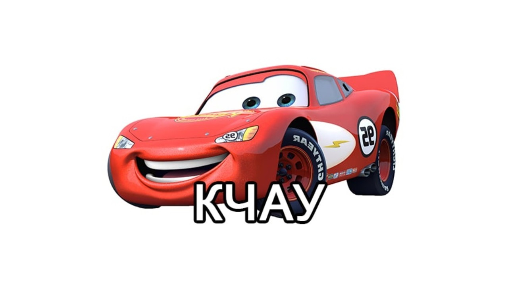
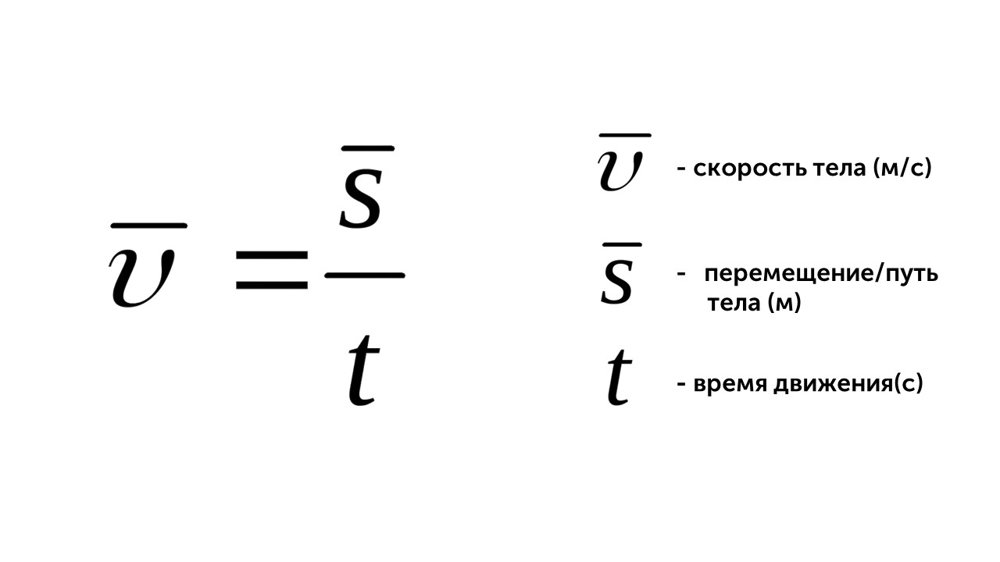
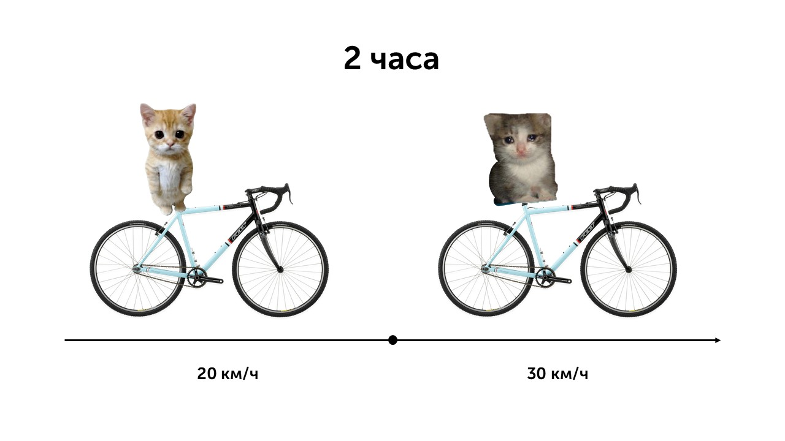
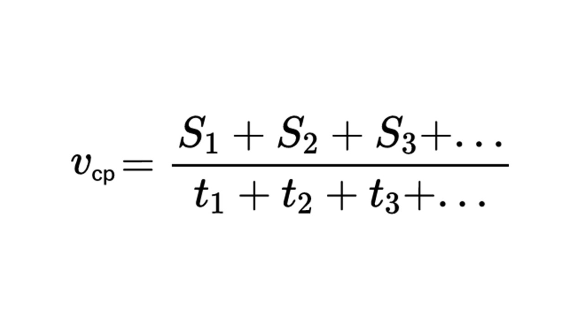
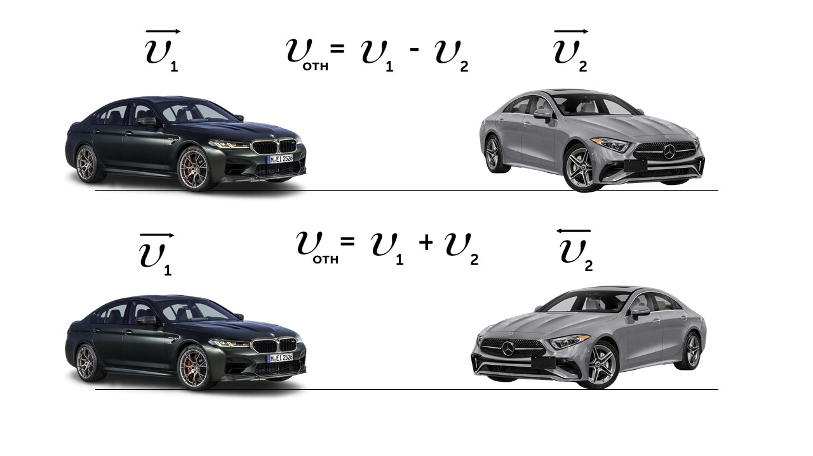
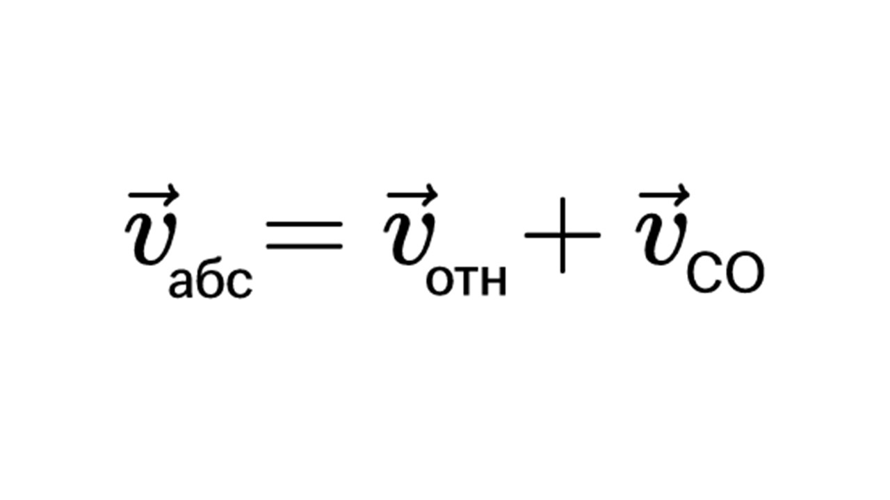
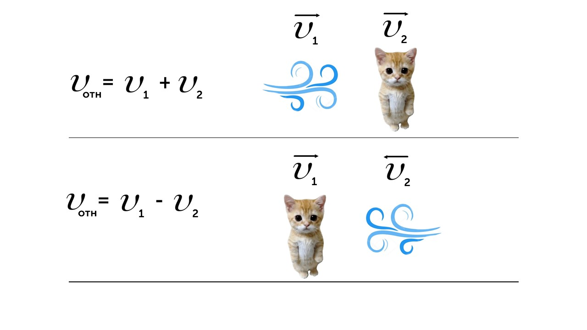

Наша новая тема - это скорость

> [!info] Определение
> 
> **Скорость – это величина, определяющая, насколько быстро или медленно объект движется**

Если ты бежишь - у тебя есть определенная скорость, если стоишь, то твоя скорость равна 0, а если едешь на тачке, то скорость нужно соблюдать. Посмотри на формулу скорости

> [!example] Формула

Самая базовая и известная формула. Чтобы найти скорость нам нужно пройденный путь разделить на время за которые мы его прошли. 

Над скоростью и перемещением стоит палочка (может стоять стрелочка) - это показывает, что величина является **векторной**, то есть имеет направление. А у времени нет направления, поэтому это **скалярная величина**, она не имеет направления.

> [!info] Определение
> 
> **Средняя скорость – это отношение пройденного пути к затраченному времени.**

Давай посмотрим на картинку

Вот как было дело. Котенок решил покататься 2 часа на велосипеде. Первый час он ехал медленно со скоростью 20 км/ч, а второй час котик ехал быстро со скоростью 30 км/ч. Он приехал и теперь хочет узнать среднюю скорость своей поездки. Для этого используем формулу:

> [!example] Формула

Котик ехал на велосипеде 2 часа: 1 час со скоростью 20 км/ч, 1 час со скоростью 10 км/ч.

**Общий путь:** 20+30=50 км

**Средняя скорость:** 50/2 = 25 км/ч

Давай поговорим про относительную скорость

> [!info] Определение
> 
> **Относительная скорость – это скорость движения одного объекта относительно другого объекта или точки отсчета.**

> [!example] Формула
> 
> **Vотн = VА + VВ** - если объекты движутся навстречу друг другу
> 
> **Vотн = VА - VВ** - если объекты движутся в одном направлении

Давай разберем пример

Разберем первый случай, ты едешь на BMW со скоростью 110 км/ч за мерседесом, скорость которого 90 км/ч. Найдем относительную скорость

**Vотн = VА + VВ = 110 - 90 = 20 км/ч**

Это значит что относительно мерседеса ты едешь всего 20 км/ч, поэтому при обгоне автомобиля ты можешь его легко рассмотреть. 

А вот другая ситуация. Ты едешь по трассе на BMW со скоростью 90 км/ч, а на встречу тебе едет мерседес со скоростью 100 км/ч. И когда вы сближаетесь мерседес проезжает очень быстро и слышен характерный звук. Это происходит из-за того, что ваши скорости при движении навстречу складываются

**Vотн = VА + VВ = 90 + 100 = 180 км/ч**

Теперь давай рассмотрим еще один пример еще одной скорости

> [!info] Определение
> 
> **Абсолютная скорость  точки равна векторной сумме относительной и переносной скоростей.**

> [!example] Формула

**vабс** - абсолютная скорость 

**vотн** - относительная скорость 

**vСО** - переносная скорость системы отсчета (дуновение ветра, скорость реки)

Давай решим задачку

> [!question] Задача 1
> 
> **Котик бежит дистанцию со скоростью 8 км/ч. Скорость ветра 2 км/ч. Определите скорость легкоатлета относительно земли, если: а) ветер попутный; б) ветер встречный. В ответ запишите значения в км/ч.**

а) По дороге бежит котик по дороге со скоростью 8 км/ч (относительная), а в спину ему дует ветер со скоростью 2 км/ч (переносная скорость). Ветер толкает котика и помогает ему бежать быстрее, вычислим абсолютную скорость

**vабс** = **vотн** + **vСО** = 8 + 2 = 10 км/ч

б) Котик снова бежит по дороге со скоростью 8 км/ч (относительная), но ему на встречу дует ветер со скоростью 2 км/ч (переносная скорость). Так как ветер дует на встречу, котику приходится преодолевать силу ветра и котик бежит медленнее

**vабс** = **vотн** + **vСО** = 8 - 2 = 2 км/ч

Вот такая штука скорость. Теперь давай изучим виды движения: [[4. Равномерное прямолинейное движение|Двигаемся вперед]]

