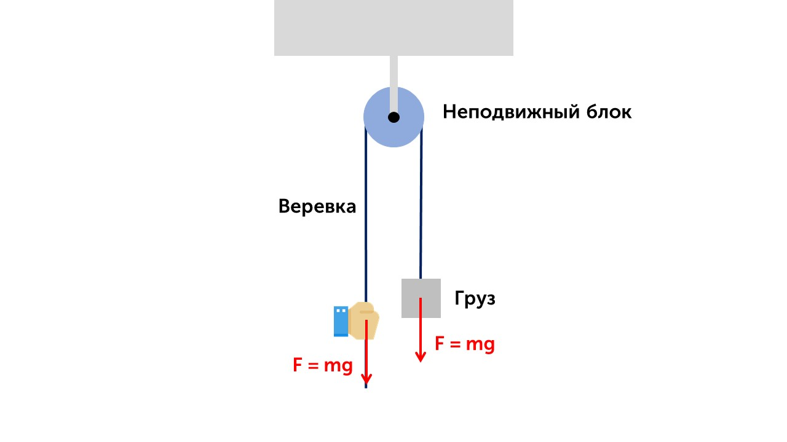
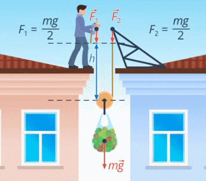

Золотое правило механики гласит

> [!info] Золотое правило механики
> 
> **Во сколько раз выигрываем в силе, во столько раз проигрываем в расстоянии.**

Давай на примере блоков посмотрим как действует это правило

> [!info] Определение
> 
> **Блок – это колесо с желобом, через которое перекинута веревка**

Использовать этот механизм можно двумя способами. Можно закрепить колесо посредине, к одному концу веревки привязать груз, за другой – тянуть. Такой блок называют **неподвижным** (сам блок не двигается)

Груз действует на веревку с силой ***F = mg***. Чтобы удержать веревку нужно также приложить силу ***mg***. То есть, неподвижный блок не даёт выигрыша в силе. Но с помощью него можно менять направление силы. Без блока силу для подъема нужно прикладывать вверх, а с помощью блока – в любом направлении. На рисунке ниже ты увидишь как работает неподвижный блок.

Второй способ применения блока – закрепить один конец веревки, за второй – тянуть, а груз привязать к центру блока. Такой блок называется **подвижным**, т.к. он будет двигаться вместе с грузом

Подвижный блок дает выигрыш в силе в 2 раза, но проигрыш в перемещении, тоже в 2 раза. Здесь и начинает работать золотое правило механики. Давай разберемся почему мы выигрываем в силе, но проигрываем в расстоянии.

Представим двух человек на крыше дома, поднимающих груз на подвижном блоке

Людям нужно поднять груз на который действует сила тяжести ***mg***. Понятно, что поднимать вдвоем в 2 раза легче, т.е. каждый из них прикладывает силу, равную ***mg/2***. Изменится ли сила, с которой будет тянуть один человек, если второго заменить жестким креплением? Очевидно, нет

Но за счет чего же происходит выигрыш в силе в 2 раза? При поднятии груза на высоту *h* освободится _h_ метров веревки с каждой стороны от блока, т.е. один человек вытащит *2h* метров веревки

Таким образом, выигрыш в силе происходит за счет проигрыша в перемещении, что и подтверждает золотое правило механики.

Теперь давай поговорим про КПД простых механизмов: [[31. КПД простых механизмов|Погнали]]

