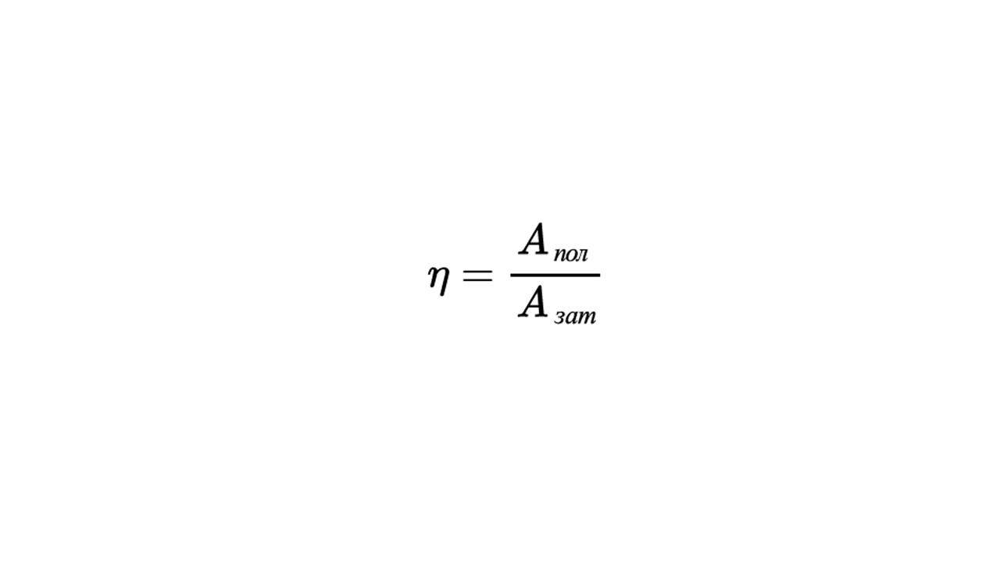
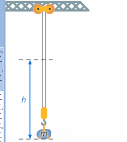

Выполняя любое действие, нельзя обойтись без потерь. Когда мы чистим картошку, вместе со шкуркой срезаем часть самой картошки.

Закупая продукты на неделю, вы помимо стоимости продуктов можете потратить деньги на проезд к магазину, на пакеты, которые нужны только для переноски этих продуктов и т.д.

Когда вы кипятите воду в чайнике, кроме воды нагревается сам чайник и воздух на кухне – это тоже ненужные потери энергии. И т.д.

Так и с механизмами: не вся выполненная ими работа будет нам нужна, но без этих потерь не обойтись, можно только постараться их минимизировать.

Поэтому, для реальных механизмов, вводят величину КПД

> [!info] Определение
> 
> **КПД – коэффициент полезного действия. Он показывает, насколько полезен данный механизм. КПД определяется как отношение полезной работы к выполненной.**

> [!example] Формула
> 

Нужно понимать, что понятия КПД – не существует в природе. Мы вводим его, чтобы оценивать эффективность механизма. Поэтому сами выбираем, что считать полезной и выполненной работой.

Обычно выполненная работа – это работа внешней силы, которая выполняет подъем тела, действуя на механизм ***Авыполненная = FS***

При подъеме тела полезная работа – это та, которая пошла непосредственно на изменение высоты тела – ведь это и есть наша цель. Тогда ***Аполезная = mgh***  И в этом случае:

**η = $\frac{mgh}{FS}$**

С КПД все ясно, пора перейти к давлению твердого тела: [[32. Давление твёрдого тела|⏩вперед]]
