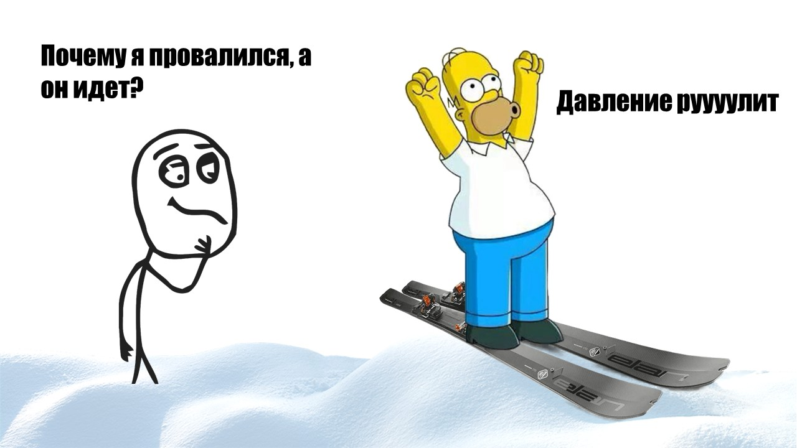
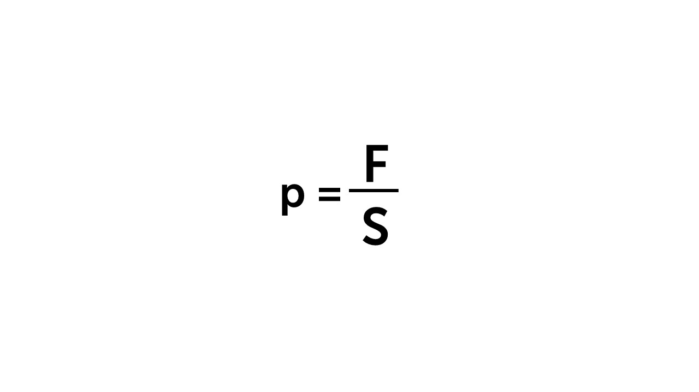

В природе есть три агрегатных состояния веществ: твердое, жидкое и газообразное. Сегодня рассмотрим с тобой твердое агрегатное состояние 🗿

Твердое состояние очень легко представить — это любой предмет, который мы встречаем в жизни (телефон, стул, кружка и множество других предметов). В этом состоянии тело сохраняет форму и объем. Расстояние между молекулами, приблизительно равно размеру самих молекул, которые, в свою очередь, расположены очень структурированно. 

Такая структура называется **кристаллической решеткой** — из-за четкой структуры молекулам сложно двигаться, и они просто колеблются около своих положений. 

##### Давление твердого тела

Представим ситуацию. Человек идет по рыхлому снегу - логично, что он будет в него постоянно проваливаться, но если он наденет лыжи, то сможет спокойно перемещаться по снегу. Казалось бы, сила и масса человека не меняется — он воздействует на снег с одинаковой силой и на лыжах, и без них. 

Дело в том, что «проваливание» в снег характеризуется не только силой — оно также зависит от площади, на которую эта сила воздействует. Площадь поверхности лыжи в 20 раз больше чем площадь поверхности ботинки (подошвы, которой человечек наступает на снег), поэтому когда человек стоит на лыжах, он действует на каждый квадратный сантиметр с силой в 20 раз меньшей, чем без них.

> [!info] Определение
> 
> **Давление твёрдого тела — это физическая величина, равная отношению силы, действующей перпендикулярно поверхности, к площади этой поверхности.**

> [!example] Формула

**p** - давление, измеряется в паскалях, Па

**F** - сила, с которой тело давит на поверхность, Н

**S** - площадь, на которую распределяется сила 1 м²

Еще один пример давления твердого тела, чем проще проколоть шарик, иголочкой или черенком от лопаты, учитывая, что сила одинаковая. Конечно проще сделать это иголкой, потому что площадь ее соприкосновения с шариком, гораздо меньше чем у черенка лопаты. 

Теперь перейдем к давлению газа: [[33. Давление газа. Атмосферное давление|⏩вперед]]
