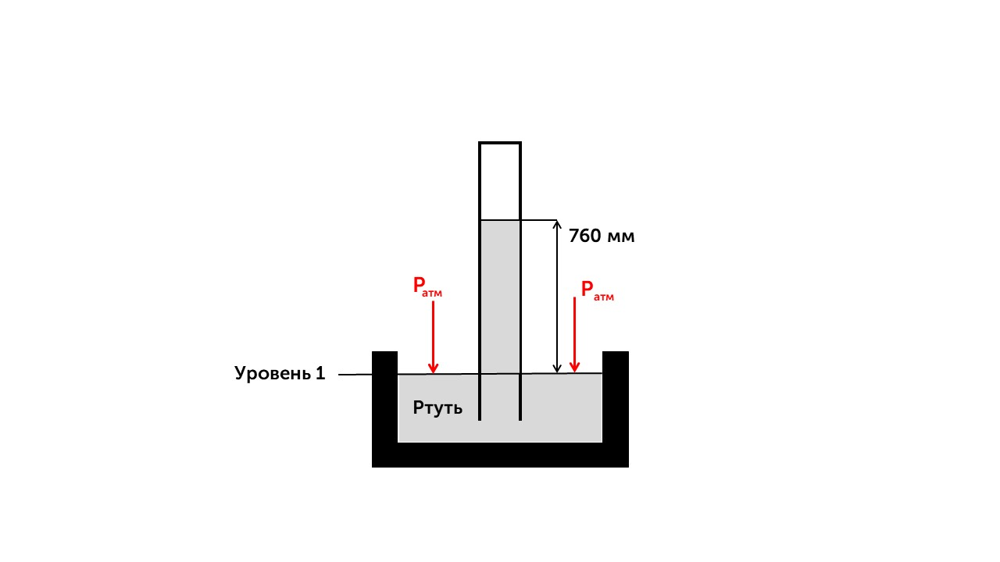

Атмосфера нашей планеты защищает нас от солнечного ультрафиолетового излучения и метеоритов. Воздух представляет собой смесь газообразных веществ, а любое вещество обладает массой. Значит, со стороны Земли на воздух действует сила тяжести, поэтому у него есть вес, как у любого покоящегося массивного тела. Атмосфера оказывает давление на свою опору — поверхность Земли. Это **атмосферное давление**.

> [!info] Определение
> 
> **Атмосферное давление — это сила, с которой воздушный столб давит на поверхность под ним, распределённая на единицу площади этой поверхности.**

Но как люди догадались измерить атмосферное давление? Спасибо Эванджелисту Торричелли, для измерения атмосферного давления, он предложил такой опыт.

Торричелли взял стеклянную трубку длиной около одного метра, запаянную с одного конца, налил в эту трубку ртуть и опустил трубку открытым концом в чашу с ртутью. Некоторое количество ртути вылилось в чашу, но большая часть ртути осталась в трубке. Изо дня в день уровень ртути в трубке незначительно колебался, то немного опускаясь, то немного поднимаясь.

Давление ртути на уровне 1 создается весом столба ртути в трубке, так как в верхней части трубки над ртутью воздуха нет (там вакуум, который получил название «торричеллиева пустота»). Отсюда следует, что атмосферное давление равно давлению столба ртути в трубке. Измерив высоту столба ртути, можно рассчитать давление, которое производит ртуть. Оно будет равно атмосферному. Если атмосферное давление уменьшается, то столб ртути в трубке Торричелли понижается, и наоборот.

Теперь возникает вопрос, почему на нас все время действует давление в 760 мм.рт.ст (101 325 Па), а мы его даже не ощущаем. Все из-за того, что внутри нас тоже есть воздух с тем же давлением, которое уравновешивает атмосферное давление снаружи. 

Давай теперь поговорим о давлении в жидкостях: [[34. Гидростатическое давление внутри жидкости|Газу]]
