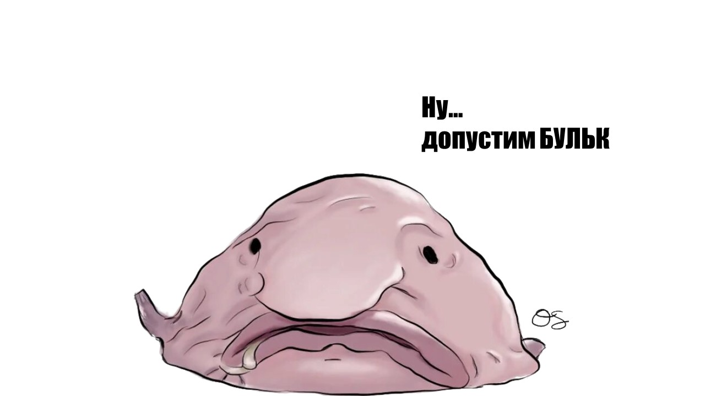
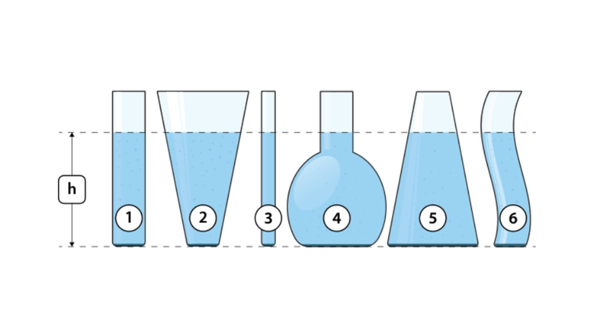

> [!info] Определение
> 
> **Гидростатическое давление внутри жидкости — это давление, которое оказывает покоящаяся жидкость на дно и стенки сосуда, а также на поверхность любого погружённого в неё тела. Оно возникает в результате действия силы тяжести на молекулы жидкости**

> [!example] Формула
> 
> **P = ρgh + Pa**
> 

**P** - давление внутри жидкости (Па)

**ρ** - плотность жидкости (кг/м$^3$)

**g** - ускорение свободного падения (м/с$^2$)

**h** - высота столба жидкости (м)

 **Pa** - атмосферное давление (Па)

Давление жидкости мы могли ощущать в бассейне или на море, когда мы пытаемся заплыть поглубже, то чувствуем, что на уши начинает закладывать, это происходит из-за гидростатического давления внутри жидкости.

Но лучше всех ощутили на себе давление глубоководные рыбы. Например рыбы-капли обитают в водах Австралии на глубине 600-1200 метров, где давление порой в 100 раз превышает показатель на суше. Чтобы выжить в таких условиях, этот вид выработал невероятно мягкое тело без прочного скелета. Из-за этого при попадании на поверхность рыбы-капли деформируются в желатиновое нечто — этот облик принес рыбе-капле титул «самого уродливого животного» в 2013 году.

Еще одно интересное свойство жидкости - это гидростатические парадокс. Как думаешь в каком из этих сосудов давление жидкости на дно будет больше?

Вот тут и проявляется гидростатический парадокс. 

> [!info] Гидростатический парадокс
> 
> **Давление жидкости на дно сосуда не зависит от формы сосуда, а только от плотности жидкости и от высоты столба жидкости**

Так что давление в сосудах на рисунках будет одинаковое.  

Теперь давай перейдем к закону Паскаля: [[35. Закон Паскаля. Гидравлический пресс|⏩вперед]]
