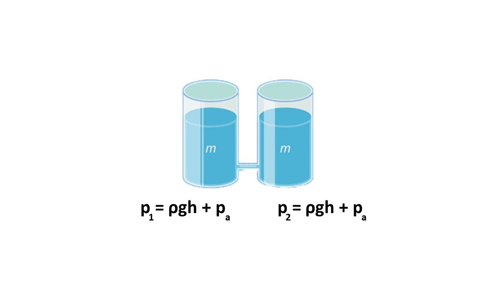
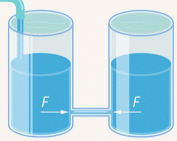
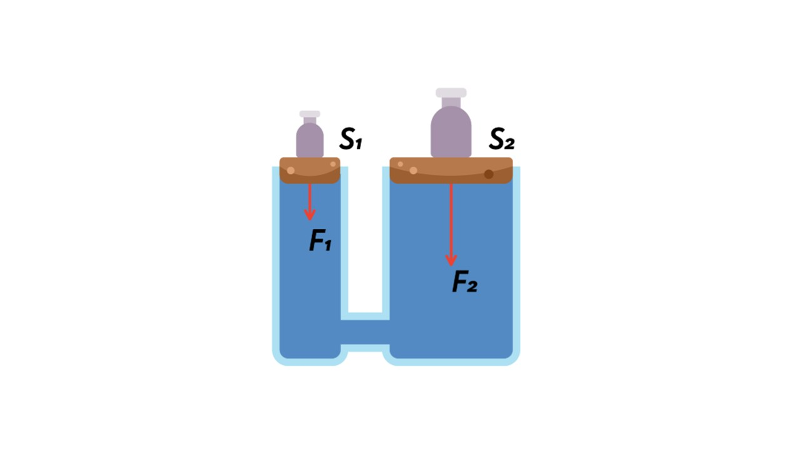
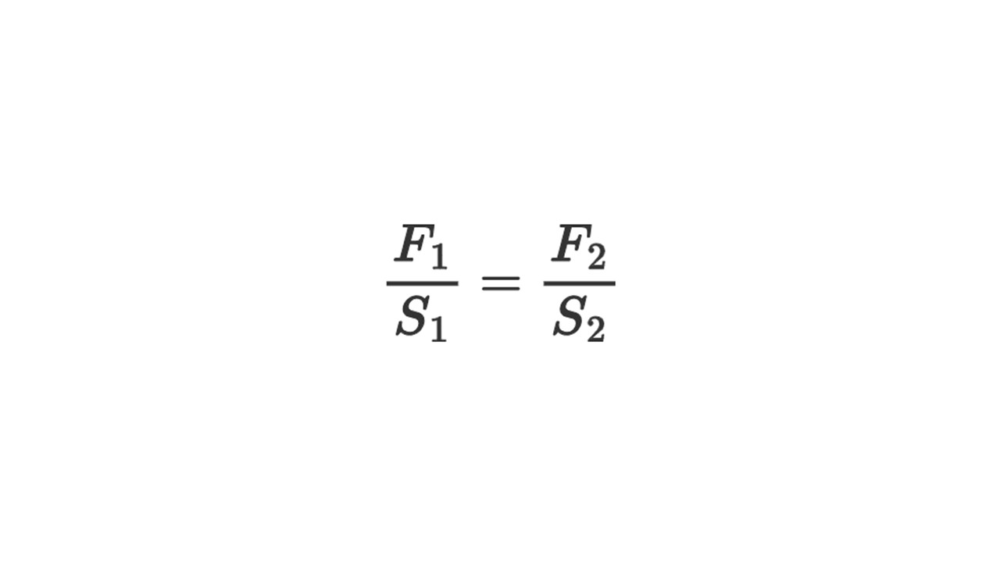
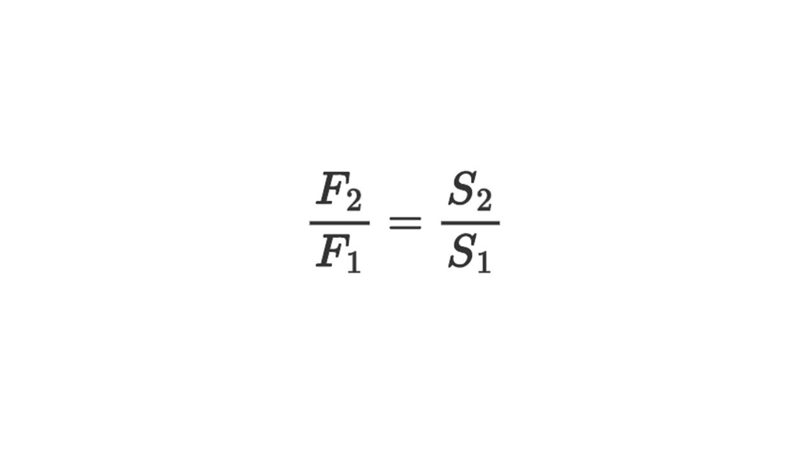

> [!info] Закон Паскаля
> 
> **Давление в жидкостях передается одинаково во всех направлениях**

То есть можно “надавить” в одном месте жидкости и это давление передастся во всех направлениях. Вы это используете каждый день, даже не задумываясь: надавливаете на тюбик с зубной пастой в одном месте, давление передается во всех направлениях, и паста выходит из тюбика.

Возьмем два одинаковых стакана, в стенках которых есть небольшие клапаны, чтобы можно было их соединять. Нальем в стаканы одно и то же количество воды. Масса воды одна и та же, значит, на дно стаканов будет действовать одна и та же сила. У стаканов одинаковые площади оснований, значит и давление на дно будет одно и то же. Его можно вычислить: на дно давит гидростатическое давление жидкости **ρgh**, вызванное силой тяжести, которая действует на воду. Стаканы открытые, поэтому на воду давит атмосфера. По закону Паскаля жидкость передает это внешнее давление **Pа**.

Теперь, вода в стаканах будет сообщаться - отсюда и название **сообщающиеся сосуды**.

Трубку считаем очень тонкой, то есть в неё затечет так мало воды, что не повлияет на уровень воды в стаканах. Давление слева и справа от трубки одинаковое, сила давления на жидкость в трубке слева и справа одинаковая – а это и есть условие равновесия.

Здесь сравнивать давления намного удобнее, чем силы. Если давления слева и справа одинаковые, то и силы одинаковые, потому что площадь сечения трубки одна и та же.

Дольем в левый стакан воды. Давление слева увеличится, а значит, сила давления слева будет больше силы давления справа. Жидкость придет в движение и будет переливаться из левого в правый стакан.

Прекратится движение, когда давления снова будут равны, и жидкость установится на одном уровне.

##### Гидравлический пресс 

Мы рассмотрели случай, когда жидкость передаёт гидростатическое и атмосферное давление. Эти давления возникают из-за притяжения к Земле, мы на них не влияем. Но ведь мы можем сами “надавить” на жидкость, и она передаст это давление.

Если надавить на жидкость в одной части сосуда, давление передастся в другую. Устройство, работающее на таком принципе, называется **гидравлическим прессом**:

На рисунке показаны силы F1 и F2 которые действуют на малый и большой поршни со стороны гирь, указаны площади поршней S1 и S2. Выразим давления, создаваемые этими силами, под малым поршнем **p1 = F1 / S1**  и под поршнем большей площади **p2 = F2 / S2**. По закону Паскаля давление, оказываемое на жидкость, передаётся по всем направлениям без изменений. Поскольку поршни находятся на одинаковой высоте, то давления под ними должны быть одинаковы **p1 = p2**, следовательно:

Преобразуем это выражение и получим

Сила F2 во столько раз больше силы F1 во сколько раз площадь большего поршня (S2) больше площади меньшего (S1). Это устройство необходимо для создания огромного давления маленькой силой. Например, если площадь большого поршня S2​ в **100 раз больше** малого S1​, то

**F2​=F1​⋅100**

То есть, приложив **10 Н**, можно получить **1000 Н**!

Тут все разобрали, теперь давай посмотрим на законы Архимеда: [[36. Закон Архимеда. Сила Архимела|Ныряем в тему]]

