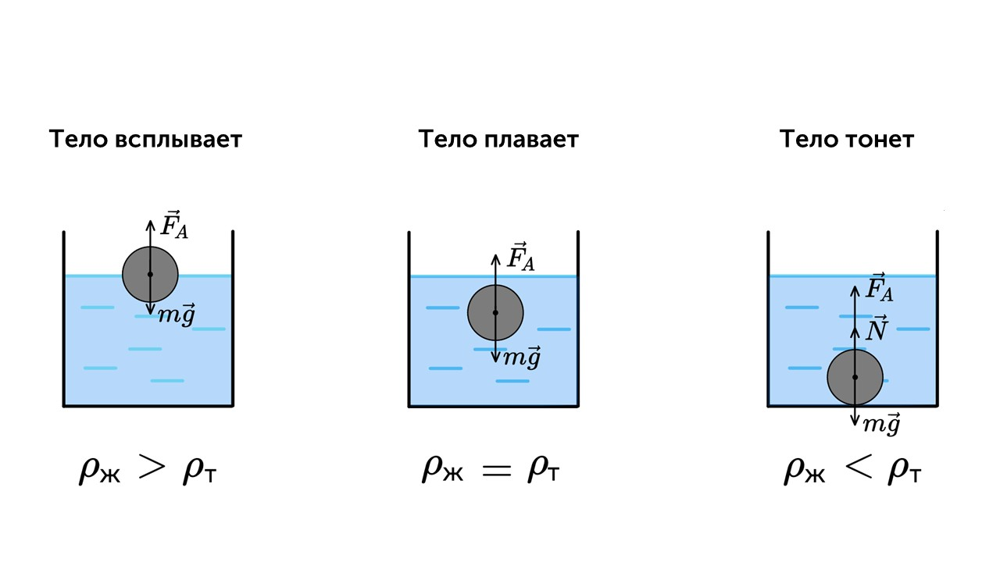

Жил был в III веке до нашей эры, в городе Сиракузы, гениальный ученый и звали его Архимед. 

Однажды царь Сиракуз Гиерон II обратился к Архимеду с просьбой установить, действительно ли его корона выполнена из чистого золота, как утверждал ювелир. Правитель подозревал, что мастер прикарманил часть драгоценного металла и частично заменил его серебром.

В те времена не существовало способов определить химический состав металлического сплава. Задача поставила учёного в тупик. Размышляя над ней, он отправился в баню и лёг в ванну, до краёв наполненную водой. Когда часть воды вылилась наружу, на Архимеда снизошло озарение. Он закричал: «Эврика!» (древнегреч. «Нашёл!»).

Он предположил, что вес вытесненной воды был равен весу его тела, и оказался прав. Явившись к царю, он попросил принести золотой слиток, равный по весу короне, и опустить оба предмета в наполненные до краёв резервуары с водой. Корона вытеснила больше воды, чем слиток. При одной и той же массе объём короны оказался больше, чем объём слитка, а значит, она обладала меньшей плотностью, чем золото. Выходит, царь правильно подозревал своего ювелира.

Так был открыт принцип, который теперь мы называем законом Архимеда

> [!info] Закон Архимеда
> 
> **На тело, погружённое в жидкость или газ, действует выталкивающая сила, равная весу жидкости или газа в объёме погружённой части тела.**

На любой объект, погружённый в воду, действует выталкивающая сила, равная весу вытесненной им жидкости. Поэтому под водой легче поднять тяжести, на них действует выталкивающая сила и они теряют в своём весе столько, сколько весит вытесненная ими жидкость (или газ). Выталкивающая сила (сила Архимеда) считается по такой формуле

> [!example] Формула
> 
> **FА = ρgV**

**ρ** - плотность жидкости или газа

**g** - ускорение свободного падения

**V** - объем погруженной части тела

На тело, находящееся внутри жидкости, действуют две силы: сила тяжести, направленная вертикально вниз, и архимедова сила, направленная вертикально вверх. Рассмотрим, что будет происходить с телом под действием этих сил, если вначале оно было неподвижно.

Условие плавания тел: **FА = mg**

С Архимедом понятно, теперь давай поговорим про механические колебания: [[37. Механические колебания. Амплитуда, период и частота|⏩вперед]]

