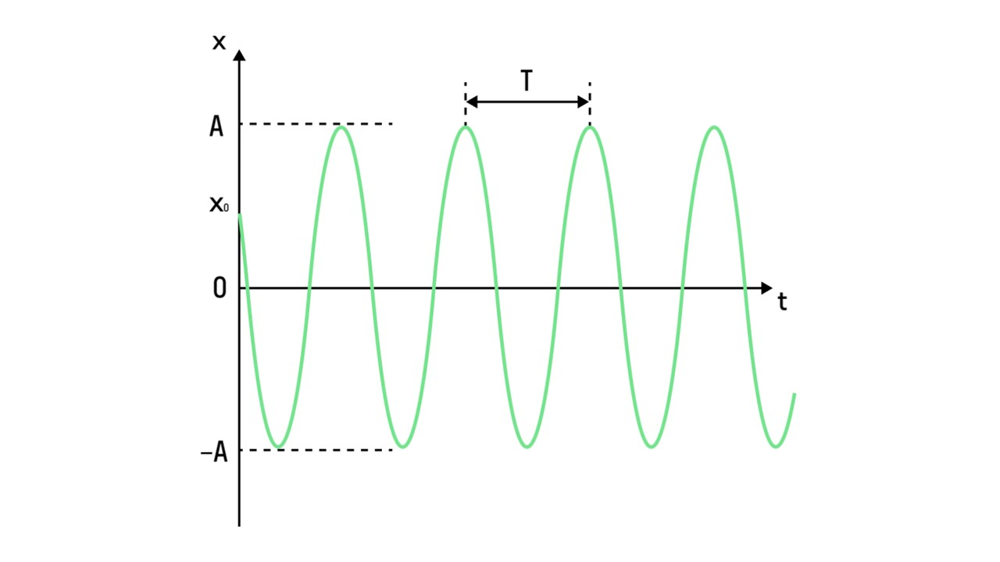

Механические колебания окружают нас повсюду — от раскачивания качелей до вибрации телефонного звонка. Это явление можно встретить в самых разных ситуациях: когда автомобиль проезжает по неровной дороге, или когда струна гитары издает звук. Сегодня мы разберёмся, что такое механические колебания, как они происходят и какие законы ими управляют. 

> [!info] Определение
> 
>
**Колебания — повторяющиеся около точки равновесия изменения состояния системы.**

Например колебание температуры. Точка равновесия это 0 градусов, а повышение и понижение температуры это колебания. Но сегодня мы поговорим о механических колебаниях

> [!info] Определение
> 
> 
**Механические колебания — колебательные (повторяющиеся во времени) движения тела или системы тел. Примером механических колебаний является движение струны музыкального инструмента, движение иголки швейной машины, а также возникновение звука и вибрации.**

Механические колебания характеризуются несколькими величинами

> [!info] Определение
> 
> **1) Амплитуда** — максимальное смещение относительно точки равновесия. Амплитуда обозначается буквой А и измеряется в СИ в метрах 
> 
> **2) Период** — время одного полного колебания. Период обозначается буквой Т, измеряется в СИ в секундах. Период можно рассчитать по формуле:
> 
> **T = t / N**
> 
> t - полное время всех колебаний, N - количество колебаний
> 
> **3) Частота** — величина, обратная периоду и характеризующая число полных колебаний в единицу времени. Обозначается буквой ν (ню) и измеряется в герцах (Гц). 
> 
> **ν = 1 / T = N / t**
> 
> **4) Циклическая частота** — это величина, характеризующая скорость колебательного процесса. Она показывает, сколько полных колебаний (в радианах) происходит за единицу времени. Её единица измерения — радианы в секунду (рад/с), обозначение — буква ω (омега). 
> 
> **ω = 2π / T = 2πν**
 
Период и амплитуду колебаний можно найти с помощью графика. Период на графике — это модуль изменения времени между соседними точками в равных положениях (например, между двумя вершинами графика). Амплитуда - это максимальное отклонение от точки равновесия

Механические колебания разобрали, перейдем к маятникам: [[38. Пружинный и математический маятники|⏩вперед]]

 

 
 

