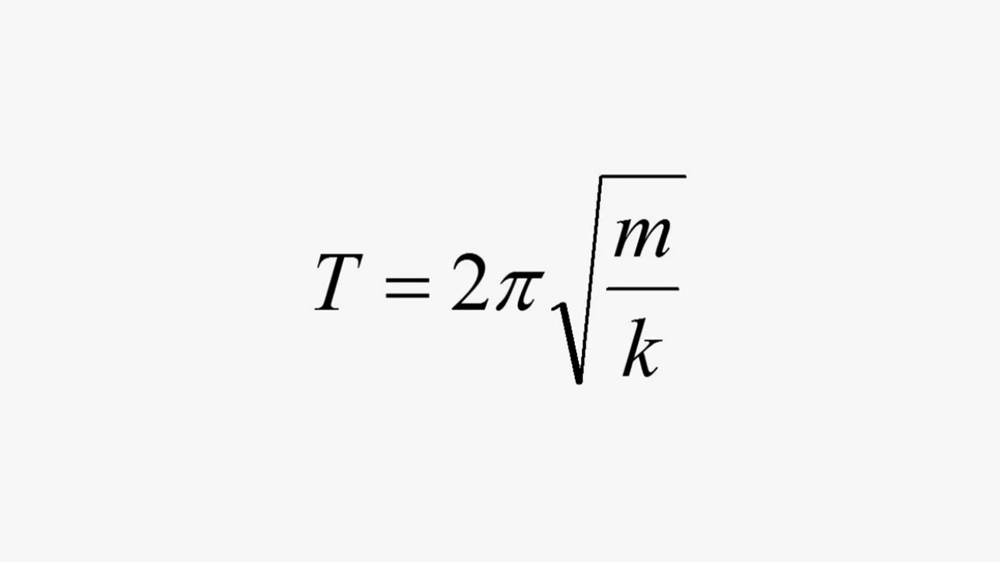

> [!info] Определение
> 
> **Пружинный маятник - это колебательная система, состоящая из материальной точки массой m и пружины.**

Вот так выглядит пружинный маятник. 

Период для пружинного маятника считается по формуле

> [!example] Формула

**m** - масса груза

**k** - коэффициент жесткости пружины