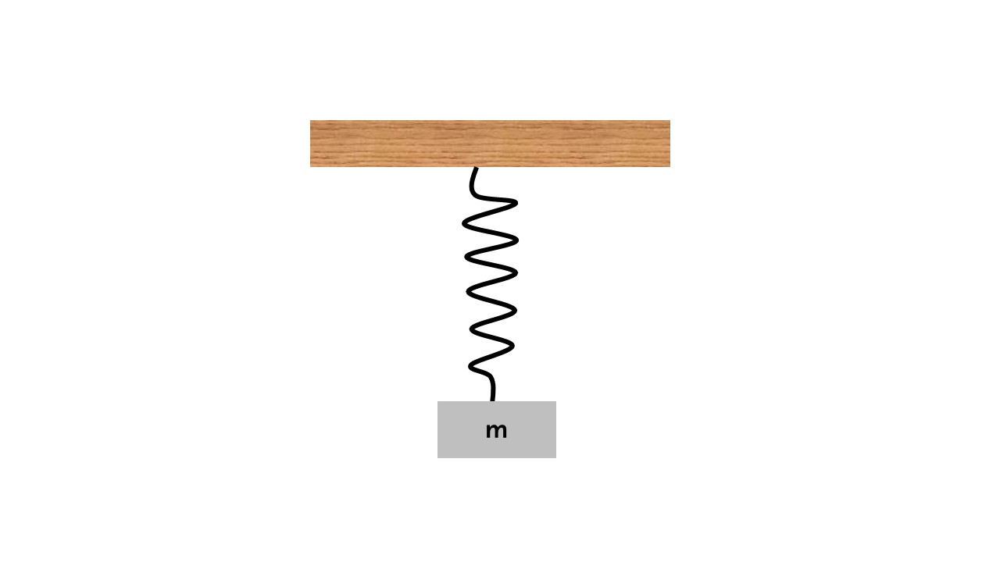
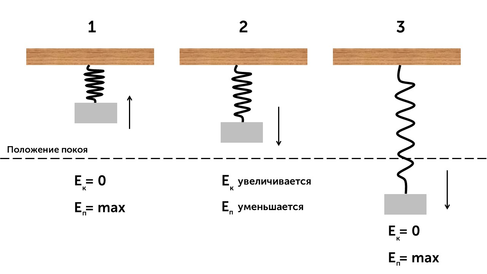
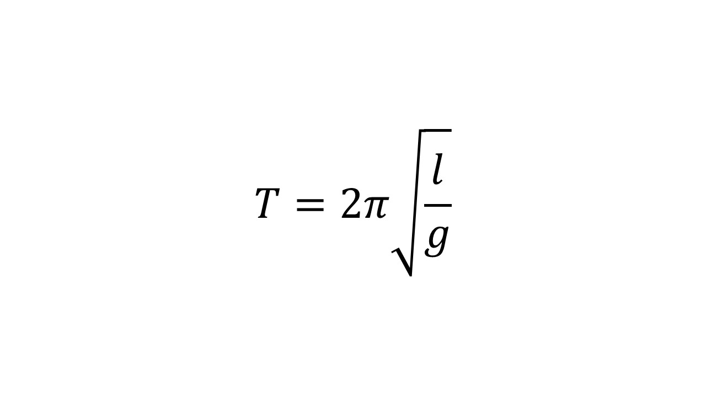
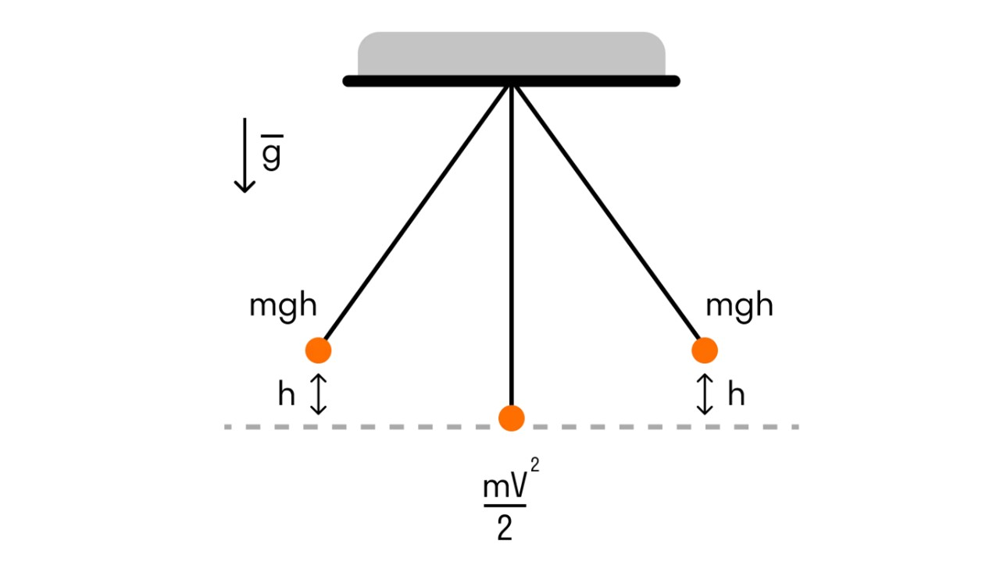

> [!info] Определение
> 
> **Пружинный маятник - это колебательная система, состоящая из материальной точки массой m и пружины.**

Вот так выглядит пружинный маятник. 

Период для пружинного маятника считается по формуле

> [!example] Формула

**m** - масса груза

**k** - коэффициент жесткости пружины

Давай посмотрим как меняется кинетическая и потенциальная энергия при движении маятника

**Положение 1**. Маятник сжали, он не имеет скорости. Потенциальная энергия максимальная, кинетическая 0

**Положение 2.** Маятник отпустили и он двигается вниз. Кинетическая энергия будет увеличиваться, а потенциальная уменьшаться, до прохождения положения покоя. После прохождения положения покоя кинетическая энергия будет уменьшаться, а потенциальная увеличиваться.

**Положение 3.** Маятник остановился в крайней нижней точке. Потенциальная энергия максимальная, кинетическая 0

Так маятник и будет двигаться пока кинетическая и потенциальная энергия не преобразуются в другую. А что у нас с математическим маятником?

> [!info] Определение
> 
> **Математическим маятником называется система, которая состоит из материальной точки массой m и невесомой нерастяжимой нити длиной l, на которой материальная точка подвешена, и которая находится в поле силы тяжести (или других сил).** 

> [!example] Формула

***l*** - длина нити

Рассмотрим закон сохранения энергии на примере математического маятника. 

Когда маятник отклоняют на высоту h, его потенциальная энергия максимальна.

Когда маятник опускается, потенциальная энергия переходит в кинетическую. Причем в нижней точке, где потенциальная энергия равна нулю, кинетическая энергия максимальна и равна потенциальной энергии в верхней точке. Скорость груза в этой точке максимальна. 

Фуф. С маятниками понятно. Давай еще поговорим про виды колебаний: [[39. Затухающие колебания. Вынужденные колебания. Резонанс|⏩вперед]]

