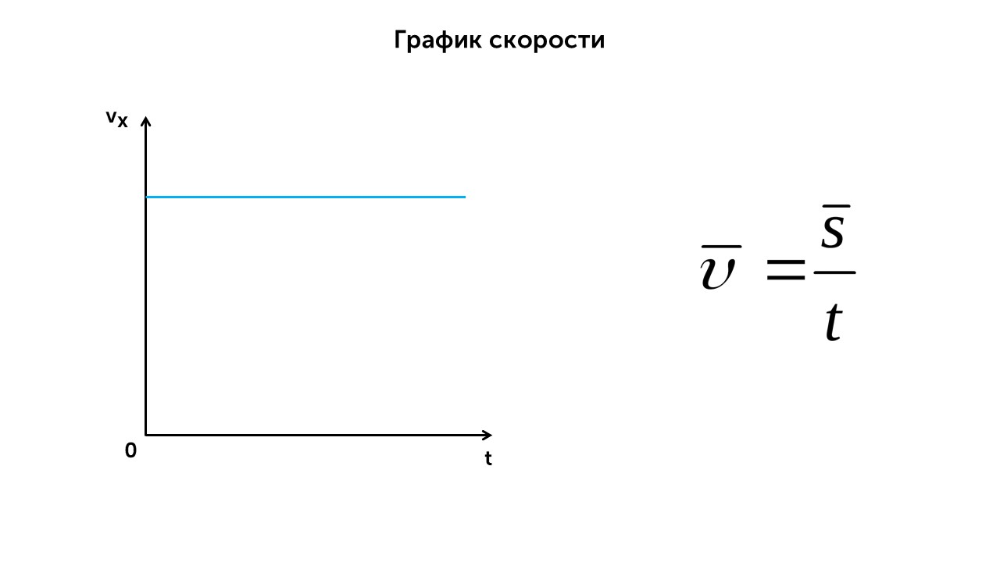
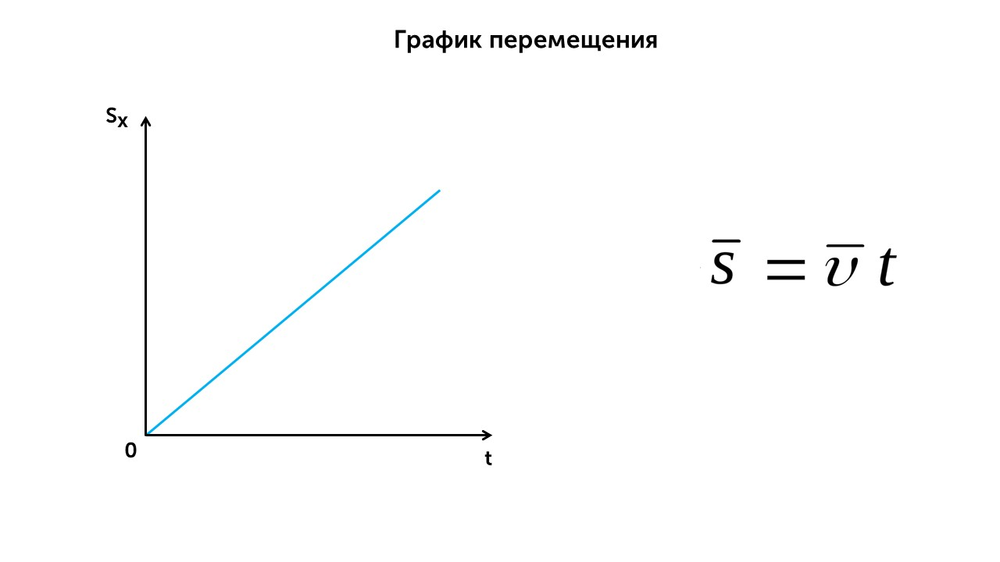
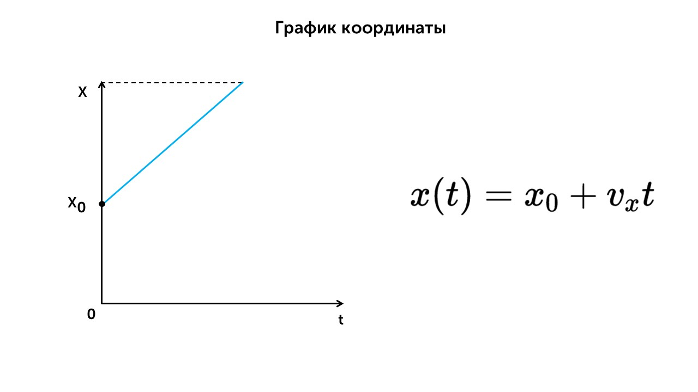
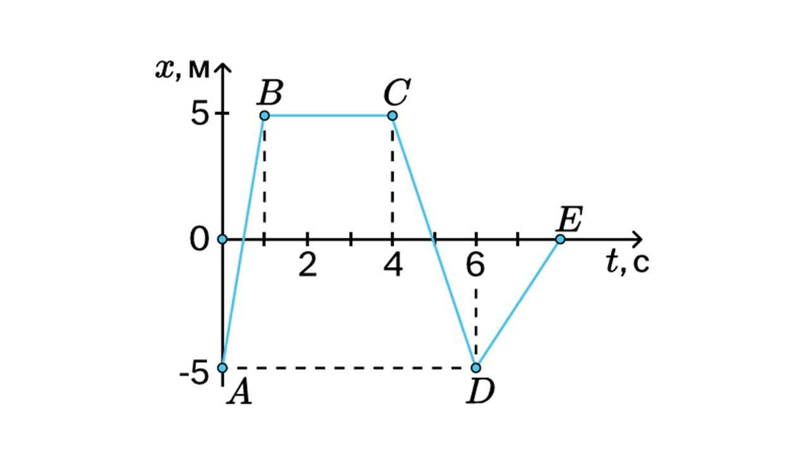

> [!info] Определение
> 
> **Равномерное движение — это движение, при котором тело за любые равные промежутки времени проходит одинаковое расстояние. При таком движении скорость тела постоянна**

Если мы едем на машине постоянно со скоростью 60 км/ч, то это равномерное движение. 

Для расчета равномерного движения используется формула зависимости координат от времени

> [!example] Формула
> 
> **x(t) = x0  + vx* t**

**x(t)** - координата тела в момент времени t,

**x0** - начальная координата (при t=0)

**vx** - проекция скорости на ось X

**t** - время

Давай посмотрим графики равномерного движения

Как ты помнишь, скорость во время равномерного движения не изменяется, поэтому на графике это и показывается. С изменением времени скорость не меняется (найти скорость можно по формуле справа)

С перемещением тоже все ясно. Так как скорость не меняется мы будем за равные промежутки времени проходить одинаковое расстояние. 

Здесь все тоже просто. Точка x0 показано начальное положение тела, x конечное положение, а синей линией показано изменение координаты тела в пространстве со временем. 

А теперь давай решим пару задачек

> [!question] Задача 1
> 
> **Тело находилось в точке с координатой 15 м, а через 1 минуту — в точке с координатой 120 м. Найдите скорость тела.**

По условию у нас есть:

**x0 = 15 метров** (это наша начальная координата)

**t = 1 минута** **= 60 секунд** (время за которое перемещалось тело, сразу переведем в секунды)

**x = 120 метров** (конечно положение тела)

**v - ?** (скорость нужно найти)

Запишем формулу зависимости координат от времени

 **x(t) = x0  + vx* t**

Выразим из нее скорость

**x(t) - x0 = vx* t

**vx = (x - x0 ) / t**

Подставим значения и найдем ответ

**vx = (120 - 15) / 60 = 1,75 м/с**

> [!question] Задача 2
> 
> **На рисунке представлен график зависимости координаты x от времени t для тела, движущегося вдоль оси Ох. Определите, с какой по модулю скоростью двигалось тело в интервале времени от 6 до 8 с.**

Для определения скорости нам нужно знать начальную, конечную координаты и время за которое между ними переместилось тело.

**t = 8 - 6 = 2 секунды**

Теперь смотрим на график и ищем какое значение координаты было при 6 секундах (начало движения) и 8 секундах (конец движения)

**Точка D = -5 м** (начало движения)

**Точка Е = 0** (конец движения)

Теперь подставляем все в формулу и получаем ответ

**vx = (0 - (-5)) / 2 = 2,5 м/с** 

Вот и все равномерное движение. Пора узнать про ускорение и равноускоренное движение: [[5. Ускорение. Равноускоренное прямолинейное движение|⏩вперед]]
