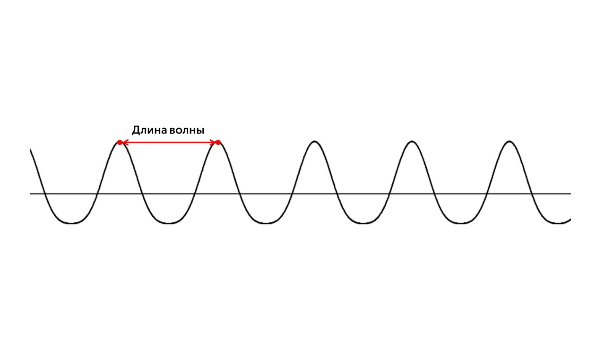

> [!info] Определение
> 
> **Звук — это колебания воздуха (или другой среды), которые наши уши воспринимают как слуховые ощущения.**

Как возникает звук? Источник звука (например, гитарная струна) колеблется, эти колебания передаются молекулам воздуха и возникают **звуковые волны** — чередующиеся сжатия и разрежения воздуха.

Теперь давай поговорим о величинах, которые определяют звук

> [!info] **Длина звуковой волны**
> 
> **Это расстояние между двумя одинаковыми точками волны (например, между двумя сжатиями)**

> [!example] Формула
> 
> **λ = v/υ**

**λ** - длина волны, лямбда (м)

**v** - скорость звука (м/с)

**υ** - частота, количество колебаний в секунду (Гц)

Также можно преобразовать эту формулу, выразив период через частоту

> [!example] Формула
> 
> **λ** = **vT**

Чем длина волны больше, тем звук ниже, а чем меньше, тем звук выше. Скорость звука сильно различается в разных средах. Чем более жесткая (или менее сжимаемая) среда, тем выше скорость звука. А вот громкость звука зависит от его амплитуды. Чем амплитуда больше, тем звук громче.

Вернемся к резонансу. Узнать эту длину волны очень просто – достаточно разделить скорость звука (330 метров в секунду) на частоту звука. Скажем, нота «ля» первой октавы у нас имеет частоту 440 герц. Тогда длина волны этой ноты «ля» будет равна 330 : 440 = 0,75 метра, то есть 75 сантиметров. Нетрудно догадаться: чем ниже та или иная нота, тем длиннее будет звуковая волна. Нота «ля» большой октавы имеет частоту 110 герц – то есть у неё длина будет уже 330 : 110 = 3 метра. И так далее.

А теперь представим себе, что у нас есть _пустой_ деревянный ящик, у которого от одной стенки до другой – ровнёхонько 75 сантиметров. Что произойдёт, если внутрь этого ящика вдруг «попадёт» нота «ля» первой октавы? Звуковая волна отражается от стенок ящика и как бы «накладывается» сама на себя, усиливает саму себя – 440 раз в секунду! Что в данном случае важно понять? У звуковой волны есть _**размер, длина,**_ то есть для возникновения резонанса нашей звуковой волне нужно «место». И чем ниже нота, чем ниже частота – тем больше места требуется этой волне, тем больших размеров нам нужен ящик-резонатор!

Так механическими явлениями закончили. Переходим к тепловым явлениям: [[../Тепловые явления/1. Основы МКТ. Агрегатные состояния вещества|Вперед🔥]]
