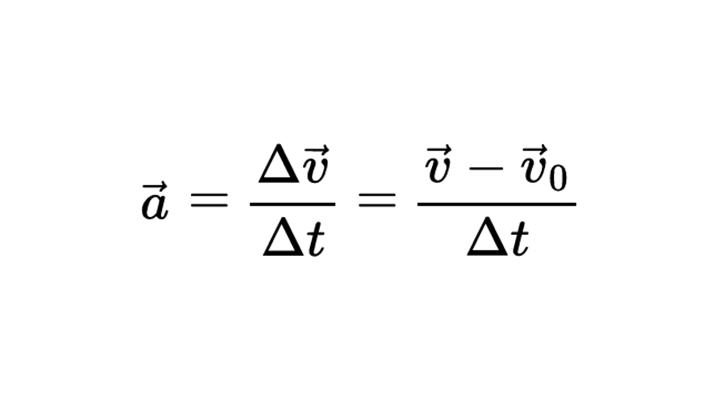
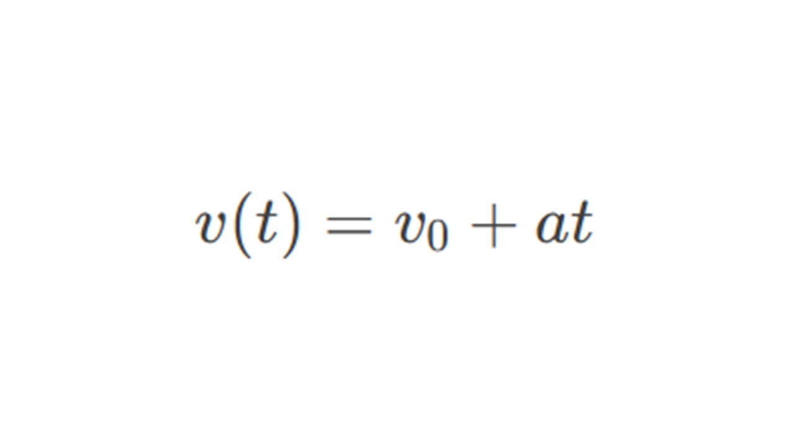
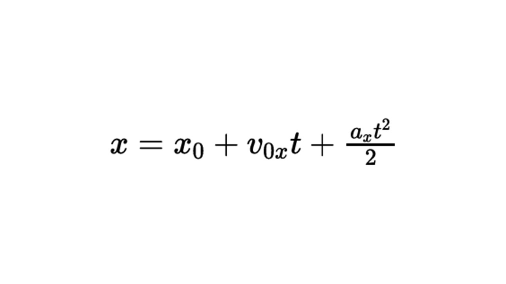
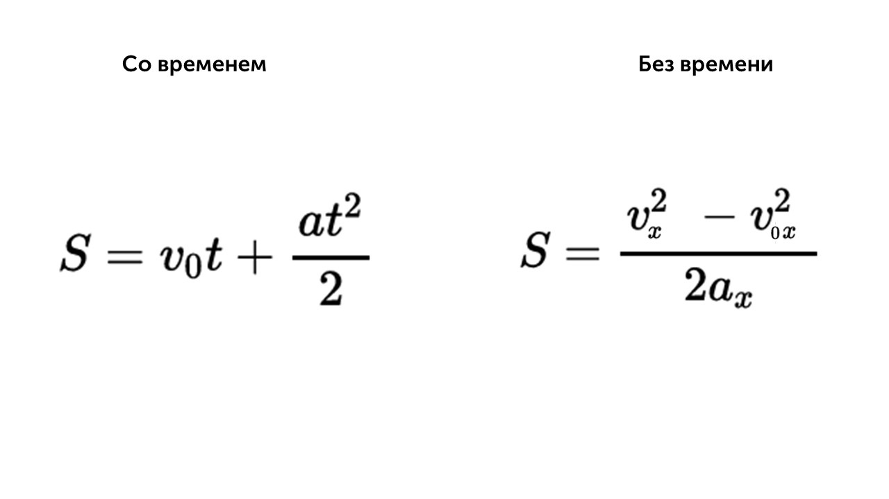
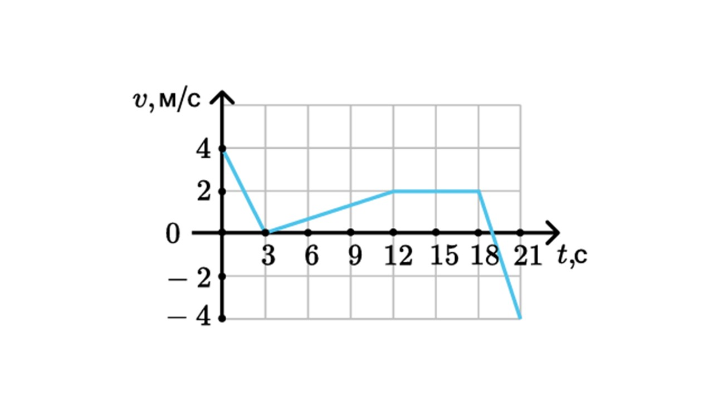
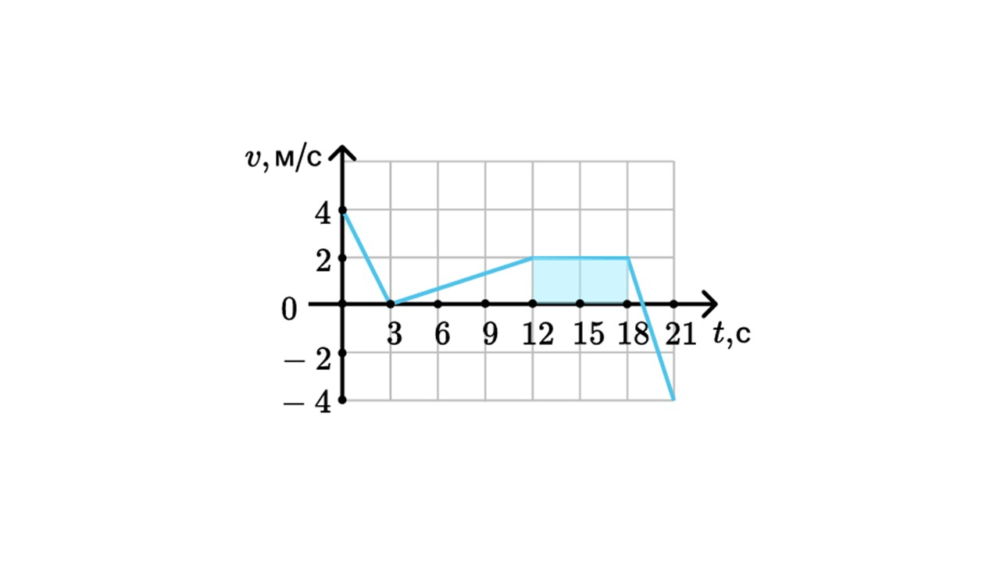
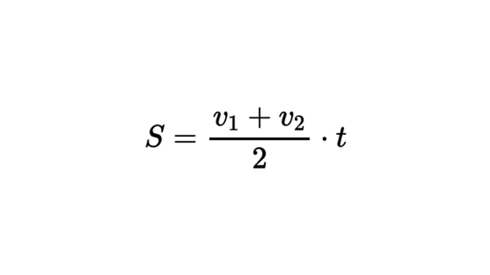
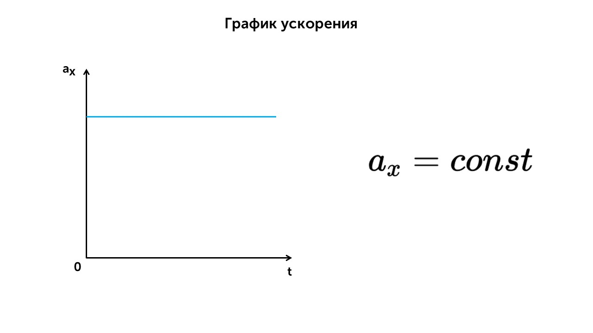
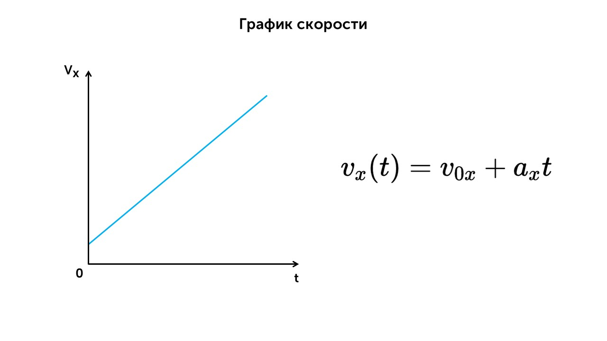
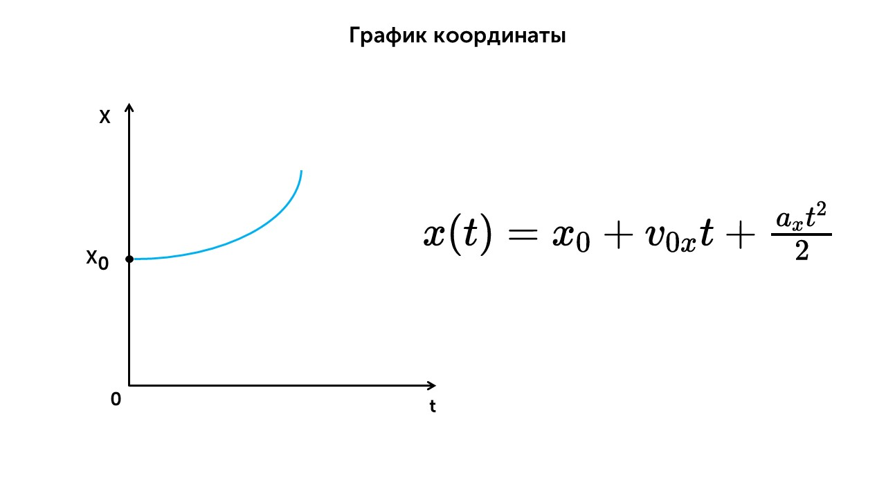

> [!info] Определение
> 
> **Ускорение — векторная величина, которая характеризует быстроту изменения скорости.**

Ускорение - это векторная величина , равная отношению изменения скорости (Δv⃗ ) к промежутку времени (Δt), за который это изменение произошло

> [!example] Формула
> 

**a** - ускорение (м/с$^2$)

**v** - конечная скорость (м/с)

**v0** - начальная скорость (м/с)

**t** - время (с)

В системе СИ ускорение измеряется в **метрах в секунду за секунду** (м/с$^2$).

> [!info] Определение
> 
> **Прямолинейное равноускоренное движение — движение по прямой, при котором за любые равные промежутки времени вектор скорости точки изменяется на равную величину.**

При равноускоренном движение ускорение постоянно, а скорость благодаря ему постепенно увеличивается на равную величину за равные промежутки времени.

Для нахождения скорости, координаты, пути при равноускоренном движении используются следующие формулы

> [!example] Формула

**v0** - начальная скорость (м/с)

**a** - ускорение (м/с$^2$)

**t** - время (с)

> [!example] Формула

**x** - конечная координата тела (м)

**x0** - начальная координата тела (м)

**v0x**  - начальная скорость тела (м/с)

**аx** - ускорение тела (м/с$^2$)

**t** - время (с)

> [!example] Формула

**S** - перемещение/путь (м)

**v0x**  - начальная скорость тела (м/с)

**аx** - ускорение тела (м/с$^2$)

**t** - время (с)

**vx**  - конечная скорость тела (м/с)

Перемещение можно находить не только при помощи формулы, но и при помощи графика

> [!warning] Важно помнить
> 
> **Чтобы найти пройденный путь по графику скорости при равноускоренном движении, нужно вычислить площадь под частью графика, соответствующей определённому интервалу времени**.

Давай посмотрим на примере, у нас есть график скорости

И нужно найти пройденный путь с 12 по 18 секунды. Пройденный телом путь численно равен площади под графиком v(t). В нашем рисунке это вот этот прямоугольник

**S = 2 * (18 - 12) = 12 м**

При движении в одном направлении путь можно найти так

> [!example] Формула

**v1**  - начальная скорость тела (м/с)

**v2**  - конечная скорость тела (м/с)

**t** - время (с)

Осталось только рассмотреть графики равноускоренного прямолинейного движения

При равноускоренном движении ускорение постоянное (a = const), если a > 0, то тело разгоняется, если а < 0, то тело тормозит

Все тоже понятно, скорость благодаря ускорению увеличивается со временем. Если график идет вверх, то а > 0, скорость увеличивается, если a < 0, скорость уменьшается. Площадь под графиком (синей линией) равно пройденному пути

График координаты - это парабола. Сначала скорость у тела маленькая и оно перемещается на небольшое расстояние, потом скорость увеличивается и тело перемещается на большее расстояние за меньшие промежутки времени.

Теперь пойдем разберем свободное падение: [[6. Свободное падение. Вертикальный полет тела|Погнали🔥]]

