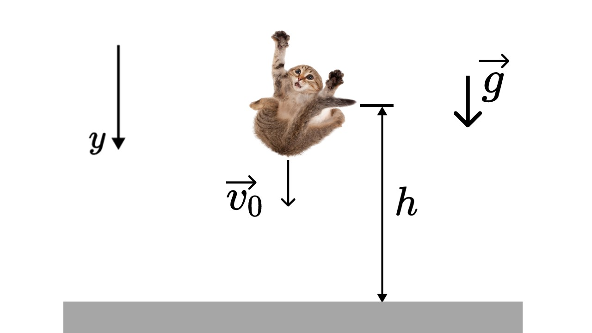
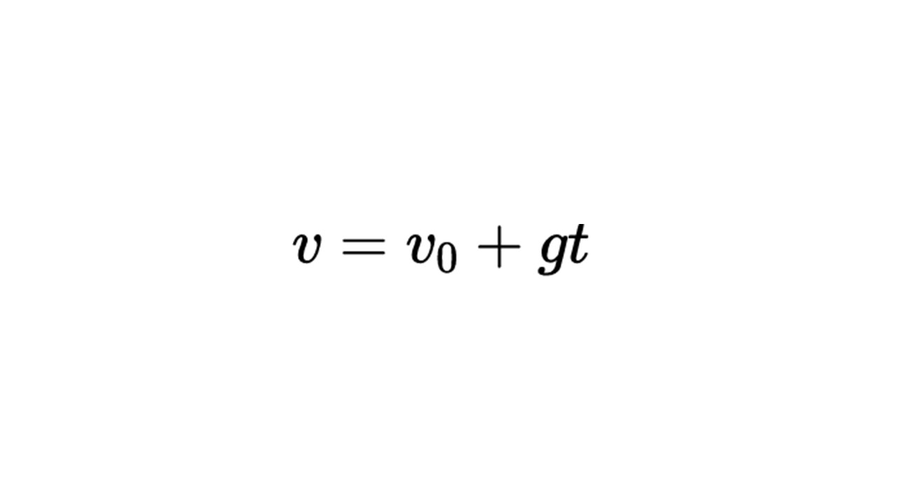
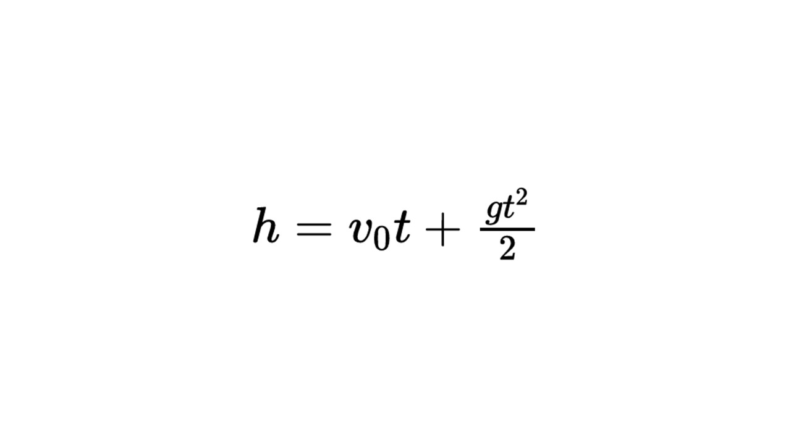

Сейчас мы с тобой чуть-чуть узнаем про полет тел✈️

> [!info] Определение
> 
> **Свободное падение – это движение по вертикальной оси под действием силы тяжести, когда другие силы, действующие на тело, отсутствуют или пренебрежимо малы.**

Например мальчик упал с гаража на землю и во время полёта мальчик будет находится в свободном падении. При полете на мальчика будет действовать ускорение свободного падения

> [!info] Определение
> 
> **Ускорение свободного падения всегда направлено вертикально вниз. 
 Для задач кинематики оно равно постоянной величине g = 10 м/с²**

**Вертикальный полет тела** может включать:

Движение вверх (замедленное с ускорением −g).
    
Падение вниз (ускоренное с ускорением +g).

Давай рассмотрим как рассчитывать величины связанные с свободным падением

Есть основные три величины

**h** - это высота с которой падает тело (м)

**v0** - это начальная скорость с которой падает тело (м/с)

**g** - это ускорение свободного падения (10 м/с²)

> [!example] Формула

Так как скорость и ускорение свободного падения векторные величины, то знаки перед ними нужно ставить в соответствии с осью Y. На рисунке ось Y направлена вниз, поэтому перед v0 и g стоит знак плюс.

> [!example] Формула

Чтобы найти высоту свободного падения необходимо знать начальную скорость и время полета

Про свободное падение мы все узнали, теперь давай узнаем про движение по окружности: [[7. Движение по окружности. Период и частота|Покатились]]

