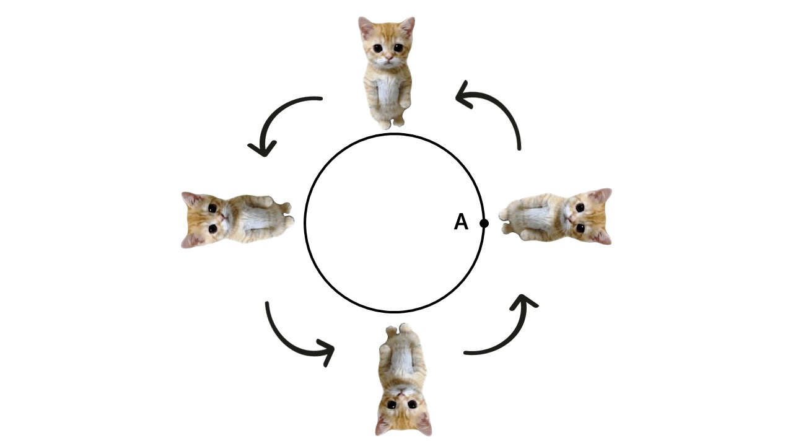
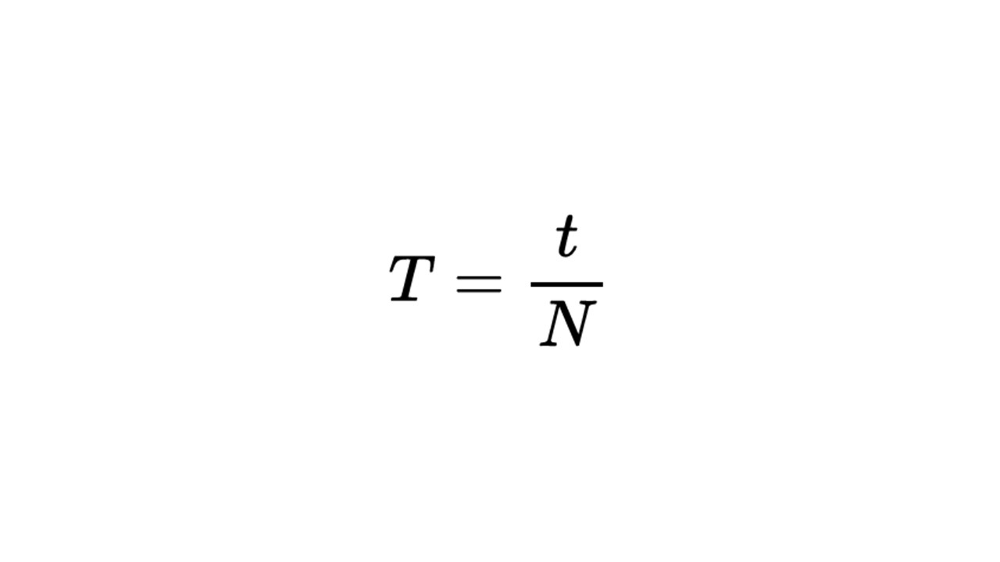
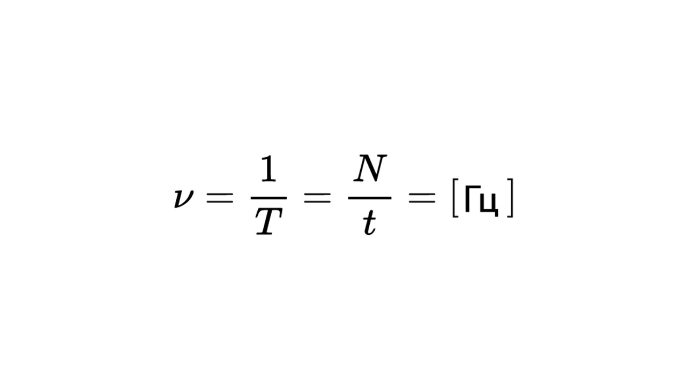

Для равномерного движения по окружности вводят такие физические величины, как период и частота обращения

> [!info] Определение
> 
> **Период — время, за которое тело проходит всю длину окружности и возвращается в исходную точку.**

Например котик стоял в точке А и время за которое он пройдет окружность и вернется в точку А называется период

> [!example] Формула

**T** - период (с)

**t** - время, в течение которого двигалось тело (с)

**N** - количество оборотов, которое сделало тело (это просто количество не имеет единицы измерения)

> [!info] Определение
> 
> **Частота — это величина, обратная периоду. Показывает, как много оборотов совершает тело в единицу времени**

> [!example] Формула

Буква обозначающая частоту называется **«ню»**. Давай решим задачку

> [!question] Задача 1
> 
> **Колесо автомобиля за t = 6 с совершило 30 оборотов. Найдите период и частоту вращения колеса.**

Все супер легко, нам дано

**t** = 6 c

**N** = 30

Подставим данные в формулы периода и частоты

**T = t / N = 6 / 30 = 0,2 c**

**ν = 1 / T = 1 / 0,2 = 5 Гц**

С периодом и частотой все понятно, теперь давай познакомимся с угловой скоростью: [[8. Угловая и линейная скорость. Центростремительное ускорение|Погнали]]
