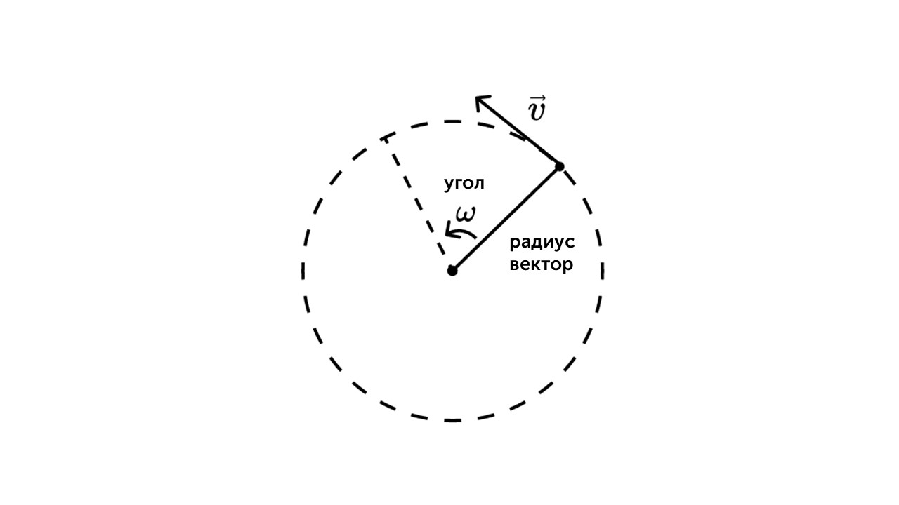
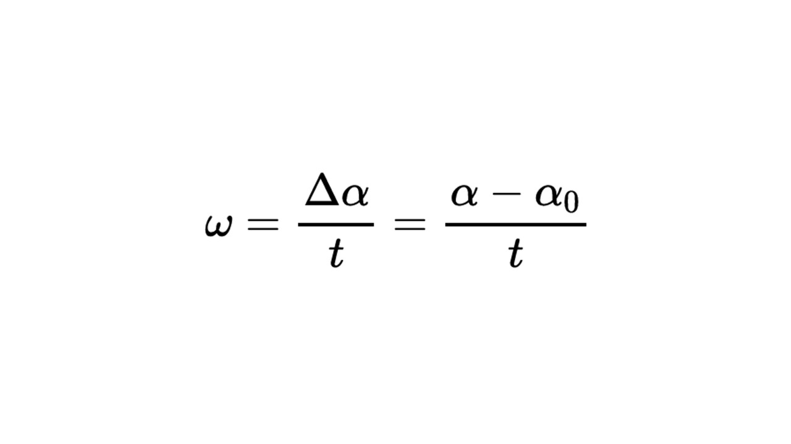
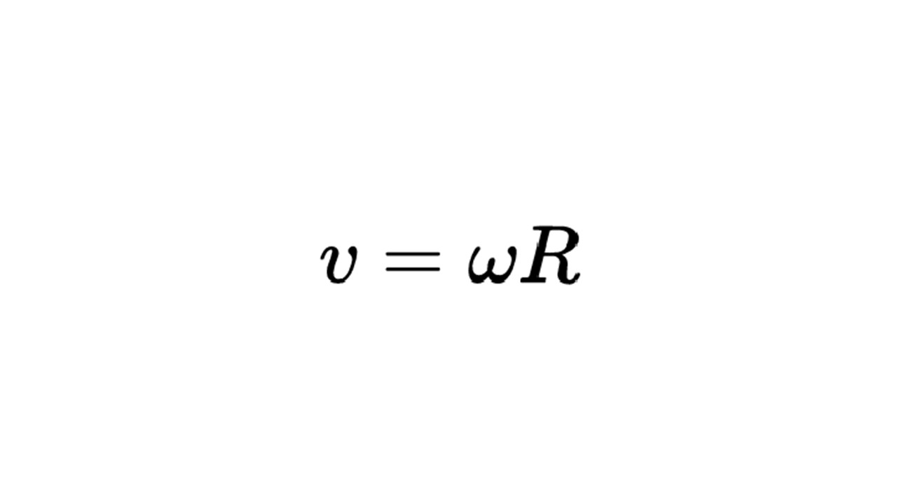
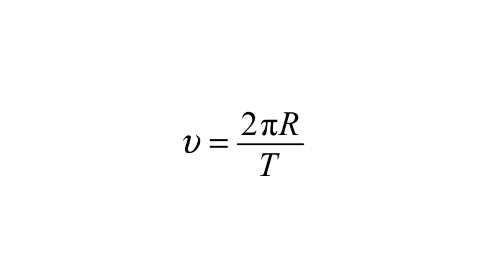
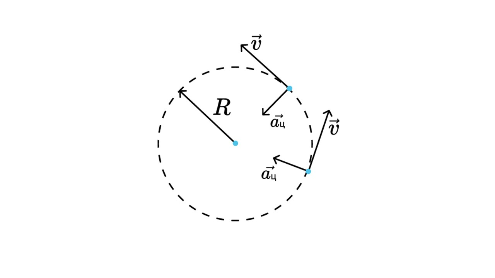
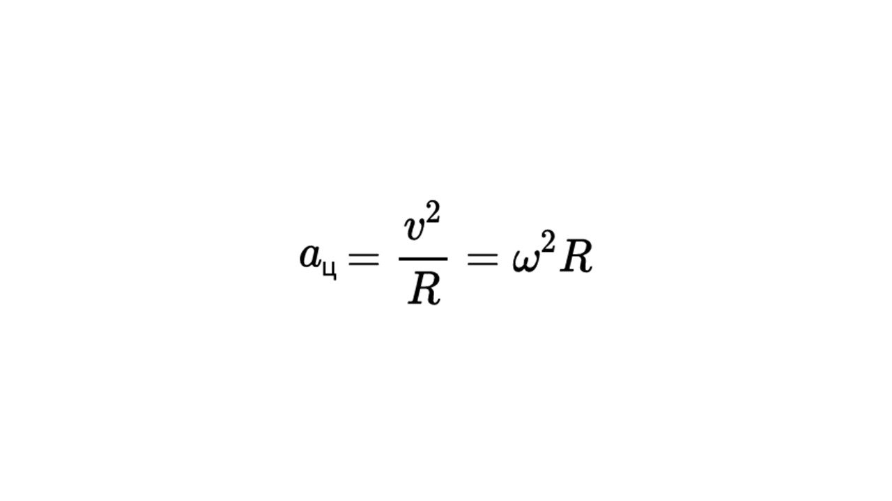

**Угловая и линейная скорости** — физические величины, которые характеризуют движение материальной точки по окружности.

> [!info] Определение
> 
> **Угловая скорость показывает, на какой угол поворачивается радиус-вектор точки за единицу времени. В международной системе единиц измерения угловую скорость принято измерять в радианах в секунду.**

То есть угловая скорость, это просто угол на который поворачивается радиус-вектор относительно центра окружности 

> [!example] Формула

**ω** - угловая скорость (рад/с)

**α** - конечный угол (рад, °)

**α0** - начальный угол (рад, °)

**t** - время (c)

 > [!info] Определение
 > 
 > **Линейная скорость — это скорость, с которой точка проходит путь по дуге окружности. Она определяется как отношение пройденного пути к времени. Вектор линейной скорости всегда направлен по касательной к траектории, в данном случае — по касательной к окружности.**
 
 Линейная скорость тесно связана с угловой скоростью

> [!example] Формула

**v** - линейная скорость (м/с)

**ω** - угловая скорость (рад/с)

**R** - это радиус окружности (м)

Также линейную скорость можно вычислить зная радиус окружности и период

Теперь давай разберем понятие центростремительного ускорения

 > [!info] Определение
 > 
 > **Центростремительное ускорение (aц​) — это ускорение, которое возникает при движении тела по окружности. Оно всегда направлено к центру окружности и отвечает за изменение направления скорости**
 

> [!example] Формула

**aц** -  центростремительное ускорение (м/с$^2$)

**v** - линейная скорость (м/с)

**R** - радиус окружности (м)

**ω** - угловая скорость (рад/с)

Теперь давай решим задачку 

> [!question] Задача 1
> 
> **Колесо обозрения диаметром 80 м имеет скорость крайних точек 0,2 м/с. Чему равна угловая скорость крайних точек колеса? Ответ дайте в рад/с.**

Итак. У нас дано

**D = 80 м** (сразу найдем радиус **R = 40**)

**v** = 0,2 м/с

**ω** - ?

Выразим угловую скорость из этой формулы **v** = **ωR**

**ω = v / R**

**ω = 0,2 / 40 = 0,005 рад/с**

На этом все. Переходим к новому разделу - прошу любить и жаловать: [[9. Масса и плотность вещества|Динамика]]
