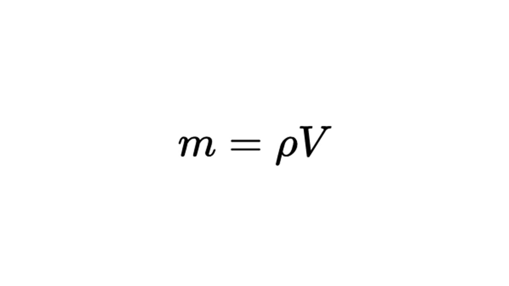

> [!info] Определение
> 
> **Динамика – раздел механики, в котором изучаются причины изменения механического движения**

**Масса и плотность вещества** — две важные физические величины, которые описывают свойства объектов

> [!info] Определение
> 
> **Масса – это фундаментальная физическая величина, которая характеризует инертность тела или его способность сохранять свое состояние покоя или движения.**

Также масса показывает количество вещества в теле. Единица измерения массы - это кг. 

> [!info] Определение
> 
> **Инертность — это свойство тела сопротивляться изменению скорости (т. е. сохранять состояние покоя или равномерного прямолинейного движения).**

Чем больше масса тела тем его инертность больше и тем сложнее разогнать тело (грузовик разгоняется медленнее чем легковой автомобиль) и остановить его (поезд останавливается дольше чем велосипед)

Масса тела определяется его размерами и плотностью вещества из которого состоит тело

> [!example] Формула

**m** - масса тела (кг)

**ρ** - плотность тела "Ро" (кг/м³)

**V** - объем тела (м³)

Давай разберем что такое плотность тела

> [!info] Определение
> 
> **Плотность — это физическая величина, которая показывает, какая масса вещества содержится в единице объема**

Плотность вещества зависит от того сколько молекул вещества (масса) содержится в единице объема, чем больше молекул, тем плотность выше. На рисунке видно, что плотность алмаза больше чем плотность древесины.

Теперь давай узнаем что такое сила: [[10. Сила. Равнодействующая сила|Узнать]]
