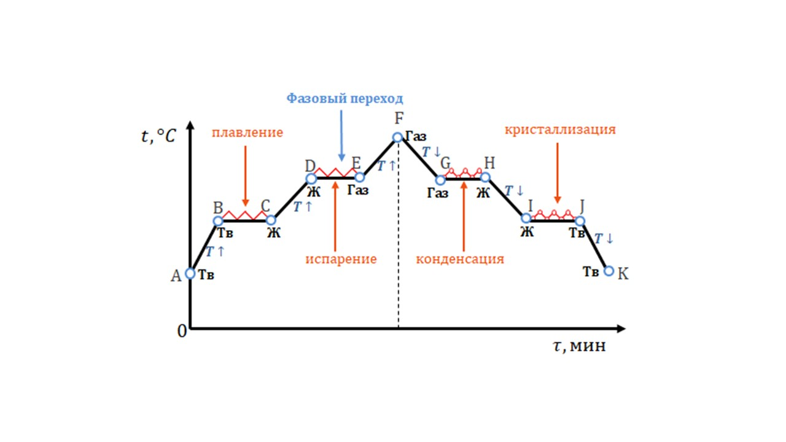
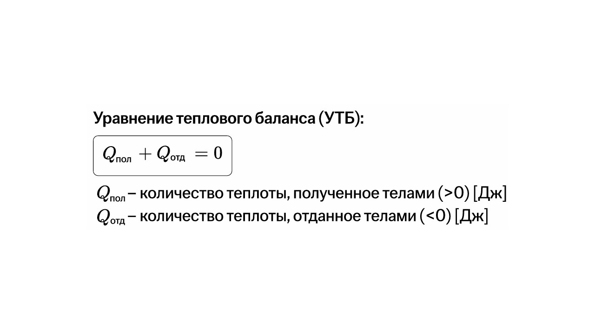

На рисунке показано как ведет себя твердое тело при повышении температуры. Пусть этим твердым телом будет кубик льда🧊

Разберем каждый участок

**A - B:** кубик льда начинает нагреваться (тело твердое)

**B - C:** кубик начинает плавиться (тело из твердого состояния переходит в жидкое)

**С - D:** кубик растаял осталось только вода, которая начинает нагреваться (тело жидкое)

**D - Е:** вода начинает кипеть и превращаться в газ

**E - F:** вся вода испарилась, остался только газ

В точке **F** температура начинает понижаться. На участке **A - F** энергия (Q) увеличивается

**F - T:** газ начинает остывать

**G - H:** газ остыл и начинает превращаться в воду (конденсация)

**H - I:** вода начинает остывать

**I - J:** вода начинает замораживаться и превращаться в лед

**J - K:** снова получился кубик льда 🧊

На участке **F - K** энергия (Q) уменьшается. Этот график показывает нам что такое тепловой баланс

> [!info] Определение
> 
> **Тепловой баланс — это состояние, когда количество теплоты, которое поступает в систему, равно количеству теплоты, которое из неё уходит. Это описывает закон сохранения тепловой энергии: количество теплоты, отданное горячим телом, равно количеству теплоты, полученному холодным телом.**

Закон сохранения тепловой энергии описывается такой формулой

При таком использовании УТБ можно не заморачиваться, где температура больше 
 или меньше, а всегда подставлять **t конечная – t начальная**. Все знаки минусов уйдут сами при решении уравнения.

Осталось последняя тема из блока тепловой энергии, погнали: [[12. Внутренняя энергия сгорания топлива. Тепловой двигатель|⏩вперед]]
