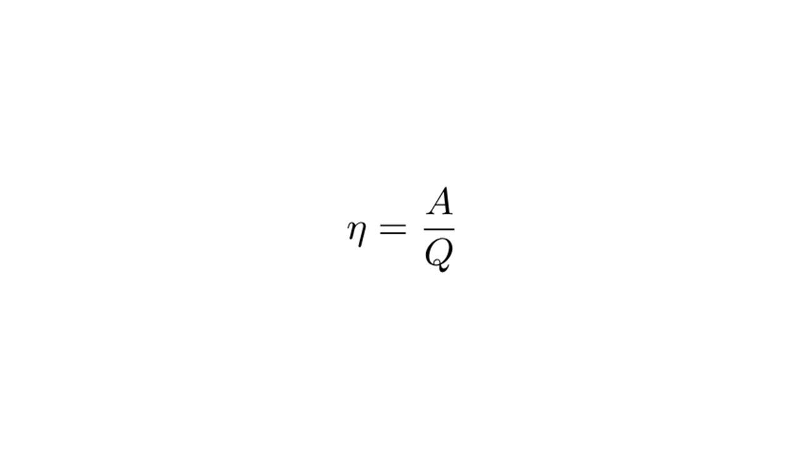

При сгорании топлива (бензин, уголь, газ и др.) происходит химическая реакция окисления, в результате которой выделяется большое количество теплоты.

> [!example] Формула
> 

**Q = qm**

**Q** – количество теплоты, выделяющееся при сгорании (Дж)

**q** – удельная теплота сгорания (Дж/кг)

**m** – масса вещества (кг)

На основе тепловой энергии был создан тепловой двигатель

> [!info] Определение
> 
> **Тепловой двигатель — устройство, преобразующее тепловую энергию (от сгорания топлива) в механическую работу.**

Тепловой двигатель может работать на нескольких принципах

**Нагревание рабочего тела:** (газ, пар) за счёт сгорания топлива🔥

**Расширение газа:** совершение работы (например, движение поршня)⛽️

**Охлаждение:** и возврат в исходное состояние (цикл)🥶

КПД теплового двигателя считается вот так

> [!example] Формула

**А** – полезная работа, которую совершает двигатель (Дж)

**Q** – количество теплоты, выделившееся при сгорании топлива

Поздравляю🎉

Еще один раздел физики закрыт, теперь давай перейдем к довольно интересному разделу, электромагнитные явления: [[../Электромагнитные явления/1. Электризация тел. Электрические заряды|⏩вперед]]
