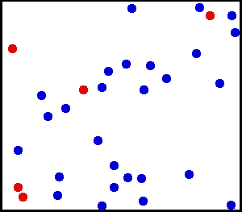

#### Тепловое движение атомов и молекул

**Тепловое движение** - это процесс беспорядочного движения частиц, образующих вещество. Чем больше скорость движения частиц, тем тело более нагрето, и наоборот - чем медленнее движутся частицы вещества, тем тело холоднее

Примерно вот так выглядит движение молекул. 

#### Броуновское движение

> [!info] Определение
> 
> **Броуновское движение — беспорядочное движение микроскопических видимых частиц твёрдого вещества в жидкости или газе. Частицы движутся независимо друг от друга и описывают сложные зигзагообразные траектории.**

Открыл это явление ботаник Роберт Броун 🌿

Причина броуновского движения — **неравномерные столкновения постоянно движущихся молекул жидкости или газа** с частицами. Так как молекулы движутся хаотично, то броуновские частицы получают толчки с разных сторон, что и приводит к хаотичному движению.

Представьте себе, что мы издалека наблюдаем, как плотная толпа людей толкает над собой большой мяч. Причём каждый толкает мяч, куда хочет. Мы не видим отдельных игроков, потому что поле далеко от нас, но мяч мы видим — и замечаем, что перемещается он очень беспорядочно. Мяч постоянно меняет направление своего движения, и пойти в какую-нибудь определенную сторону не желает. Предсказать его местоположение через заданное время — нельзя. Вот так можно представить броуновское движение.

#### Диффузия

> [!info] Определение
> 
> **Диффузия — это процесс взаимного проникновения молекул одного вещества между молекулами другого, который приводит к самопроизвольному выравниванию концентраций по всему занимаемому объёму.**

##### Диффузия в газах

Молекулы газов расположены на значительном расстоянии друг от друга и движутся с большой скоростью, поэтому диффузия в газах протекает быстро. Компонент смеси стремится заполнить ту часть пространства, где его концентрация меньше, и система возвращается к равновесному однородному состоянию.

Например, мы пшикаем духами и начинаем слышать их аромат. Это происходит из-за того что молекулы духов проникают между молекулами воздуха и мы слышим аромат.

##### Диффузия в жидкостях

Частицы жидкости движутся медленнее, чем молекулы газа, поэтому диффузия занимает больше времени. Чем больше густота и вязкость жидкости, тем медленнее идёт процесс.

Если мы в горячий чай добавим молоко, то они быстро смешаются, потому что чай горячий и молекулы двигаются быстро. А если добавить в холодную воду молоко, то придется долго размешивать его, из-за медленного движения молекул воды и молока. 

> [!warning] Важно запомнить
> 
> **Диффузия ускоряется при повышении температуры, так как с увеличением температуры увеличивается скорость движения молекул.**

##### Диффузия в твердых телах

Молекулы твёрдых тел не перемещаются в пространстве, а лишь колеблются на своих местах в кристаллических решётках, поэтому диффузия в них возможна, но происходит очень медленно. Чтобы молекулы одного твёрдого вещества проникли в другое всего на несколько миллиметров, понадобятся годы.

Для заметного ускорения диффузии твёрдых тел необходима высокая температура. Например, если положить два слитка разных металлов друг на друга, то даже за несколько лет слой смешанного вещества на их стыке будет всего в пару миллиметров толщиной.

Тут разобрались, давай узнаем про смачивание и капиллярные явления: [[3. Смачивание и капиллярные явления|⏩вперед]]
