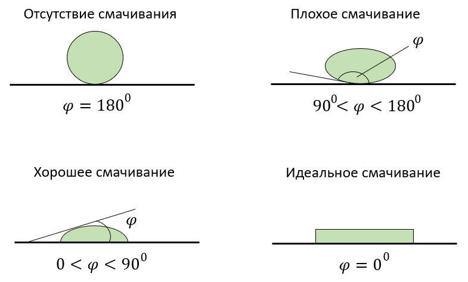

#### Смачивание

> [!info] Определение
> 
> **Смачивание — это способность жидкости растекаться по поверхности твёрдого тела.**

Если жидкость смачивает поверхность (например, вода на стекле), она растекается, образуя острый край с поверхностью (угол смачивания меньше 90°).

Если не смачивает (например, ртуть на стекле или вода на жирной поверхности), жидкость собирается в капли, угол смачивания больше 90°.

#### Капиллярные явления

> [!info] Определение
> 
> **Капиллярные явления — это физические процессы, которые происходят в узких трубках (капиллярах) или пористых материалах, связанные с движением жидкости под воздействием сил сцепления и поверхностного натяжения.**

Когда жидкость попадает в капилляр или пористый материал, молекулы жидкости взаимодействуют с молекулами стенок. Если силы сцепления между жидкостью и стенками больше, чем между молекулами жидкости, то жидкость поднимается вверх по трубке — это капиллярный подъём.

Обратный процесс — капиллярное понижение — происходит, когда силы сцепления между молекулами жидкости больше, чем сцепление с твёрдой поверхностью. Например, в пористых материалах, таких как песок, вода может не подниматься, а опускаться вниз. 

Давай глянем на пару примеров

- **Подъём воды по стеблю растения🪴**. Корни растений поглощают воду из почвы, и эта вода поднимается по стеблю благодаря капиллярным явлениям. 
- **Перемещение грунтовых вод💦**. По капиллярам в почве грунтовые воды поднимаются к корневой системе растений. 
- **Впитывание жидкости материалом🧽**. Например, бумажные полотенца впитывают воду за счёт капиллярного действия, а мелкие поры губки действуют как маленькие капилляры.

Эти темы очень редко встречаются на экзамене, но понимать их нужно. Теперь давай поговорим про тепловое и расширение и сжатие: [[4. Тепловое расширение и сжатие. Тепловое равновесие|⏩вперед]]
