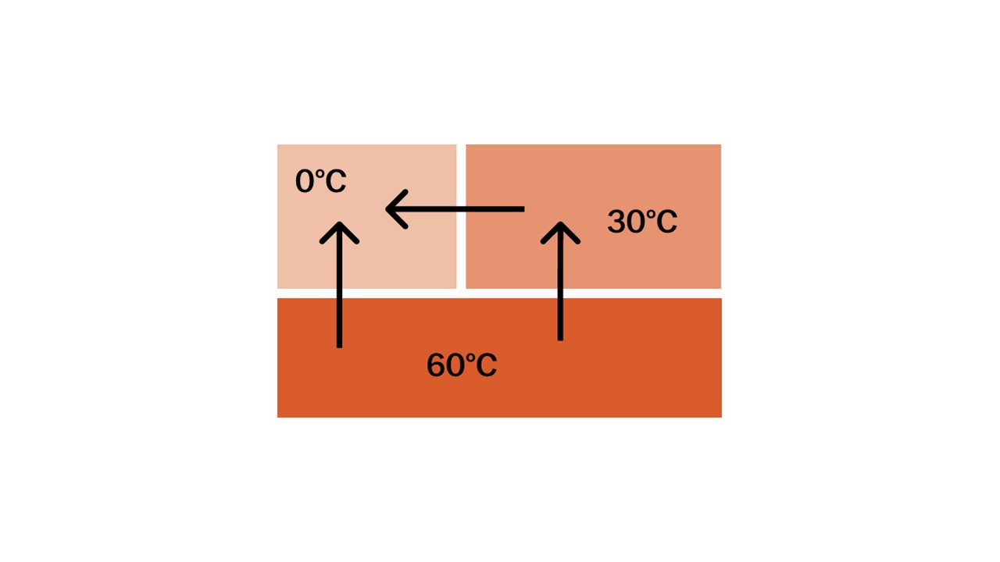

#### Что такое теплота?

> [!info] Определение
> 
> **Теплота — это мера энергии, переходящей от одного более нагретого тела к другому менее нагретому телу в процессе теплопередачи**

Как переходит тепло от тел разной температуры увидишь на рисунке ниже

Разберем как тепло может переходить от одного тела к другому.

#### Теплопроводность

> [!info] Определение
> 
> **Теплопроводность – теплопередача от более нагретых участков тел к менее нагретым за счет соприкосновения друг с другом.**

Теплопроводность напрямую зависит от расстояния между молекулами вещества. Таким образом, вещества с наихудшей теплопроводностью – это все газы и практически все жидкости, стекло, дерево и пористые тела такие как шерсть, волосы, перья птиц, бумага, пробка и так далее.

Самым нетеплопроводным является вакуум. Самой высокой теплопроводностью обладают металлы.

#### Конвекция

> [!info] Определение
> 
> **Конвекция – передача теплоты струями жидкостей или газов.**

Явление конвекции обусловлено движением несравнимо больших групп частиц (относительно размеров отдельных частиц). Например при нагревании комнаты при помощи радиатора, струи горячего воздуха выходят из него и смешиваются с холодным воздухом и нагревают его.

#### Излучение

> [!info] Определение
> 
> **Излучение – передача теплоты посредством электромагнитных волн (без переноса вещества).**

Примером излучения тепла может быть

**Свеча🕯**

**Солнце🌞**

**Костер🔥**

При излучении тёмные тела поглощают тепло лучше, чем светлые.

Теперь давай поговорим о влажности: [[7. Влажность воздуха|⏩вперед]]

