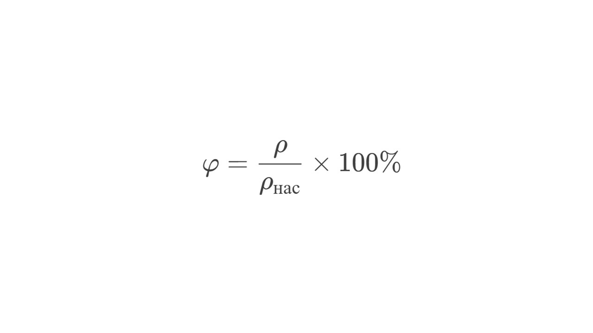

#### Влажность

> [!info] Определение
> 
> **Влажность воздуха — это показатель количества водяного пара в атмосфере. Она влияет на погоду, самочувствие людей, работу техники и сохранность материалов.**

Думаю, ты слышал про увлажнители воздуха. Этот аппарат просто выпрыскивает воду, повышая влажность в комнате. Есть два основных понятия влажности

#### Абсолютная влажность

> [!info] Определение
> 
> **Абсолютная влажность - количество водяного пара в единице объема воздуха (г/м³).**

> [!example] Формула
> 
> **ρ = mпара /  Vвоздуха**

#### Относительная влажность

> [!info] Определение
> 
> **Относительная влажность - отношение текущего количества пара к максимально возможному при данной температуре.**

> [!example] Формула

**ρ** — абсолютная влажность

**ρнас** — плотность насыщенного пара при той же температуре

При насыщении пара установлено равновесие между испарением и конденсацией: число молекул, вылетающих из жидкости в единицу времени, равно числу молекул, возвращающихся в неё. Это означает, что при данной температуре в определённом объёме не может находиться большее количество пара. Такой пар называется насыщенным

Эта тема редко встречается на экзамене, но знать ее нужно. Теперь давай перейдем к базовой теме, которую обязательно нужно знать: [[8. Нагревание и охлаждение тел. Количество теплоты. Удельная теплоёмкость|⏩вперед]]

