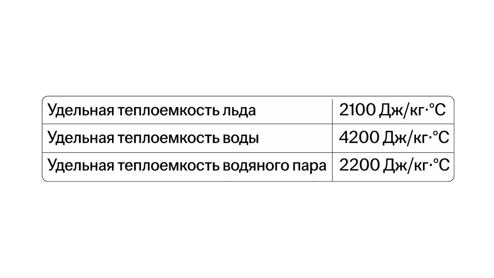

#### Теплоемкость

Перед нагреванием и охлаждением давай поговорим о теплоемкости.

> [!info] Определение
> 
> **Теплоёмкость — физическая величина, которая характеризует способность вещества поглощать или отдавать тепло при изменении его температуры. Чем выше теплоёмкость, тем больше тепла материал может «впитать» при нагреве и «отдать» при охлаждении.** 

Измеряется теплоемкость по такой формуле:

> [!example] Формула

**C = Q / ΔT**

**C** – теплоёмкость (Дж/К)

**Q** – количество теплоты, переданное телу в процессе (Дж)

**ΔT** – изменение температуры тела в процессе (°C)

Существует еще удельная теплоемкость, она вычисляется по такой формуле:

> [!example] Формула

**c = Q / mΔT**

**c** – удельная теплоёмкость (Дж/кг·°С)

**Q** – количество теплоты, переданное телу в процессе (Дж)

**ΔT** – изменение температуры тела в процессе (°C)

**m** – масса вещества (кг)

Ключевое различие между теплоемкостью и удельной теплоемкостью состоит в том, что теплоемкость зависит от количества вещества, а удельная теплоемкость от него не зависит.

Удельная теплоемкость тела – известное табличное значение и часто даётся 
 в константах в начале КИМ.


Удельная теплоемкость может отличаться в разных агрегатных состояниях.

#### Нагревание и охлаждение тел

> [!info] Определение
> 
> **Нагревание происходит, когда тело получает тепловую энергию**
> 
> **Охлаждение происходит, когда тело теряет тепловую энергию**

Количество тепла Q, необходимое для нагрева тела массой m на ΔT считается по такой формуле:

> [!example] Формула

**Q = cm(t2 - t1)**

**Q** – поглощённая или выделенная энергия (Дж)

**c** – удельная теплоёмкость (Дж/кг·°С)

**m** – масса вещества (кг)

**t2** – конечная температура тела (°С)

**t1** –  начальная температура тела (°С) 

Если t₂ > t₁ – энергия поглощается (Q>0). Если t₂ < t₁ – энергия выделяется (Q<0).

Теперь давай поговорим о плавлении и кристаллизации: [[9. Плавление и кристаллизация. Удельная теплота|⏩вперед]]
