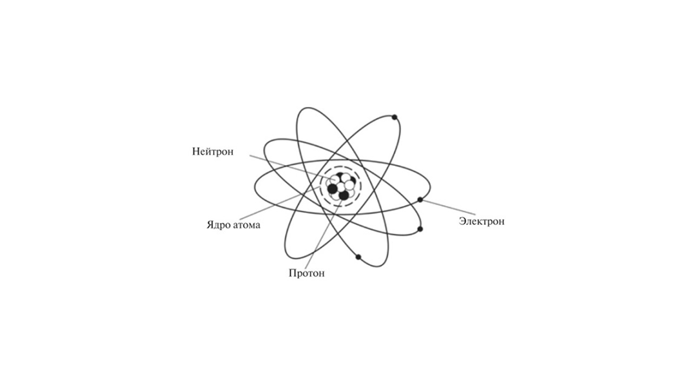
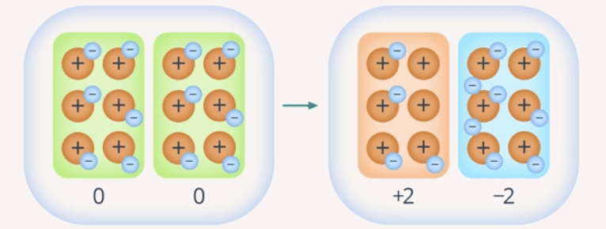
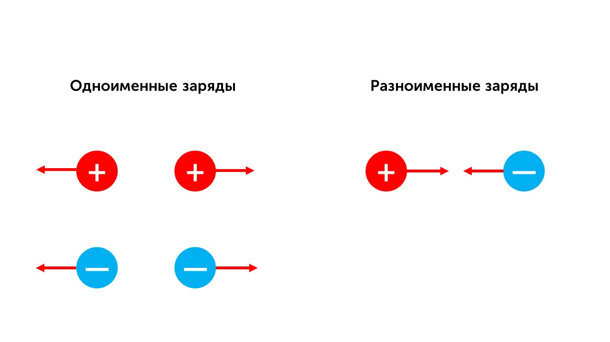
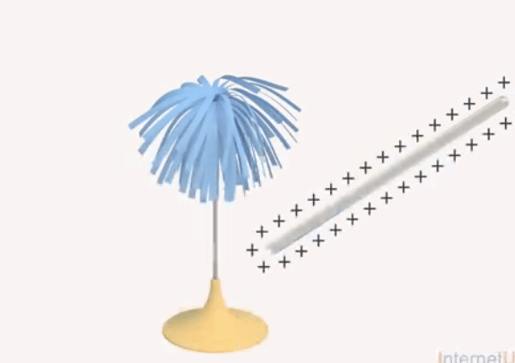
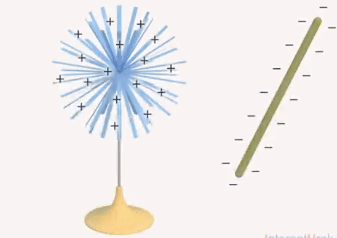

Давай вспомним как устроены атомы

Ядро атома состоит из протонов и нейтронов, а вокруг него крутятся электроны. Электроны довольно легкие и легко отрываются от атома при трении или ударе. 

> [!info] Определение
> 
> **Электризация – разделение электрических зарядов. Это значит, что электроны от одного тела переходят к другому**

Существует два типа электрических зарядов

**Положительный (+)**: связан с недостатком электронов (например, стекло, потёртое о шёлк).

**Отрицательный (–)**: связан с избытком электронов (например, эбонит, потёртый о мех).

Есть два закона относительно электрических зарядов

**Одноименные заряды взаимно отталкиваются**

**Разноименные заряды взаимно притягиваются**

Давай представим такой опыт.

Когда стеклянную палочку натирают о бумагу, палочка получает положительный заряд. Соприкасаясь с металлической стойкой, палочка передает положительный заряд бумажному султану, и его лепестки отталкиваются друг от друга. Этот опыт говорит о том, что одноименные заряды отталкиваются друг от друга.

В результате трения о мех эбонит приобретает отрицательный заряд. Поднося эту палочку к бумажному султану, видим, как лепестки притягиваются к ней

Теперь давай поговорим о законе Кулона: [[2. Взаимодействие заряженных тел. Закон Кулона|⏩вперед]]

