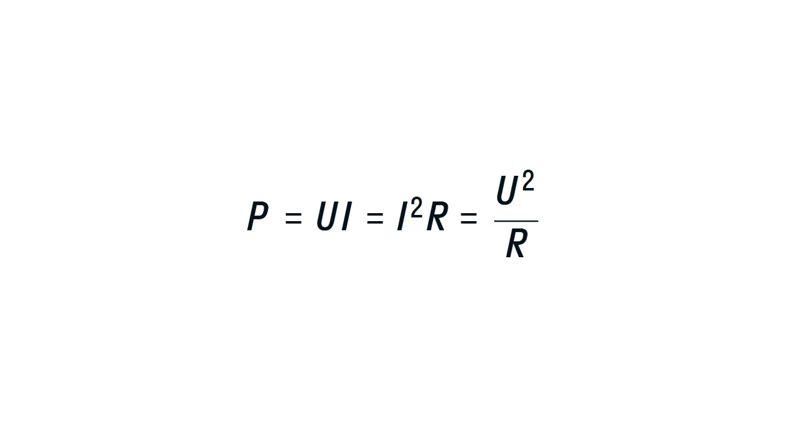

#### Работа электрического тока

В электрических цепях работа совершается, когда ток проходит через резистор или другой элемент цепи, где возникает сопротивление. Рассчитать работу можно по формуле: 

> [!example] Формула
> 
> **A = U⋅I⋅t** 

**A** — работа тока (Дж)

**U** — напряжение (В)

**I** — сила тока (А)

**t** — время (с) 

#### Мощность электрического тока

Мощность — это быстрота выполнения работы. В таком случае, мощность электрического прибора можно рассчитать по формуле 

> [!example] Формула
> 
> **P = A / t = I⋅U**

Если выразить напряжение или силу тока через закон Ома, получим такие формулы: 

 

Знание работы и мощности тока помогает нам понять, сколько энергии расходует электрическое устройство и насколько оно экономично. Например, мощность лампочки определяет, как ярко она будет светить и сколько энергии потребит за определенное время. 

Вот такая небольшая тема. Теперь давай рассмотрим закону Джоуля-Ленца: [[11. Закон Джоуля – Ленца|⏩вперед]]

