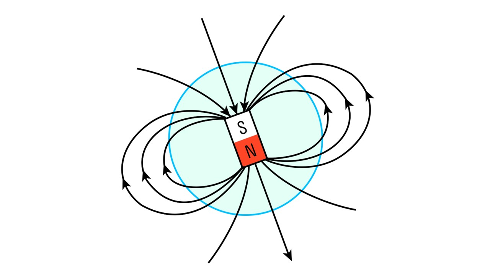

Люди только и делают, что говорят про какие-то магнитные бури, привозят магнитики на холодильник, ходят в походы с компасом, который показывает, где север, а где юг. В основе всего этого лежит магнитное поле.

> [!info] Определение
> 
>**Магнитное поле — это особый вид материи, который существует вокруг магнитов или движущихся зарядов.** 

У любого магнита есть два полюса — северный и южный.

Любое магнитное поле описывается магнитными линиями, которые выходят из северного поля и приходят в южный. Эти линии всегда замкнуты, даже если у них бесконечная длина. Вот так это выглядит: 

 

Северный полюс обозначается латинской буквой N (от английского слова North). А южный — буквой S (от английского слова South). 

> [!info] Определение
> 
> **Постоянный магнит – это материал (например, феррит, альнико или неодимовый сплав), который сохраняет собственное магнитное поле без внешнего воздействия.**

Важно знать следующее о постоянных магнитах🧲

**Разноимённые полюса притягиваются, одноимённые отталкиваются.**

**Если сломать магнит, то получится два магнита с новым полюсом на изломе.**

Перейдем к следующей теме:[[13. Опыт Эрстеда. Магнитное поле прямого проводника с током. Линии магнитной индукции|⏩вперед]]
