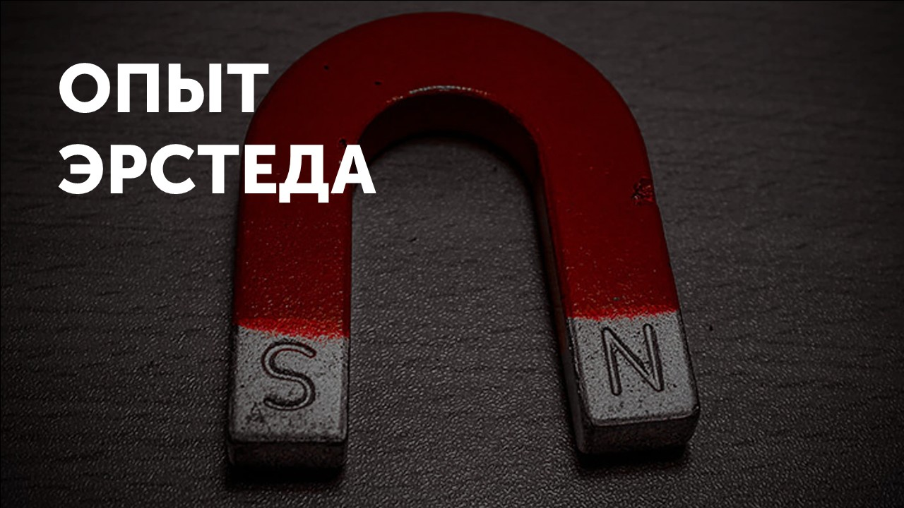
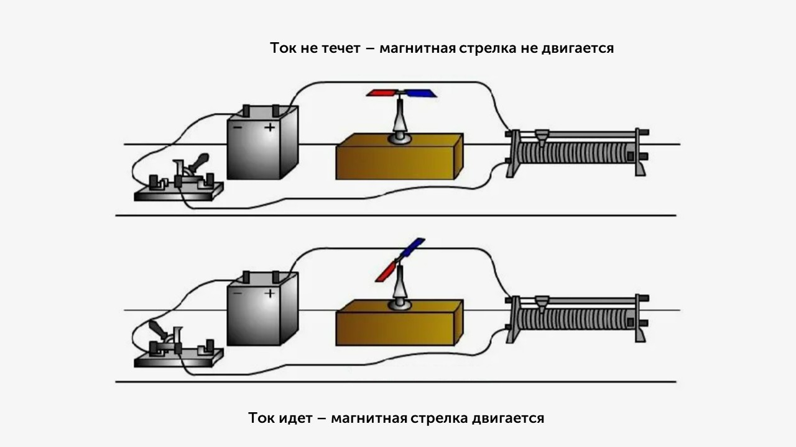
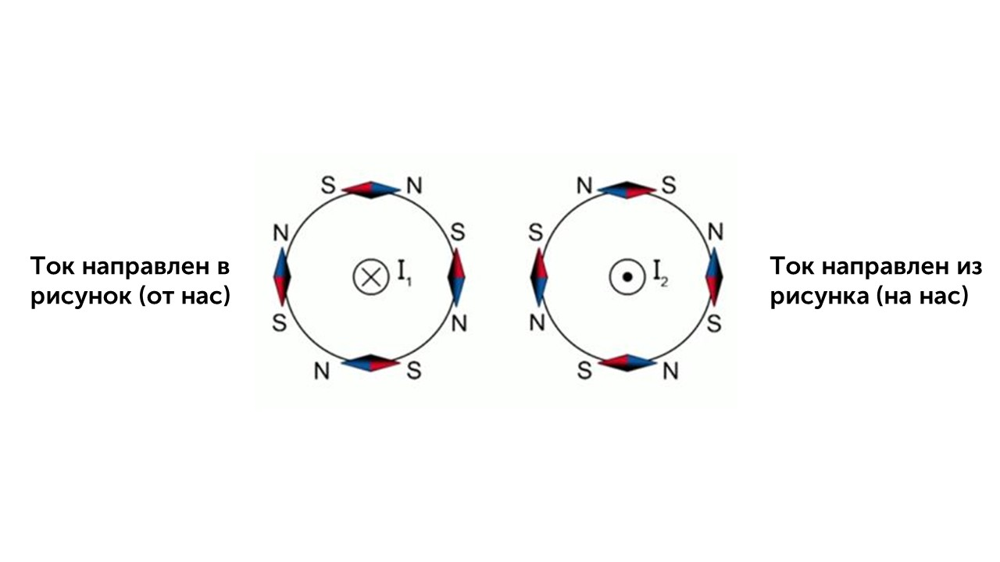
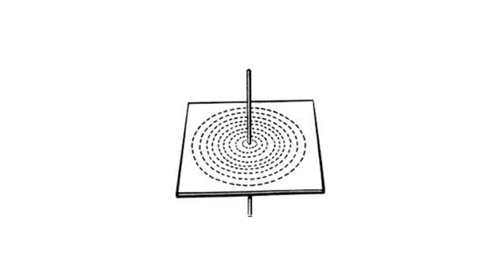
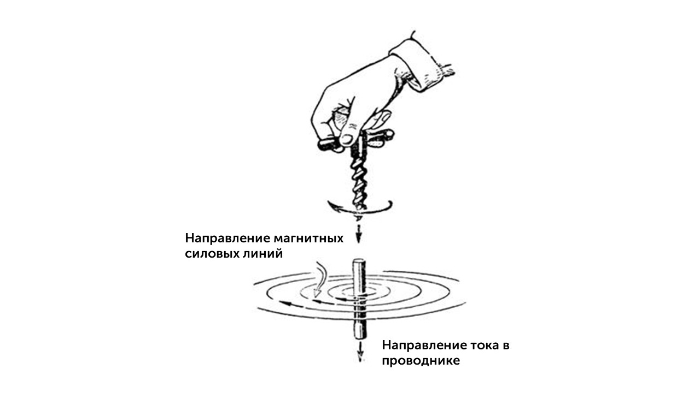
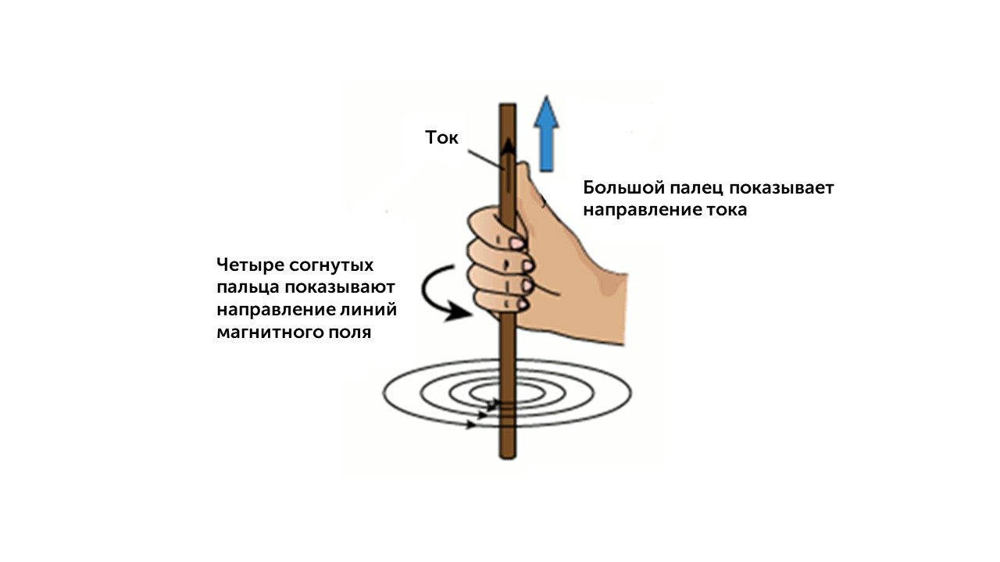

В 1820 году учёный Ханс Кристиан Эрстед обнаружил, что магнитная стрелка поворачивается возле проводника с током.  После проведения нескольких экспериментов Эрстед обнаружил, что поворот магнитной стрелки зависел от направления тока в проводнике. Ниже представлен сам опыт:

> [!warning] Важный момент

Для того чтобы представить, по какому принципу происходит поворот магнитной стрелки вблизи проводника с током, рассмотрим вид с торца проводника (ток I1 направлен в рисунок, I2 – из рисунка), , возле которого установлены магнитные стрелки. 

После пропускания тока стрелки выстроятся определённым образом, противоположными полюсами друг к другу. Так как магнитные стрелки выстраиваются по касательным к магнитным линиям, то магнитные линии прямого проводника с током представляют собой окружности, а их направление зависит от направления тока в проводнике.

Для более наглядной демонстрации магнитных линий проводника с током можно провести следующий опыт. Если вокруг проводника с током высыпать железные опилки, то через некоторое время опилки, попав в магнитное поле проводника, намагнитятся и расположатся по окружностям, которые охватывают проводник

### Правило буравчика. Правило правой руки

Для определения направления магнитных линий возле проводника с током существует **правило буравчика** (правило правого винта) – если вкручивать буравчик по направлению тока в проводнике, то направление вращения ручки буравчика укажет направление линий магнитного поля тока

Также можно использовать **правило правой руки** – если направить большой палец правой руки по направлению тока в проводнике, то четыре согнутых пальца укажут направление линий магнитного поля тока

В этой теме главное понять как меняет свое направление магнитная стрелка. Теперь давай разберем следующую тему:[[14. Действие магнитного поля на проводник  с током|⏩вперед]]
