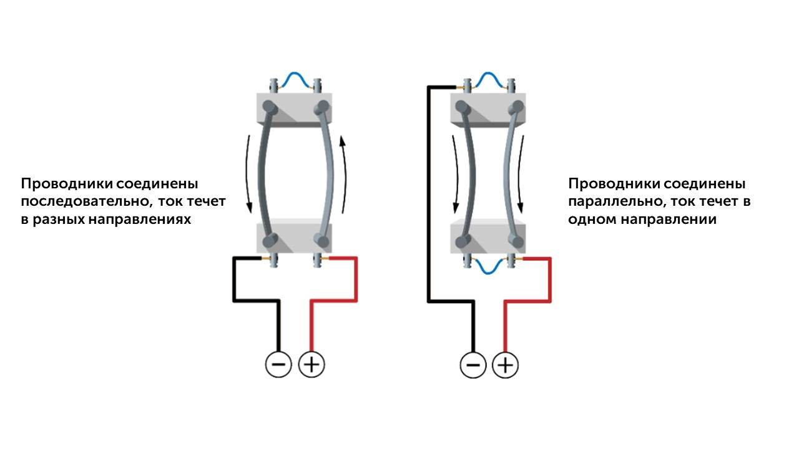

После открытия явления возникновения магнитного поля вблизи проводника с током Эрстед разослал результаты своих исследований большинству ведущих учёных Европы. Получив эти данные, французский математик и физик Ампер приступил к своей серии экспериментов и через некоторое время продемонстрировал публике опыт по взаимодействию двух параллельных проводников с током.

> [!warning] Важный момент

Ампер установил, что если по двум расположенным параллельно проводникам течёт электрический ток в одну сторону, то такие проводники притягиваются если ток течёт в противоположные стороны – проводники отталкиваются.

| Тип соединения  | Направление тока     | Что происходит с проводниками |
| --------------- | -------------------- | ----------------------------- |
| Последовательно | В разном направлении | Отталкиваются                 |
| Параллельно     | В одном направлении  | Притягиваются                 |

При увеличении силы тока взаимодействие между проводниками усиливается.

Довольно коротенькая тема, погнали к следующей: [[15. Опыты Фарадея. Явление электромагнитной  индукции. Правило Ленца|⏩вперед]]
