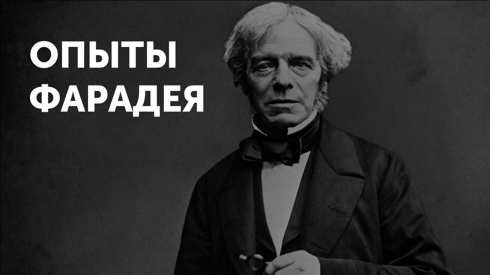
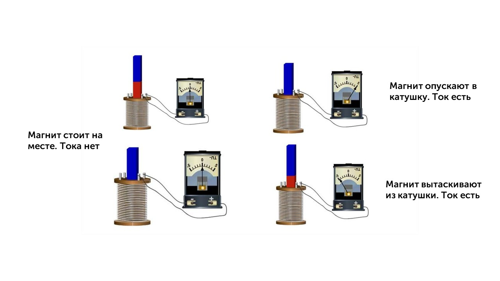
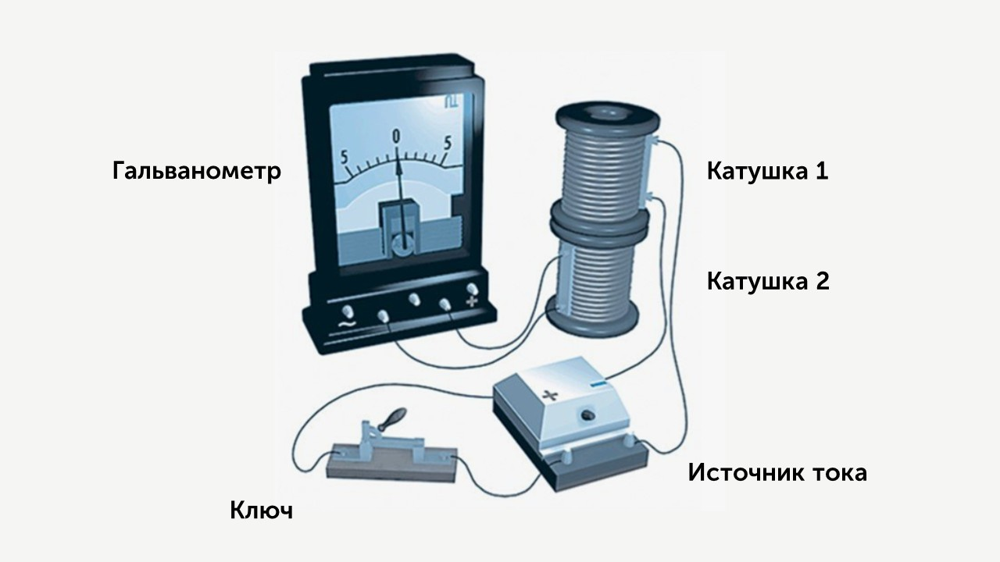
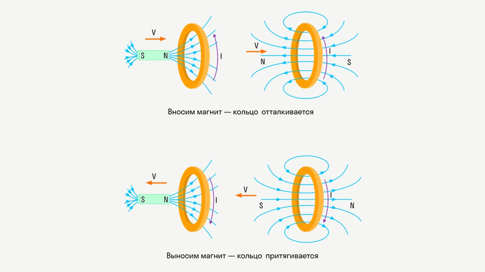

Майкл Фарадей в 1831 году провёл серию опытов, которые показали связь между электричеством и магнитным полем.

До него уже знали, что *электрический ток создаёт магнитное поле* (опыт Эрстеда — компас отклоняется рядом с проводом с током).

Фарадей же выяснил обратное: **меняющееся магнитное поле может создавать электрический ток**.

### Классический опыт Фарадея

Берём катушку из провода и подключаем к ней гальванометр (устройство, которое показывает наличие тока). Подносим к катушке магнит:

- Если магнит двигается к катушке или от неё — стрелка гальванометра отклоняется: появился электрический ток!⚡️
  
- Если магнит неподвижен — тока нет.❌

Можно сделать вывод, что **ток возникает только при изменении магнитного поля**, то есть при движении магнита

Есть и второй опыт Фарадея, рассмотрим его. У нас есть две катушки:

**Первая катушка** подключена к источнику тока (например, батарейке).

**Вторая катушка** рядом, и к ней подключён гальванометр (чтобы увидеть, есть ли ток).

> [!warning] Важный момент

В первой катушке течет ток, значит появляется магнитное поле. Если сила тока не меняется, то магнитное поле постоянное, во второй катушке тока нет.

Если ток **включить, выключить или изменить** → магнитное поле начнёт изменяться. - А значит, магнитный поток через вторую катушку изменится и во второй катушке появится индукционный ток. 

### Явление электромагнитной индукции

Это как раз то, что открыл Фарадей.

> [!info] Определение
> 
> **Электромагнитная индукция — явление возникновения тока в замкнутом проводящем контуре при изменении магнитного потока, пронизывающего его.** 

Магнитный поток — это, грубо говоря, "количество магнитных линий", проходящих через поверхность контура.

> [!warning] Важный момент

**1)** Индукционный ток возникает только при изменении линий магнитной индукции.

**2)** Направление тока будет различно при увеличении числа линий и при их уменьшении.

**3)** Сила индукционного тока зависит от скорости изменения магнитного потока. Может изменяться само поле, или контур может перемещаться в неоднородном магнитном поле. 

Индукционный ток — это электрический ток, возникающий в замкнутом проводящем контуре при изменении потока магнитной индукции через этот контур. Это явление называется электромагнитной индукцией. 

### Правило Ленца

Возникает вопрос: А в какую сторону будет течь индукционный ток?

На это отвечает правило Ленца:  

👉 **Индукционный ток всегда направлен так, что своим магнитным полем он противодействует изменению магнитного потока, которое его вызвало.**

**Пояснение:**

- Если магнит приближается к катушке (поток увеличивается), то ток возникнет такой, что создаст магнитное поле **против увеличения** (будет как бы отталкивать магнит).

- Если магнит удаляется (поток уменьшается), то ток возникнет такой, чтобы "удержать" магнитное поле (как будто хочет притянуть магнит обратно).

Представь, что катушка с током — это "лентяй", который **не любит перемен**: 

Приближаем магнит → катушка сопротивляется этому изменению, создавая поле против движения.

Убираем магнит → катушка опять сопротивляется, "пытается удержать" магнитное поле.

То есть катушка всегда борется с изменениями, как будто говорит: "Оставьте всё как есть!"

С этой темой все понятно, пора переходить к следующей: [[16. Электромагнитные волны. Шкала электромагнитных волн|⏩вперед]]
