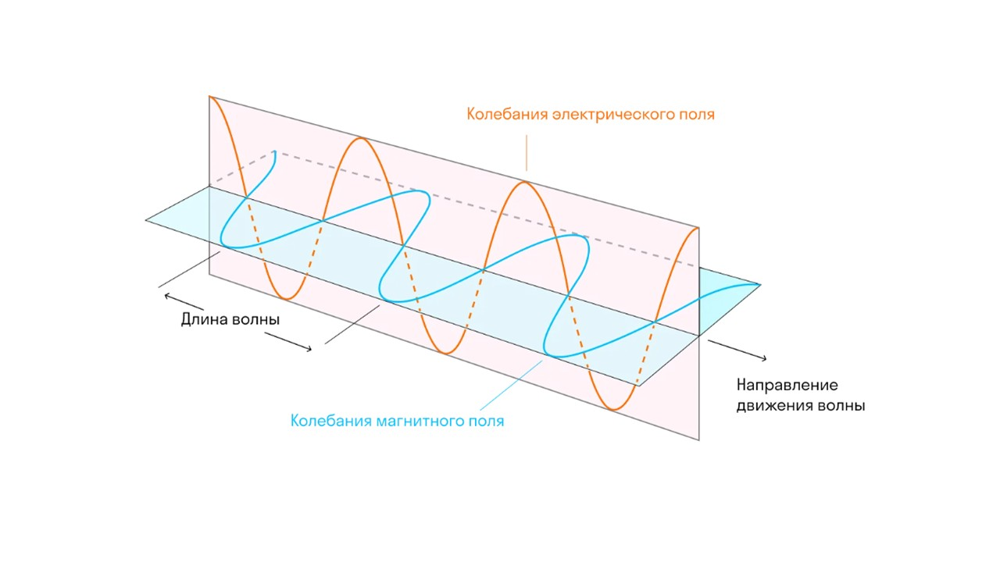
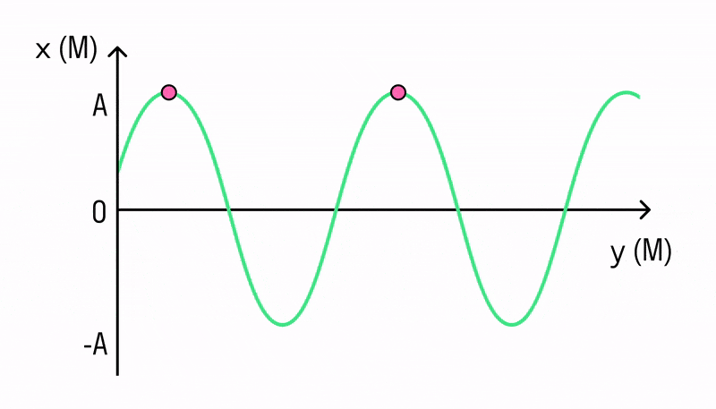

Радио, Wi-Fi и вышки 5G — все это электромагнитные волны. Разбираемся, что это такое и рушим мифы про это странное явление. 

Увы, мы не можем потрогать руками электромагнитные волны. Осталось разобраться, как это так: волна есть, а возможности пощупать ее — нет.

Электромагнитная волна появляется благодаря электромагнитному полю.

Вот есть электрическое поле — его создает любой электрический заряд. Есть магнитное поле — оно возникает из-за движущегося заряда. А их взаимодействие — это электромагнитное поле. 

> [!info] Определение
> 
> **Электромагнитная волна — это распространение электромагнитного поля. А если конкретнее, то электрическое поле колеблется (меняет свое значение и направление вектор напряженности электрического поля), магнитное поле колеблется (меняет значение и направление вектор магнитной индукции), эти колебания распространяются, и получается электромагнитная волна.**

  

#### Характеристики электромагнитной волны 

**Длина волны**

Это самая важная характеристика для волны. Ей называется расстояние между двумя точками этой волны, колеблющихся в одной фазе. Если проще, то это расстояние между двумя «гребнями».

Обозначается эта величина буквой λ и измеряется в метрах. 

  

Еще длиной волны можно назвать расстояние, пройденное волной, за один период колебания. 

**Период**

Период — это время, за которое происходит одно колебание. То есть, если дано время распространения волны и количество колебаний, можно рассчитать период. 

> [!example] Формула
> 
> **T = t/N** 

**T** — период (с)

**t** — время (с)

**N** — количество колебаний 

Для электромагнитных волн есть целая шкала длин волн. Она показывает длину волны и частоту для разных типов электромагнитных волн. 

  

**Частота**

Частота — это величина, обратно пропорциональная периоду. Она определяет, сколько колебаний в единицу времени совершила волна. 

> [!example] Формула
> 
> **υ = N/t = 1/T** 

**Скорость**

Также важной характеристикой распространения волны является ее скорость. 

> [!example] Формула
> 
> 𝑣 = λ/T 

С электромагнитными волнами понятно, перейдем к оптике: [[17. Оптика. Закон прямолинейного распространения лучей света|⏩вперед]]
