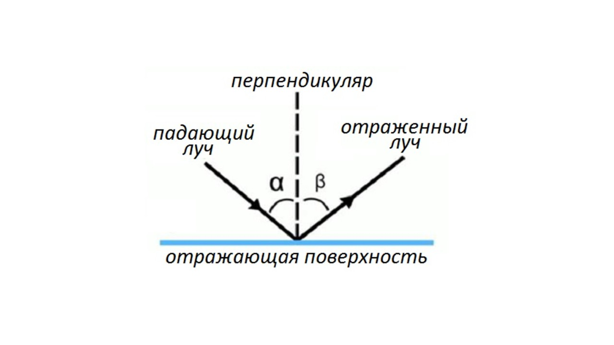
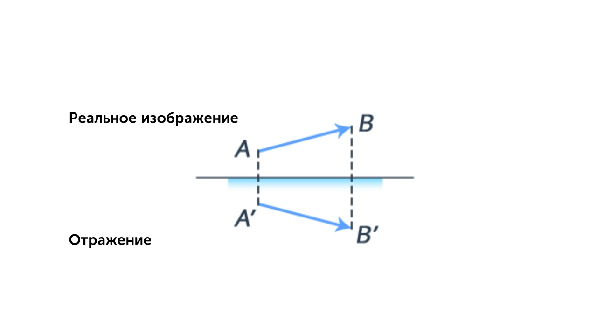
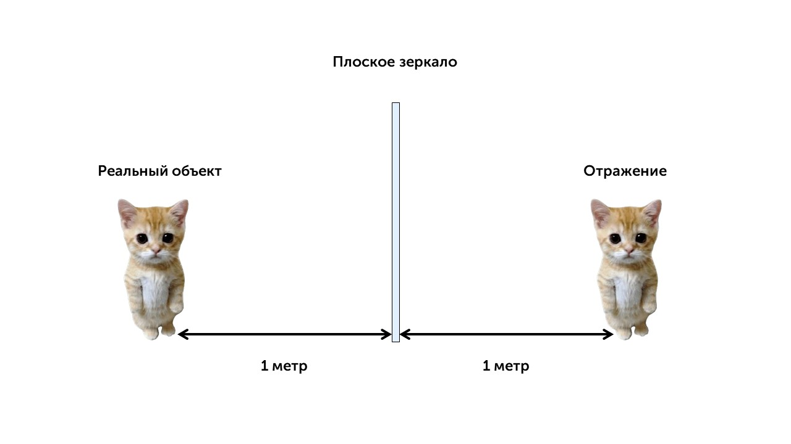

> [!info] Законы отражения
> 
> **1) Луч падающий, луч отраженный и перпендикуляр, восстановленный в точке падения, лежат в одной плоскости.**
> 
> **2) Угол падения равен углу отражения.**

  

**Угол α** - это угол падения

**Угол β** - это угол отражения

> [!info] Определение
> 
> **Плоское зеркало — это гладкая поверхность, отражающая свет согласно закону отражения.**

Свойство изображения в плоском зеркале:

- **Равно по размеру** объекту.

- **Симметрично** относительно плоскости зеркала.

- **Расстояние от объекта до зеркала** равно расстоянию от изображения до зеркала.

**Построение изображения:**

1. Проведи перпендикуляр от объекта к зеркалу.

2. Продолжи его за зеркало на такое же расстояние.

3. Изображение будет находиться в этой точке.

  

**Пример:** 

Если человек стоит в 1 метре от зеркала, его изображение будет находиться в 1 метре за зеркалом (в двух метрах от человека).

Теперь давай поговорим о преломлении света: [[19. Преломление света. Закон преломления света|⏩вперед]]
