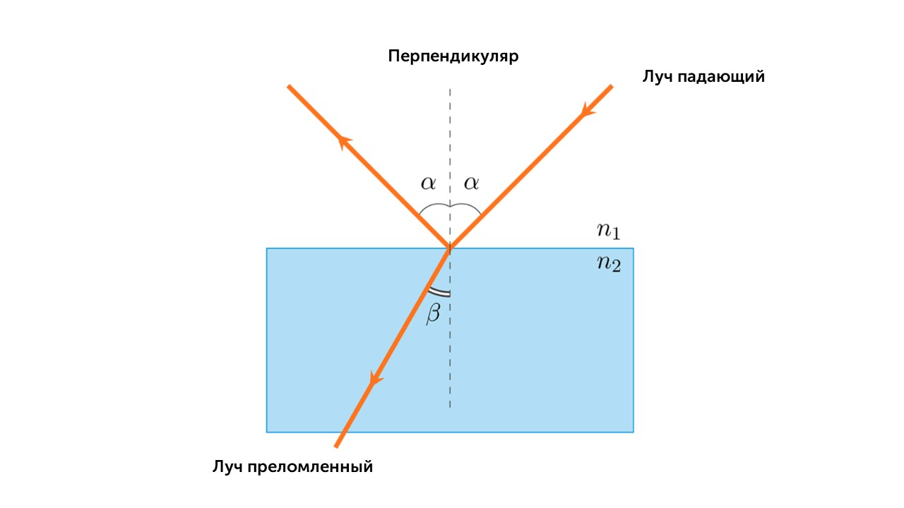
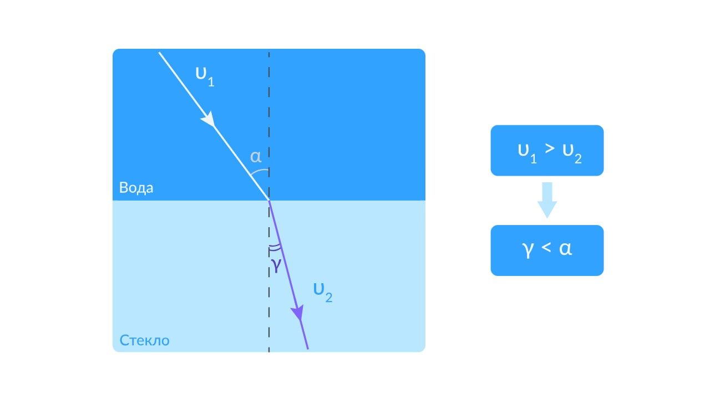
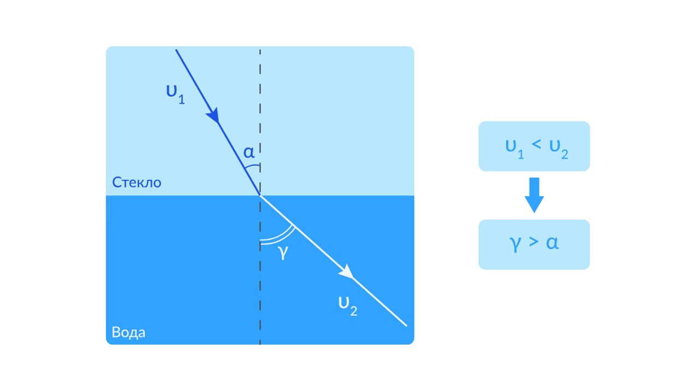

> [!info] Определение
> 
> **Преломление - изменение направления распространения волны при переходе из одной среды в другую. Преломление вызвано тем, что скорости распространения волн в этих средах различны.**

Степень преломления показывается **абсолютным показателем преломления** среды *n* - это физическая величина, равная отношению скорости света *с* в вакууме к скорости света ν в данной среде:

$n = c / ν$

Оптически более плотная среда - среда с большим показателем преломления, оптически менее плотная среда - с меньшим показателем преломления.

Относительный показатель преломления n - физическая величина, равная отношению скоростей света в этих средах:

n21 = ν1 / ν2

Где ν1 - скорость света в первой среде, ν2 - скорость света во второй среде.

При падении света на плоскую границу раздела двух сред (например воды и воздуха) часть света отражается, часть проходит дальше (преломляется), при этом выполняются два закона отражения и два закона преломления света.

> [!info] Законы преломления
> 
> **1) Луч падающий, луч преломленный и перпендикуляр, восстановленный в точке падения, лежат в одной плоскости.**
> 
> **2) Если α - угол падения, а β - угол преломления, то n1⋅sinα = n2⋅sinβ**

Явление преломления связано с изменением скорости распространения света при переходе из одной среды в другую.

Если луч переходит из среды, в которой свет распространяется с большей скоростью, в среду, где эта скорость меньше, то он будет прижиматься к перпендикуляру. То есть угол преломления будет меньше, чем угол падения: γ<α. Например, так будет происходить при переходе луча света из воздуха в воду или из воды в стекло.

Если же скорость света в первой среде меньше скорости света во второй среде, то угол преломления будет больше угла преломления: γ>α

Перейдем к следующей теме: [[20. Дисперсия света. Свет – электромагнитная волна|⏩вперед]]
