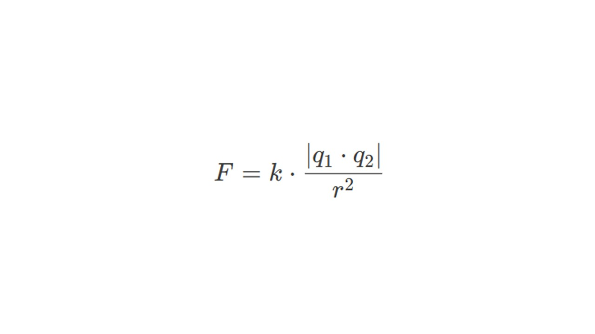
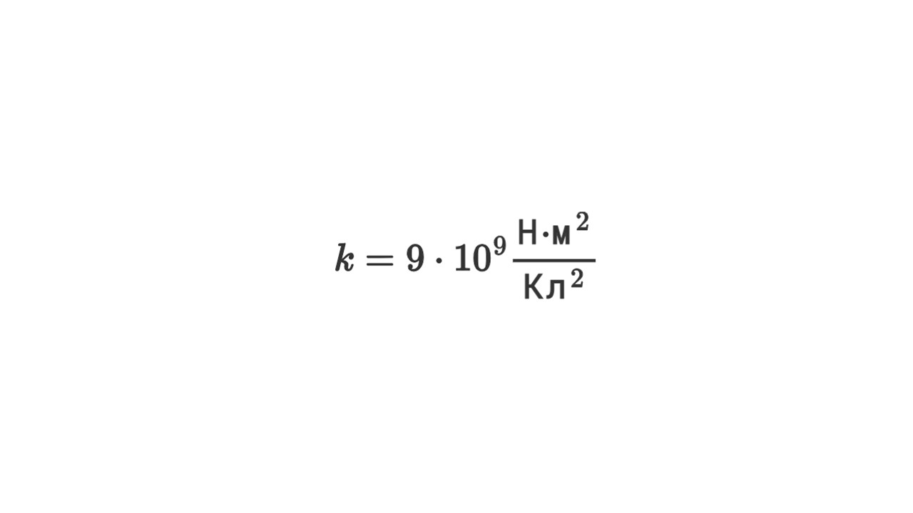

Как мы уже говорили, когда два тела имеют электрический заряд, они начинают притягиваться или отталкиваться — это и есть электростатическое взаимодействие. Сила этого взаимодействия зависит от величины зарядов и расстояния между ними.

Французский физик Шарль Кулон в 1785 году установил, с какой силой взаимодействуют два точечных заряда.

> [!info] Определение
> 
> **Сила взаимодействия двух точечных зарядов прямо пропорциональна их величинам и обратно пропорциональна квадрату расстояния между ними.**

> [!example] Формула

**F** — сила взаимодействия (в ньютонах, Н)

**q1,q2​** — величины зарядов (в кулонах, Кл)

**r** — расстояние между зарядами (в метрах, м)

**k** — коэффициент пропорциональности. В Международной системе единиц (СИ) он равен

Идем к следующей теме: [[3. Закон сохранения электрического заряда|⏩вперед]]

