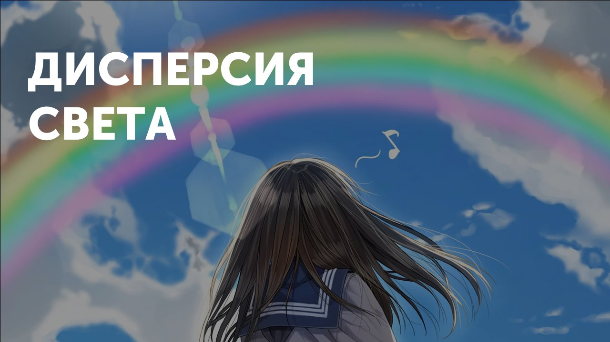
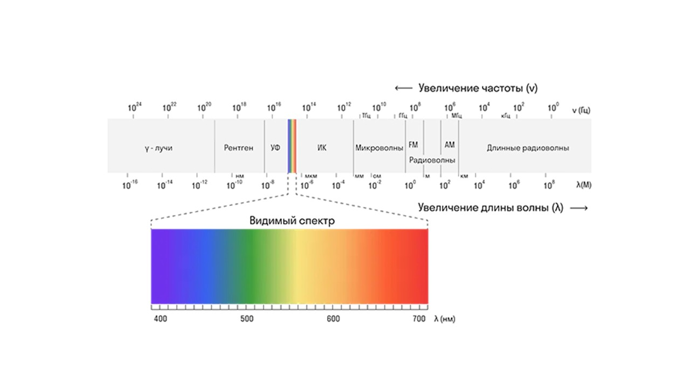

> [!info] Определение
> 
> **Дисперсия света - разложение света в спектр при его преломлении и дифракции.**

Явление дисперсии возникает в связи с тем, что световые лучи с разной длиной волны имеют различную скорость распространения в оптической среде.

Абсолютный показатель преломления возрастает с увеличением частоты света и уменьшается с увеличением длины световой волны

Тут можно вспомнить этот рисунок 

  
Красному цвету соответствует самая большая длина световой волны, поэтому он имеет минимальную степень преломления, а фиолетовый цвет имеет самую большой показатель преломления

Дисперсия света относится к числу самых красивых явлений природы. Каждому доводилось наблюдать дисперсию в повседневной жизни. Радуга, блики на мыльных кругах - все это дисперсия.

Теперь давай поговорим о линзах: [[21. Тонкие линзы. Собирающая и рассеивающая  линзы.|⏩вперед]]
